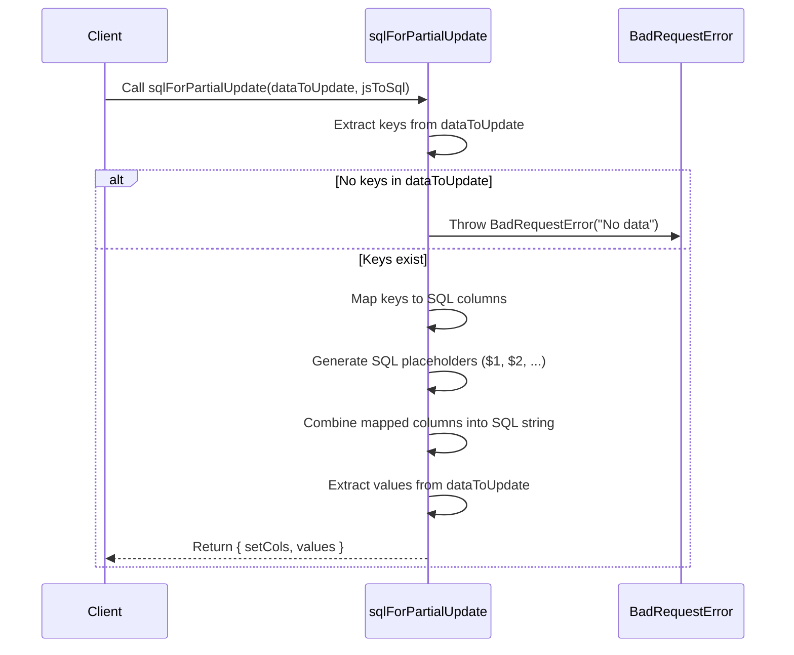
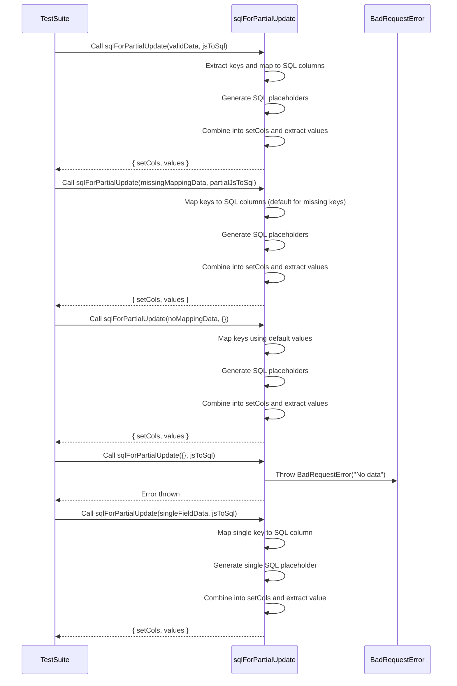

# helpers folder file notes/explanations/diagrams

## [Table of Contents](#table-of-contents)
- [helpers folder file notes/explanations/diagrams](#helpers-folder-file-notesexplanationsdiagrams)
  - [Scripts](#scripts)
    - [sql.js](#sqljs)
      - [sql.js diagram](#sqljs-diagram)
      - [Explanation of sql.js Sequence Diagram](#explanation-of-sqljs-Sequence-Diagram)
      - [Example Workflow](#sqljs-example-workflow)
      - [Code Overview](#sqljs-code-overview)
  - [Tests](#tests)
    - [sql.test.js](#sqltestjs)
      - [sql.test.js diagram](#sqltestjs-diagram)
      - [Explanation of sql.test.js Sequence Diagram](#explanation-of-sqltestjs-Sequence-Diagram)
      - [Code Overview](#sqltestjs-code-overview)

## Scripts

### sql.js

#### What `sqlForPartialUpdate` Does
The `sqlForPartialUpdate` function dynamically generates a SQL query fragment for an `UPDATE` statement based on partial input data. It converts JavaScript-style object keys into SQL column names and maps them to placeholders for parameterized queries. This function is essential for safely and efficiently updating database records.

[Back to TOC](#table-of-contents)

#### sql.js diagram

[Back to TOC](#table-of-contents)


#### Explanation of sql.js Sequence Diagram

1. Function Call
   - `Client->>sql: Call sqlForPartialUpdate(dataToUpdate, jsToSql)`
     - The client (caller) invokes the `sqlForPartialUpdate` function with:
       - `dataToUpdate`: An object containing the fields to be updated and their new values.
       - `jsToSql`: An optional mapping of JavaScript-style keys to SQL column names (e.g., `{ firstName: "first_name" }`).

2. Extract Keys
   - `sql->>sql: Extract keys from dataToUpdate`
     - The function extracts the keys (field names) from the `dataToUpdate` object using `Object.keys`.

3. Handle Empty Input
   - `alt No keys in dataToUpdate`
     - If `dataToUpdate` is empty (i.e., no keys), the function throws a `BadRequestError`:
       - sql->>Error: `Throw BadRequestError("No data")`
       - This ensures that the caller provides at least one field to update, preventing invalid SQL queries.

4. Map Keys to SQL Columns
   - `sql->>sql: Map keys to SQL columns`
     - The function iterates over the keys using `Array.map`:
       - It looks for each key in the `jsToSql` mapping.
       - If a mapping exists, it replaces the JavaScript-style key with the corresponding SQL column name.
       - If no mapping exists, it uses the original key as the column name.

5. Generate SQL Placeholders
   - `sql->>sql: Generate SQL placeholders ($1, $2, ...)`
     - For each key, the function generates a parameterized SQL placeholder (`$1`, `$2`, etc.) using the index of the key in the array.

6. Combine Columns into SQL String
   - `sql->>sql: Combine mapped columns into SQL string`
     - The function concatenates the mapped columns and placeholders into a single string, separated by commas. Example:
       - Input: `{ firstName: "Aliya", age: 32 }`
       - Output: `"first_name"=$1, "age"=$2`

7. Extract Values
   - `sql->>sql: Extract values from dataToUpdate`
     - The function extracts the values associated with the keys in `dataToUpdate` using `Object.values`. These values will be passed to the database query alongside the generated SQL string.

8. Return Result
   - `sql-->>Client: Return { setCols, values }`
     - The function returns an object containing:
       - `setCols`: The SQL fragment (e.g., `"first_name"=$1, "age"=$2`).
       - `values`: An array of values corresponding to the placeholders (e.g., `["Aliya", 32]`).


[Back to TOC](#table-of-contents)


#### sql.js Example Workflow

**Input**
```javascript
const dataToUpdate = { firstName: "Aliya", age: 32 };
const jsToSql = { firstName: "first_name" };

```

**Output**
```javascript
{
  setCols: '"first_name"=$1, "age"=$2',
  values: ["Aliya", 32]
}
```

**Execution**
1. Extract keys: `["firstName", "age"]`.
2. Map keys:
- `firstName` → `"first_name"` (via `jsToSql` mapping).
- `age` → `"age"` (default key used).
3. Generate placeholders: `[$1, $2]`.
4. Combine columns and placeholders: `"first_name"=$1, "age"=$2`.
5. Extract values: `["Aliya", 32]`.
   
[Back to TOC](#table-of-contents)


#### Code Overview

[Back to TOC](#table-of-contents)


## Tests


### sql.test.js

**Explanation of the Test Cases**

1. Valid Input with Complete Mapping
   - Ensures the function correctly maps JavaScript-style keys to SQL column names using the `jsToSql` mapping.
   - Example: `{ firstName: "Aliya", age: 32 }` → `"first_name"=$1, "age"=$2`.

2. Partial Mapping Provided
   - Tests behavior when some keys have mappings in `jsToSql` and others do not. The function should fall back to using the original keys for unmapped fields.

3. No Mapping Provided
   - Verifies that the function correctly uses default keys when `jsToSql` is empty.

4. Empty Input
   - Ensures the function throws a `BadRequestError` when `dataToUpdate` is empty, as updating with no data is invalid.

5. Single Field Update
   - Tests the behavior when updating only one field. The generated SQL string and values should reflect the single field.

[Back to TOC](#table-of-contents)


#### sql.test.js diagram



[Back to TOC](#table-of-contents)


#### Explanation of sql.test.js Sequence Diagram

**What the Diagram Represents**
This sequence diagram illustrates how the test suite interacts with the `sqlForPartialUpdate` function across multiple test cases. It demonstrates:
- The various input scenarios tested (e.g., valid inputs, partial mappings, empty input).
- The internal steps performed by the `sqlForPartialUpdate` function.
- The possible outcomes, including successful generation of SQL fragments or throwing an error for invalid input.

**Step-by-Step Explanation**

1. Test Case: Valid Input
   - The test suite calls `sqlForPartialUpdate` with a valid `dataToUpdate` object and a complete `jsToSql` mapping.
   - The function:
     - Extracts keys from `dataToUpdate`.
     - Maps keys to SQL column names using `jsToSql`.
     - Generates placeholders for parameterized queries.
     - Combines the SQL fragments and extracts values.
   - The function returns an object with `setCols` and `values`.

2. Test Case: Missing jsToSql Mapping
   - The test suite calls `sqlForPartialUpdate` with an input that has some missing mappings in `jsToSql`.
   - The function:
     - Uses the `jsToSql` mapping for known keys.
     - Defaults to using the original keys for unmapped fields.
     - Proceeds to generate placeholders, combine fragments, and extract values.
   - The function returns the SQL string and values.

3. Test Case: No jsToSql Mapping
   - The test suite calls `sqlForPartialUpdate` with an empty `jsToSql` object.
   - The function:
     - Defaults to using the original keys from `dataToUpdate` for all fields.
     - Generates placeholders and extracts values.
   - The function returns the SQL fragment and values.

4. Test Case: Empty Input
   - The test suite calls `sqlForPartialUpdate` with an empty `dataToUpdate` object.
   - The function checks for keys and immediately throws a `BadRequestError` when none are found.
   - The test validates that the error is thrown.

5. Test Case: Single Field Update
   - The test suite calls `sqlForPartialUpdate` with a `dataToUpdate` object containing only one field.
   - The function:
     - Maps the single key to a SQL column using `jsToSql`.
     - Generates a single SQL placeholder and extracts the value.
   - The function returns a SQL fragment and a single value.
[Back to TOC](#table-of-contents)


#### Code Overview

[Back to TOC](#table-of-contents)

