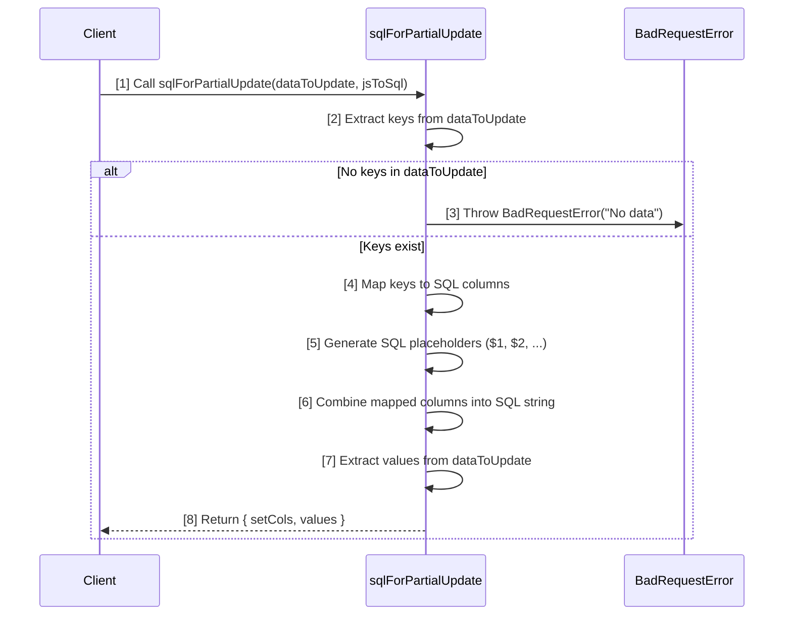
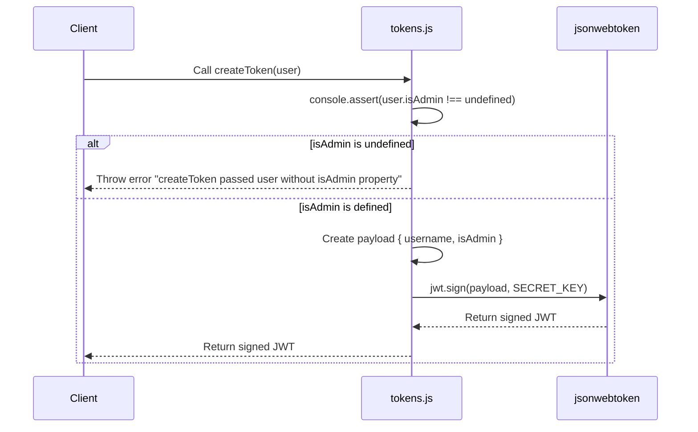
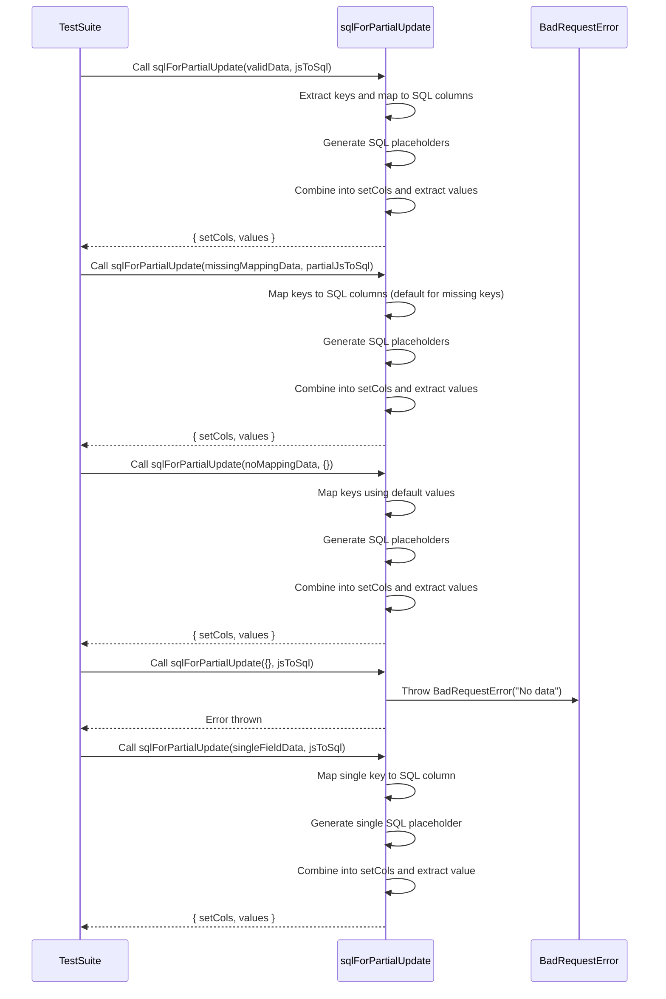

# helpers folder file notes/explanations/diagrams

## [Table of Contents](#table-of-contents)

- [helpers folder file notes/explanations/diagrams](#helpers-folder-file-notesexplanationsdiagrams)
  - [Scripts](#scripts)
  - [sql.js](#sqljs)
    - [sql.js sequence diagram](#sqljs-sequence-diagram)
    - [sql.js diagram explanation](#sqljs-diagram-explanation)
    - [Example Workflow](#sqljs-example-workflow)
    - [sql.js Code Overview](#sqljs-code-overview)
  - [tokens.js](#tokensjs)
    - [tokens.js sequence diagram](#tokensjs-sequence-diagram)
    - [tokens.js diagram explanation](#tokensjs-diagram-explanation)
    - [Example Workflow](#tokensjs-example-workflow)
    - [tokens.js Code Overview](#tokensjs-code-overview)
  - [Tests](#tests)
  - [sql.test.js](#sqltestjs)
    - [sql.test.js sequence diagram](#sqltestjs-sequence-diagram)
    - [sql.test.js diagram explanation](#sqltestjs-diagram-explanation)
    - [sql.test.js code overview](#sqltestjs-code-overview)
  - [tokens.test.js](#tokenstestjs)
    - [tokens.test.js sequence diagram](#tokenstestjs-sequence-diagram)
    - [tokens.test.js diagram explanation](#tokenstestjs-diagram-explanation)
    - [tokens.test.js code overview](#tokenstestjs-code-overview)

### Scripts

### sql.js

**What `sqlForPartialUpdate` Does**
The `sqlForPartialUpdate` function dynamically generates a SQL query fragment for an `UPDATE` statement based on partial input data. It converts JavaScript-style object keys into SQL column names and maps them to placeholders for parameterized queries. This function is essential for safely and efficiently updating database records.

[Back to TOC](#table-of-contents)

#### sql.js sequence diagram



[Back to TOC](#table-of-contents)

#### sql.js diagram explanation

1. Function Call

   - `Client->>sql: Call sqlForPartialUpdate(dataToUpdate, jsToSql)`
     - The client (caller) invokes the `sqlForPartialUpdate` function with:
       - `dataToUpdate`: An object containing the fields to be updated and their new values.
       - `jsToSql`: An optional mapping of JavaScript-style keys to SQL column names (e.g., `{ firstName: "first_name" }`).

2. Extract Keys

   - `sql->>sql: Extract keys from dataToUpdate`
     - The function extracts the keys (field names) from the `dataToUpdate` object using `Object.keys`.

3. Handle Empty Input

   - `alt No keys in dataToUpdate`
     - If `dataToUpdate` is empty (i.e., no keys), the function throws a `BadRequestError`:
       - sql->>Error: `Throw BadRequestError("No data")`
       - This ensures that the caller provides at least one field to update, preventing invalid SQL queries.

4. Map Keys to SQL Columns

   - `sql->>sql: Map keys to SQL columns`
     - The function iterates over the keys using `Array.map`:
       - It looks for each key in the `jsToSql` mapping.
       - If a mapping exists, it replaces the JavaScript-style key with the corresponding SQL column name.
       - If no mapping exists, it uses the original key as the column name.

5. Generate SQL Placeholders

   - `sql->>sql: Generate SQL placeholders ($1, $2, ...)`
     - For each key, the function generates a parameterized SQL placeholder (`$1`, `$2`, etc.) using the index of the key in the array.

6. Combine Columns into SQL String

   - `sql->>sql: Combine mapped columns into SQL string`
     - The function concatenates the mapped columns and placeholders into a single string, separated by commas. Example:
       - Input: `{ firstName: "Aliya", age: 32 }`
       - Output: `"first_name"=$1, "age"=$2`

7. Extract Values

   - `sql->>sql: Extract values from dataToUpdate`
     - The function extracts the values associated with the keys in `dataToUpdate` using `Object.values`. These values will be passed to the database query alongside the generated SQL string.

8. Return Result
   - `sql-->>Client: Return { setCols, values }`
     - The function returns an object containing:
       - `setCols`: The SQL fragment (e.g., `"first_name"=$1, "age"=$2`).
       - `values`: An array of values corresponding to the placeholders (e.g., `["Aliya", 32]`).

[Back to TOC](#table-of-contents)

#### sql.js Example Workflow

**Input**

```javascript
const dataToUpdate = { firstName: "Aliya", age: 32 };
const jsToSql = { firstName: "first_name" };
```

**Output**

```javascript
{
  setCols: '"first_name"=$1, "age"=$2',
  values: ["Aliya", 32]
}
```

**Execution**

1. Extract keys: `["firstName", "age"]`.
2. Map keys:

- `firstName` → `"first_name"` (via `jsToSql` mapping).
- `age` → `"age"` (default key used).

3. Generate placeholders: `[$1, $2]`.
4. Combine columns and placeholders: `"first_name"=$1, "age"=$2`.
5. Extract values: `["Aliya", 32]`.

[Back to TOC](#table-of-contents)

#### sql.js Code Overview

**Overview**
The `sqlForPartialUpdate` function is a utility function designed to generate a SQL query for partially updating a database record. This function is particularly useful when you need to update only specific fields of a record without affecting the other fields.

**Function**: `sqlForPartialUpdate`
**Parameters**:

- `dataToUpdate` (Object): An object containing the fields to be updated and their new values. For example, `{ firstName: 'Aliya', age: 32 }`.
- `jsToSql` (Object): An object that maps JavaScript-style field names to their corresponding SQL column names. For example, `{ firstName: 'first_name' }`.

**Returns**:

- An object containing:
- `setCols` (String): A string of SQL column assignments formatted for an `UPDATE` statement. For example, `"first_name"=$1, "age"=$2`.
- `values` (Array): An array of the values to be updated, corresponding to the placeholders in `setCols`.

**Throws**:

- `BadRequestError`: If `dataToUpdate` is empty, indicating that there is no data to update.

**Example Usage**:

```javascript
const { sqlForPartialUpdate } = require("./path/to/this/module");

const dataToUpdate = { firstName: "Aliya", age: 32 };
const jsToSql = { firstName: "first_name" };

const result = sqlForPartialUpdate(dataToUpdate, jsToSql);

console.log(result.setCols); // Output: '"first_name"=$1, "age"=$2'
console.log(result.values); // Output: ['Aliya', 32]
```

**Explanation**:

1. Input Validation: The function first checks if `dataToUpdate` contains any keys. If it is empty, it throws a `BadRequestError` with the message "No data".

2. Column Mapping: The function maps the keys of `dataToUpdate` to their corresponding SQL column names using the `jsToSql` mapping. If a key does not have a corresponding SQL column name in `jsToSql`, it uses the key as-is.

3. SQL Query Generation: The function generates a string of SQL column assignments (`setCols`) and an array of values (`values`) to be used in the `UPDATE` statement.

This function simplifies the process of creating dynamic SQL `UPDATE` queries, ensuring that only the specified fields are updated while maintaining the integrity of the other fields in the record.

[Back to TOC](#table-of-contents)

### tokens.js

#### tokens.js sequence diagram

[Back to TOC](#table-of-contents)
#### tokens.js diagram explanation
**Explanation of Each Step**

1. Client Calls `createToken`:
   - The client calls the `createToken` function with a `user` object.

2. Assertion Check:
   - The `createToken` function uses `console.assert` to ensure that the `isAdmin` property is defined on the `user` object.
   - If `isAdmin` is undefined, the function throws an error with the message "createToken passed user without isAdmin property".

3. Payload Creation:
   - If `isAdmin` is defined, the function creates a `payload` object containing the `username` and `isAdmin` properties.
   - The `isAdmin` property defaults to `false` if it is not explicitly set to `true`.

4. JWT Signing:
   - The `createToken` function calls `jwt.sign` with the `payload` and `SECRET_KEY` to create a signed JWT.
   - The `jwt.sign` function returns the signed JWT.

5. Return Signed JWT:
   - The `createToken` function returns the signed JWT to the client.
[Back to TOC](#table-of-contents)


#### tokens.js Example Workflow 

1. Import the `createToken` function:
   - First, you need to import the `createToken` function from the `tokens.js` file.
```javascript
const { createToken } = require("./helpers/tokens");
```

2. Create a user object:
   - Create a user object with the necessary properties (`username` and `isAdmin`).
```javascript
const user = {
  username: "john_doe",
  isAdmin: true
};
```

3. Generate a JWT token:
   - Call the `createToken` function with the user object to generate a signed JWT token.
```javascript
const token = createToken(user);
console.log("Generated JWT Token:", token);
```

4. **Full Example**
```javascript
const { createToken } = require("./helpers/tokens");

// Step 2: Create a user object
const user = {
  username: "john_doe",
  isAdmin: true
};

// Step 3: Generate a JWT token
const token = createToken(user);
console.log("Generated JWT Token:", token);
```

5. Explanation of Each Step
  - First, import the createToken function:
    - The `createToken` function is imported from the `tokens.js` file using `require`.
  - Second, create a user object:
    - A user object is created with the properties `username` and `isAdmin`.
  - Third, generate a JWT token:
    - The `createToken` function is called with the user object as an argument.
    - Inside the `createToken` function:
      - An assertion is made to ensure the `isAdmin` property is defined.
      - A payload object is created with the `username` and `isAdmin` properties.
      - The `jwt.sign` function is called with the payload and `SECRET_KEY` to generate a signed JWT token.
    - The generated JWT token is returned and logged to the console.

[Back to TOC](#table-of-contents)

#### tokens.js Code Overview

This file contains a function to create JSON Web Tokens (JWT) for user authentication.

1. Imports and Setup

- `jsonwebtoken`: Library for creating and verifying JWTs.
- `SECRET_KEY`: Secret key used to sign the JWT, imported from the configuration file.

```javascript
const jwt = require("jsonwebtoken");
const { SECRET_KEY } = require("../config");
```

2. Create Token Function:

- `createToken(user)`: Function that takes a user object and returns a signed JWT.
- `console.assert`: Ensures that the `isAdmin` property is defined on the user object.
- `payload`: Object containing the `username` and `isAdmin` properties.
- `jwt.sign(payload, SECRET_KEY)`: Signs the payload with the secret key to create the JWT.

```javascript
function createToken(user) {
  console.assert(
    user.isAdmin !== undefined,
    "createToken passed user without isAdmin property"
  );

  let payload = {
    username: user.username,
    isAdmin: user.isAdmin || false,
  };

  return jwt.sign(payload, SECRET_KEY);
}
```

3. Export the Function

- Exports the `createToken` function for use in other parts of the application.

```javascript
module.exports = { createToken };
```

[Back to TOC](#table-of-contents)

### Tests
### sql.test.js
#### sql.test.js sequence diagram



[Back to TOC](#table-of-contents)

#### sql.test.js diagram explanation

**What the Diagram Represents**
This sequence diagram illustrates how the test suite interacts with the `sqlForPartialUpdate` function across multiple test cases. It demonstrates:

- The various input scenarios tested (e.g., valid inputs, partial mappings, empty input).
- The internal steps performed by the `sqlForPartialUpdate` function.
- The possible outcomes, including successful generation of SQL fragments or throwing an error for invalid input.

**Step-by-Step Explanation**

1. Test Case: Valid Input

   - The test suite calls `sqlForPartialUpdate` with a valid `dataToUpdate` object and a complete `jsToSql` mapping.
   - The function:
     - Extracts keys from `dataToUpdate`.
     - Maps keys to SQL column names using `jsToSql`.
     - Generates placeholders for parameterized queries.
     - Combines the SQL fragments and extracts values.
   - The function returns an object with `setCols` and `values`.

2. Test Case: Missing jsToSql Mapping

   - The test suite calls `sqlForPartialUpdate` with an input that has some missing mappings in `jsToSql`.
   - The function:
     - Uses the `jsToSql` mapping for known keys.
     - Defaults to using the original keys for unmapped fields.
     - Proceeds to generate placeholders, combine fragments, and extract values.
   - The function returns the SQL string and values.

3. Test Case: No jsToSql Mapping

   - The test suite calls `sqlForPartialUpdate` with an empty `jsToSql` object.
   - The function:
     - Defaults to using the original keys from `dataToUpdate` for all fields.
     - Generates placeholders and extracts values.
   - The function returns the SQL fragment and values.

4. Test Case: Empty Input

   - The test suite calls `sqlForPartialUpdate` with an empty `dataToUpdate` object.
   - The function checks for keys and immediately throws a `BadRequestError` when none are found.
   - The test validates that the error is thrown.

5. Test Case: Single Field Update
   - The test suite calls `sqlForPartialUpdate` with a `dataToUpdate` object containing only one field.
   - The function:
     - Maps the single key to a SQL column using `jsToSql`.
     - Generates a single SQL placeholder and extracts the value.
   - The function returns a SQL fragment and a single value.
     [Back to TOC](#table-of-contents)

#### sql.test.js code overview

The `sqlForPartialUpdate` function is a utility designed to generate SQL queries for partially updating database records. The accompanying test suite ensures that this function behaves correctly under various scenarios. Below is an overview of the test cases provided for the `sqlForPartialUpdate` function.

Test Suite: `sqlForPartialUpdate`

**Test Cases**:

1. Correct Output for Valid Input:
- Description: Tests that the function generates the correct SQL query and values for valid input data.
- Input:
```javascript
const dataToUpdate = { firstName: "Aliya", age: 32 };
const jsToSql = { firstName: "first_name", age: "age" };
```

- Expected Output
```javascript
{
  setCols: '"first_name"=$1, "age"=$2',
  values: ["Aliya", 32],
}
```

2. Input with Missing `jsToSql` Mapping Uses Default Keys:

- Description: Tests that the function uses default keys when the `jsToSql` mapping is missing for some fields.
- Input
```javascript
const dataToUpdate = { firstName: "Aliya", hobby: "Reading" };
const jsToSql = { firstName: "first_name" };
```

- Expected Output
```javascript
{
  setCols: '"first_name"=$1, "hobby"=$2',
  values: ["Aliya", "Reading"],
}
```

3. Input with No `jsToSql` Mapping Uses Default Keys:
- Description: Tests that the function uses default keys when no `jsToSql` mapping is provided.
- Input
```javascript
const dataToUpdate = { lastName: "Smith", city: "New York" };
const jsToSql = {}; // No mapping provided
```
- Expected Output
```javascript
{
  setCols: '"lastName"=$1, "city"=$2',
  values: ["Smith", "New York"],
}
```

4. Throws `BadRequestError` if No Data Provided:
- Description: Tests that the function throws a `BadRequestError` when no data is provided for the update.
- Input
```javascript
const dataToUpdate = {};
const jsToSql = { firstName: "first_name" };
```
- Expected Output: Throws `BadRequestError`

5. Handles Single Field Update
- Description: Tests that the function correctly handles updates with a single field.
- Input
```javascript
const dataToUpdate = { firstName: "Aliya" };
const jsToSql = { firstName: "first_name" };
```
- Expected Output
```javascript
{
  setCols: '"first_name"=$1',
  values: ["Aliya"],
}
```

**Example Usage**
```javascript
const { sqlForPartialUpdate } = require("./sql");
const { BadRequestError } = require("../expressError");

describe("sqlForPartialUpdate", () => {
  test("works: correct output for valid input", () => {
    const dataToUpdate = { firstName: "Aliya", age: 32 };
    const jsToSql = { firstName: "first_name", age: "age" };
    
    const result = sqlForPartialUpdate(dataToUpdate, jsToSql);

    expect(result).toEqual({
      setCols: '"first_name"=$1, "age"=$2',
      values: ["Aliya", 32],
    });
  });

  test("works: input with missing jsToSql mapping uses default keys", () => {
    const dataToUpdate = { firstName: "Aliya", hobby: "Reading" };
    const jsToSql = { firstName: "first_name" };
    
    const result = sqlForPartialUpdate(dataToUpdate, jsToSql);

    expect(result).toEqual({
      setCols: '"first_name"=$1, "hobby"=$2',
      values: ["Aliya", "Reading"],
    });
  });

  test("works: input with no jsToSql mapping uses default keys", () => {
    const dataToUpdate = { lastName: "Smith", city: "New York" };
    const jsToSql = {}; // No mapping provided
    
    const result = sqlForPartialUpdate(dataToUpdate, jsToSql);

    expect(result).toEqual({
      setCols: '"lastName"=$1, "city"=$2',
      values: ["Smith", "New York"],
    });
  });

  test("throws BadRequestError if no data provided", () => {
    const dataToUpdate = {};
    const jsToSql = { firstName: "first_name" };

    expect(() => sqlForPartialUpdate(dataToUpdate, jsToSql))
      .toThrow(BadRequestError);
  });

  test("works: handles single field update", () => {
    const dataToUpdate = { firstName: "Aliya" };
    const jsToSql = { firstName: "first_name" };

    const result = sqlForPartialUpdate(dataToUpdate, jsToSql);

    expect(result).toEqual({
      setCols: '"first_name"=$1',
      values: ["Aliya"],
    });
  });
});
```

This test suite ensures that the `sqlForPartialUpdate` function behaves correctly under various scenarios, including valid input, missing `jsToSql` mappings, no data provided, and single field updates.

[Back to TOC](#table-of-contents)

### tokens.test.js
#### tokens.test.js sequence diagram
```mermaid
const jwt = require("jsonwebtoken");
const { createToken } = require("./tokens");
const { SECRET_KEY } = require("../config");

describe("createToken", function () {
  test("works: not admin", function () {
    const token = createToken({ username: "test", is_admin: false });
    const payload = jwt.verify(token, SECRET_KEY);
    expect(payload).toEqual({
      iat: expect.any(Number),
      username: "test",
      isAdmin: false,
    });
  });

  test("works: admin", function () {
    const token = createToken({ username: "test", isAdmin: true });
    const payload = jwt.verify(token, SECRET_KEY);
    expect(payload).toEqual({
      iat: expect.any(Number),
      username: "test",
      isAdmin: true,
    });
  });

  test("works: default no admin", function () {
    // given the security risk if this didn't work, checking this specifically
    const token = createToken({ username: "test" });
    const payload = jwt.verify(token, SECRET_KEY);
    expect(payload).toEqual({
      iat: expect.any(Number),
      username: "test",
      isAdmin: false,
    });
  });
});

```
[Back to TOC](#table-of-contents)

#### tokens.test.js diagram explanation

**Explanation of Each Step**
1. Test for Non-Admin User (`createToken` with `is_admin: false`):
- The test framework calls the `createToken` function with a user object where `is_admin` is set to `false`.
- The `createToken` function uses `console.assert` to ensure that the `isAdmin` property is defined on the user object.
- Since `isAdmin` is defined, the function creates a payload object containing the `username` and `isAdmin` properties.
- The `createToken` function calls `jwt.sign` with the payload and `SECRET_KEY` to create a signed JWT.
- The `jwt.sign` function returns the signed JWT.
- The `createToken` function returns the signed JWT to the test framework.
- The test framework calls `jwt.verify` with the token and `SECRET_KEY` to verify the token.
- The `jwt.verify` function returns the payload, which includes the `iat`, `username`, and `isAdmin` fields.
- The test framework verifies that the payload matches the expected values.

2. Test for Admin User (`createToken` with `isAdmin: true`):
- The test framework calls the `createToken` function with a user object where `isAdmin` is set to true.
- The `createToken` function uses `console.assert` to ensure that the `isAdmin` property is defined on the user object.
- The function creates a payload object containing the `username` and `isAdmin` properties.
- The `createToken` function calls `jwt.sign` with the payload and `SECRET_KEY` to create a signed JWT.
- The `jwt.sign` function returns the signed JWT.
- The `createToken` function returns the signed JWT to the test framework.
- The test framework calls `jwt.verify` with the token and `SECRET_KEY` to verify the token.
- The `jwt.verify` function returns the payload, which includes the `iat`, `username`, and `isAdmin` fields.
- The test framework verifies that the payload matches the expected values.

3. Test for Default Non-Admin User (`createToken` without `isAdmin`):
- The test framework calls the `createToken` function with a user object where `isAdmin` is not specified.
- The `createToken` function uses `console.assert` to ensure that the `isAdmin` property is defined on the user object.
- Since `isAdmin` is not specified, it defaults to false.
- The function creates a payload object containing the `username` and `isAdmin` properties.
- The `createToken` function calls `jwt.sign` with the payload and `SECRET_KEY` to create a signed JWT.
- The `jwt.sign` function returns the signed JWT.
- The `createToken` function returns the signed JWT to the test framework.
- The test framework calls `jwt.verify` with the token and `SECRET_KEY` to verify the token.
- The `jwt.verify` function returns the payload, which includes the `iat`, `username`, and `isAdmin` fields.
- The test framework verifies that the payload matches the expected values.

[Back to TOC](#table-of-contents)

#### tokens.test.js code overview

This file contains tests for the `createToken` function using the `jest` testing framework.

1. Imports and Setup

- `jsonwebtoken`: Library for creating and verifying JWTs.
- `createToken`: Function to create JWTs, imported from `tokens.js`.
- `SECRET_KEY`: Secret key used to sign the JWT, imported from the configuration file.

```javascript
const jwt = require("jsonwebtoken");
const { createToken } = require("./tokens");
const { SECRET_KEY } = require("../config");
```

2. Test Suite Overview

```javascript
describe("createToken", function () {
  test("works: not admin", function () {
    const token = createToken({ username: "test", is_admin: false });
    const payload = jwt.verify(token, SECRET_KEY);
    expect(payload).toEqual({
      iat: expect.any(Number),
      username: "test",
      isAdmin: false,
    });
  });

  test("works: admin", function () {
    const token = createToken({ username: "test", isAdmin: true });
    const payload = jwt.verify(token, SECRET_KEY);
    expect(payload).toEqual({
      iat: expect.any(Number),
      username: "test",
      isAdmin: true,
    });
  });

  test("works: default no admin", function () {
    // given the security risk if this didn't work, checking this specifically
    const token = createToken({ username: "test" });
    const payload = jwt.verify(token, SECRET_KEY);
    expect(payload).toEqual({
      iat: expect.any(Number),
      username: "test",
      isAdmin: false,
    });
  });
});
```

2. (a) Test for Non-Admin User

Creates a token for a non-admin user and verifies the payload

```javascript
test("works: not admin", function () {
  const token = createToken({ username: "test", is_admin: false });
  const payload = jwt.verify(token, SECRET_KEY);
  expect(payload).toEqual({
    iat: expect.any(Number),
    username: "test",
    isAdmin: false,
  });
});
```

2. (b) Test for Admin User

Creates a token for an admin user and verifies the payload.

```javascript
test("works: admin", function () {
  const token = createToken({ username: "test", isAdmin: true });
  const payload = jwt.verify(token, SECRET_KEY);
  expect(payload).toEqual({
    iat: expect.any(Number),
    username: "test",
    isAdmin: true,
  });
});
```

2. (c) Test for Default Non-Admin User

Creates a token for a user without specifying `isAdmin` and verifies the payload defaults to `isAdmin: false`.

```javascript
test("works: default no admin", function () {
  // given the security risk if this didn't work, checking this specifically
  const token = createToken({ username: "test" });
  const payload = jwt.verify(token, SECRET_KEY);
  expect(payload).toEqual({
    iat: expect.any(Number),
    username: "test",
    isAdmin: false,
  });
});
```

2. (d) Understanding `beforeEach` and `afterEach`

In the provided test file, there are no `beforeEach` or `afterEach` hooks. However, these hooks are commonly used in other test files to manage database transactions or reset state.

- `beforeEach`: Runs a specific piece of code before each test case. This is useful for setting up a consistent state before each test.
- `afterEach`: Runs a specific piece of code after each test case. This is useful for cleaning up after each test to ensure tests do not affect each other.

Running Tests with Coverage and the `-i` Flag
To run the tests with coverage and ensure they run in order (in band), you can use the following command:

Start up the server *(note that, unlike most exercises, we start this server on port 3001)*.

```javascript
jest --coverage -i
```


[Back to TOC](#table-of-contents)