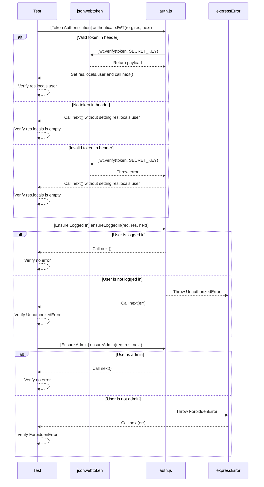
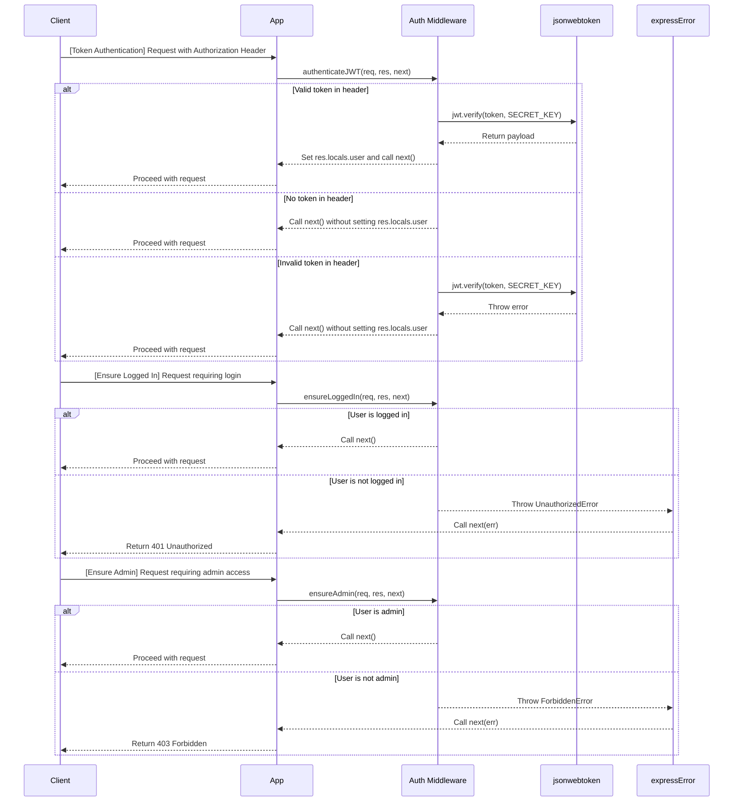

# `middleware` folder file notes/explanations/diagrams

## Table of Contents

- [middleware folder file notes/explanations/diagrams](#middleware-folder-file-notesexplanationsdiagrams)
  - [Tests](#tests)
  - [auth.test.js](#authtestjs)
    - [auth.test.js sequence diagram](#authtestjs-sequence-diagram)
    - [auth.test.js diagram explanation](#authtestjs-diagram-explanation)
    - [auth.test.js code overview](#authtestjs-code-overview)
  - [Scripts](#scripts)
  - [auth.js](#authjs)
    - [auth.js sequence diagram](#authjs-sequence-diagram)
    - [auth.js diagram explanation](#authjs-diagram-explanation)
    - [auth.js code overview](#authjs-code-overview)

### Tests
### auth.test.js

#### auth.test.js sequence diagram

[Back to TOC](#middleware-folder-file-notesexplanationsdiagrams)

#### auth.test.js diagram explanation

**Explanation of Each Step**
1. Token Authentication (`authenticateJWT`):
   - The test framework calls the `authenticateJWT` function with a request object (`req`), response object (`res`), and a `next` function.
   - If a valid token is provided in the request header:
     - The `authenticateJWT` function calls `jwt.verify` to verify the token using the `SECRET_KEY`.
     - The `jwt.verify` function returns the payload, which includes the `username` and `isAdmin` fields.
     - The `authenticateJWT` function sets `res.locals.user` with the payload and calls `next()`.
     - The test framework verifies that `res.locals.user` is set correctly.
   - If no token is provided in the request header:
     - The `authenticateJWT` function calls `next()` without setting `res.locals.user`.
     - The test framework verifies that `res.locals` is empty.
   - If an invalid token is provided in the request header:
     - The `authenticateJWT` function calls `jwt.verify` to verify the token using the `SECRET_KEY`.
     - The `jwt.verify` function throws an error.
     - The `authenticateJWT` function calls `next()` without setting `res.locals.user`.
     - The test framework verifies that `res.locals` is empty.

2. Ensure Logged In (`ensureLoggedIn`):
   - The test framework calls the `ensureLoggedIn` function with a request object (`req`), response object (`res`), and a `next` function.
   - If the user is logged in (i.e., `res.locals.user` is set):
     - The `ensureLoggedIn` function calls `next()`.
     - The test framework verifies that no error is thrown.
   - If the user is not logged in (i.e., `res.locals.user` is not set):
     - The `ensureLoggedIn` function throws an `UnauthorizedError`.
     - The `ensureLoggedIn` function calls `next(err)` with the `UnauthorizedError`.
     - The test framework verifies that an `UnauthorizedError` is thrown.

3. Ensure Admin (`ensureAdmin`):
  - The test framework calls the `ensureAdmin` function with a request object (`req`), response object (`res`), and a `next` function.
  - If the user is an admin (i.e., `res.locals.user.isAdmin` is `true`):
    - The `ensureAdmin` function calls `next()`.
    - The test framework verifies that no error is thrown.
  - If the user is not an admin (i.e., `res.locals.user.isAdmin` is `false` or `undefined`):
    - The `ensureAdmin` function throws a `ForbiddenError`.
    - The `ensureAdmin` function calls `next(err)` with the `ForbiddenError`.
    - The test framework verifies that a `ForbiddenError` is thrown.

[Back to TOC](#middleware-folder-file-notesexplanationsdiagrams)

#### auth.test.js code overview

This file contains tests for the authentication middleware functions using the jest testing framework.

1. Imports and Setup

- `jsonwebtoken`: Library for creating and verifying JWTs.
- `UnauthorizedError`: Custom error class for handling unauthorized access.
- `authenticateJWT`, `ensureLoggedIn`: Middleware functions to be tested.
- `SECRET_KEY`: Secret key used to sign the JWT, imported from the configuration file.
- `testJwt`: A valid JWT token for testing.
- `badJwt`: An invalid JWT token for testing.

```javascript
"use strict";

const jwt = require("jsonwebtoken");
const { UnauthorizedError } = require("../expressError");
const { authenticateJWT, ensureLoggedIn } = require("./auth");

const { SECRET_KEY } = require("../config");
const testJwt = jwt.sign({ username: "test", isAdmin: false }, SECRET_KEY);
const badJwt = jwt.sign({ username: "test", isAdmin: false }, "wrong");
```

2. Test Suite: `authenticateJWT`

- Test for Valid Token:
  - Verifies that a valid token in the header sets `res.locals.user` correctly.
- Test for No Header:
  - Verifies that no token in the header leaves `res.locals` empty.
- Test for Invalid Token:
  - Verifies that an invalid token in the header leaves `res.locals` empty.

```javascript
describe("authenticateJWT", function () {
  test("works: via header", function () {
    expect.assertions(2);
    const req = { headers: { authorization: `Bearer ${testJwt}` } };
    const res = { locals: {} };
    const next = function (err) {
      expect(err).toBeFalsy();
    };
    authenticateJWT(req, res, next);
    expect(res.locals).toEqual({
      user: {
        iat: expect.any(Number),
        username: "test",
        isAdmin: false,
      },
    });
  });

  test("works: no header", function () {
    expect.assertions(2);
    const req = {};
    const res = { locals: {} };
    const next = function (err) {
      expect(err).toBeFalsy();
    };
    authenticateJWT(req, res, next);
    expect(res.locals).toEqual({});
  });

  test("works: invalid token", function () {
    expect.assertions(2);
    const req = { headers: { authorization: `Bearer ${badJwt}` } };
    const res = { locals: {} };
    const next = function (err) {
      expect(err).toBeFalsy();
    };
    authenticateJWT(req, res, next);
    expect(res.locals).toEqual({});
  });
});
```

3. Test Suite: `ensureLoggedIn`

- Test for Logged-In User:
  - Verifies that a logged-in user (with `res.locals.user` set) proceeds without error.
- Test for Not Logged-In User:
  - Verifies that a user who is not logged in (without `res.locals.user` set) throws an `UnauthorizedError`.

```javascript
describe("ensureLoggedIn", function () {
  test("works", function () {
    expect.assertions(1);
    const req = {};
    const res = { locals: { user: { username: "test", is_admin: false } } };
    const next = function (err) {
      expect(err).toBeFalsy();
    };
    ensureLoggedIn(req, res, next);
  });

  test("unauth if no login", function () {
    expect.assertions(1);
    const req = {};
    const res = { locals: {} };
    const next = function (err) {
      expect(err instanceof UnauthorizedError).toBeTruthy();
    };
    ensureLoggedIn(req, res, next);
  });
});
```

4. Test Suite: `ensureAdmin`
The `ensureAdmin` middleware function is used to ensure that a user has admin privileges before allowing access to certain routes. It checks if the user is logged in and has the `isAdmin` flag set to `true`. If the user is not logged in or is not an admin, it throws a `ForbiddenError`.

- Test for Admin User:
  - Verifies that an admin user (with `res.locals.user.isAdmin` set to `true`) proceeds without error.
- Test for Non-Admin User:
  - Verifies that a non-admin user (with `res.locals.user.isAdmin` set to `false`) throws a `ForbiddenError`.
- Test for Not Logged-In User:
  - Verifies that a user who is not logged in (without `res.locals.user` set) throws a `ForbiddenError`.
```javascript
describe("ensureAdmin", function () {
  test("works for admin", function () {
    expect.assertions(1);
    const req = {};
    const res = { locals: { user: { username: "admin", isAdmin: true } } };
    const next = function (err) {
      expect(err).toBeFalsy();
    };
    ensureAdmin(req, res, next);
  });

  test("forbidden for non-admin", function () {
    expect.assertions(1);
    const req = {};
    const res = { locals: { user: { username: "test", isAdmin: false } } };
    const next = function (err) {
      expect(err instanceof ForbiddenError).toBeTruthy();
    };
    ensureAdmin(req, res, next);
  });

  test("forbidden if no login", function () {
    expect.assertions(1);
    const req = {};
    const res = { locals: {} };
    const next = function (err) {
      expect(err instanceof ForbiddenError).toBeTruthy();
    };
    ensureAdmin(req, res, next);
  });
});
```

1. Understanding `beforeEach` and `afterEach`
   In the provided test file, there are no `beforeEach` or `afterEach` hooks. However, these hooks are commonly used in other test files to manage database transactions or reset state.

- `beforeEach`: Runs a specific piece of code before each test case. This is useful for setting up a consistent state before each test.
- `afterEach`: Runs a specific piece of code after each test case. This is useful for cleaning up after each test to ensure tests do not affect each other.

5. Running Tests with Coverage and the `-i` Flag
To run the tests with coverage and ensure they run in order (in band), you can use the following command:

```javascript
jest --coverage -i
```

- `--coverage`: Generates a test coverage report, showing which parts of your code are covered by tests.
- `-i` (in band): Ensures that tests run sequentially rather than in parallel. This is useful when tests might interfere with each other if run simultaneously.

[Back to TOC](#middleware-folder-file-notesexplanationsdiagrams)

### Scripts
### auth.js

[Back to TOC](#middleware-folder-file-notesexplanationsdiagrams)

#### auth.js sequence diagram

[Back to TOC](#middleware-folder-file-notesexplanationsdiagrams)

#### auth.js diagram explanation
**Explanation of Each Step**

1. Token Authentication (`authenticateJWT`):

- The client sends a request to the application with an Authorization header.
- The Express application routes the request to the `authenticateJWT` middleware function.
- If a valid token is provided in the request header:
  - The `authenticateJWT` function calls `jwt.verify` to verify the token using the `SECRET_KEY`.
  - The `jwt.verify` function returns the payload, which includes the `username` and `isAdmin` fields.
  - The `authenticateJWT` function sets `res.locals.user` with the payload and calls `next()`.
  - The application proceeds with the request.
- If no token is provided in the request header:
  - The `authenticateJWT` function calls `next()` without setting `res.locals.user`.
  - The application proceeds with the request.
- If an invalid token is provided in the request header:
  - The `authenticateJWT` function calls `jwt.verify` to verify the token using the `SECRET_KEY`.
  - The `jwt.verify` function throws an error.
  - The `authenticateJWT` function calls `next()` without setting res.locals.user.
  - The application proceeds with the request.

2. Ensure Logged In (`ensureLoggedIn`):

- The client sends a request to the application that requires the user to be logged in.
- The Express application routes the request to the `ensureLoggedIn` middleware function.
- If the user is logged in (i.e., `res.locals.user` is set):
  - The `ensureLoggedIn` function calls `next()`.
  - The application proceeds with the request.
- If the user is not logged in (i.e., `res.locals.user` is not set):
  - The `ensureLoggedIn` function throws an `UnauthorizedError`.
  - The `ensureLoggedIn` function calls `next(err)` with the `UnauthorizedError`.
  - The application returns a 401 Unauthorized status to the client.

3. Ensure Admin (`ensureAdmin`):
- The client sends a request to the application that requires the user to be an admin.
- The Express application routes the request to the `ensureAdmin` middleware function.
- If the user is an admin (i.e., `res.locals.user.isAdmin` is `true`):
  - The `ensureAdmin` function calls `next()`.
  - The application proceeds with the request.
- If the user is not an admin (i.e., `res.locals.user.isAdmin` is `false` or `undefined`):
  - The `ensureAdmin` function throws a `ForbiddenError`.
  - The `ensureAdmin` function calls `next(err)` with the `ForbiddenError`.
  - The application returns a 403 Forbidden status to the client.

[Back to TOC](#middleware-folder-file-notesexplanationsdiagrams)

#### auth.js code overview

This file contains middleware functions for handling authentication and authorization in the Jobly application.

1. Imports and Setup:

- `jsonwebtoken`: Library for creating and verifying JSON Web Tokens (JWT).
- `SECRET_KEY`: Secret key used to sign the JWT, imported from the configuration file.
- `UnauthorizedError`: Custom error class for handling unauthorized access.

```javascript
"use strict";

const jwt = require("jsonwebtoken");
const { SECRET_KEY } = require("../config");
const { UnauthorizedError } = require("../expressError");
```

2. Middleware: authenticateJWT

- This middleware function checks if a JWT token is provided in the request headers.
- If a token is provided, it verifies the token and stores the payload (including `username` and `isAdmin` fields) in `res.locals.user`.
- If no token is provided or the token is invalid, it simply calls `next()` without setting `res.locals.user`.

```javascript
function authenticateJWT(req, res, next) {
  try {
    const authHeader = req.headers && req.headers.authorization;
    if (authHeader) {
      const token = authHeader.replace(/^[Bb]earer /, "").trim();
      res.locals.user = jwt.verify(token, SECRET_KEY);
    }
    return next();
  } catch (err) {
    return next();
  }
}
```

3. Middleware: `ensureLoggedIn`

- This middleware function checks if the user is logged in by verifying the presence of `res.locals.user`.
- If the user is not logged in, it throws an `UnauthorizedError`.
- If the user is logged in, it calls `next()` to proceed to the next middleware or route handler.

```javascript
function ensureLoggedIn(req, res, next) {
  try {
    if (!res.locals.user) throw new UnauthorizedError();
    return next();
  } catch (err) {
    return next(err);
  }
}
```

4. Middleware: `ensureAdmin`
- This middleware function checks if the user is an admin by verifying the `isAdmin` field in `res.locals.user`.
- If the user is not an admin, it throws a `ForbiddenError`.
- If the user is an admin, it calls `next()` to proceed to the next middleware or route handler.
```javascript
function ensureAdmin(req, res, next) {
  try {
    if (!res.locals.user || !res.locals.user.isAdmin) {
      throw new ForbiddenError();
    }
    return next();
  } catch (err) {
    return next(err);
  }
}
```


5. Export the Middleware Functions

```javascript
module.exports = {
  authenticateJWT,
  ensureLoggedIn,
};
```


[Back to TOC](#middleware-folder-file-notesexplanationsdiagrams)


