# `models` folder file notes/explanations/diagrams

## Table of Contents

- [`models` folder file notes/explanations/diagrams](#models-folder-file-notesexplanationsdiagrams)
  - [Table of Contents](#table-of-contents)
  - [Tests](#tests)
    - [`_testCommon.js`](#_testcommonjs)
      - [`\_testCommon.js` diagram](#_testcommonjs-diagram)
      - [Explanation of `_testCommon.js` Sequence Diagram](#explanation-of-_testcommonjs-sequence-diagram)
      - [`_testCommon.js` Code Overview](#_testcommonjs-code-overview)
    - [`company.test.js`](#companytestjs)
      - [company.test.js sequence diagram](#companytestjs-sequence-diagram)
      - [Explanation of `company.test.js` sequence diagram](#explanation-of-companytestjs-sequence-diagram)
        - [testing `create` method](#testing-create-method)
        - [testing `findAll` method](#testing-findall-method)
        - [testing `get` method](#testing-get-method)
        - [testing `update` method](#testing-update-method)
        - [testing `remove` method](#testing-remove-method)
      - [`company.test.js` Code Overview](#companytestjs-code-overview)
    - [`user.test.js`](#usertestjs)
      - [`user.test.js` Diagram](#usertestjs-diagram)
      - [Explanation of `user.test.js` sequence diagram](#explanation-of-usertestjs-sequence-diagram)
      - [`user.test.js` Code Overview](#usertestjs-code-overview)
    - [`job.test.js`](#jobtestjs)
      - [`job.test.js` Diagram](#jobtestjs-diagram)
      - [Explanation of `job.test.js` sequence diagram](#explanation-of-jobtestjs-sequence-diagram)
      - [`job.test.js` Code Overview](#jobtestjs-code-overview)
  - [Scripts](#scripts)
    - [`company.js`](#companyjs)
      - [`company.js` sequence diagram with explanation](#companyjs-sequence-diagram-with-explanation)
        - [`create` method diagram](#create-method-diagram)
        - [`findAll` method diagram](#findall-method-diagram)
        - [`get` method diagram](#get-method-diagram)
        - [`update` method diagram](#update-method-diagram)
        - [`remove` method diagram](#remove-method-diagram)
      - [Overview of `company.js`](#overview-of-companyjs)
    - [`user.js`](#userjs)
      - [`user.js` Explanation](#userjs-explanation)
      - [`user.js` Diagram](#userjs-diagram)
    - [`job.js`](#jobjs)
      - [`job.js` sequence diagram with explanation](#jobjs-sequence-diagram-with-explanation)
        - [`create` method diagram](#create-method-diagram-1)
        - [`findAll` method diagram](#findall-method-diagram-1)
        - [`get` method diagram](#get-method-diagram-1)
        - [`update` method diagram](#update-method-diagram-1)
        - [`remove` method diagram](#remove-method-diagram-1)
      - [Overview of `job.js`](#overview-of-jobjs)

## Tests
**NOTE WELL!!!**

If you want to test a specific file with coverage you can run the command: `jest models/job.test.js --coverage -i`

**Steps to Run the Specific Test File**
1. Open your terminal.
2. Navigate to your project directory if you are not already there.
3. Run the Jest command with the specific path to the `job.test.js` file:
```
jest models/job.test.js --coverage -i
```

**Explanation**
- `jest`: The command to run Jest.
- `job.test.js`: The path to the specific test file you want to run.
- `--coverage`: This flag generates a code coverage report.
- `-i`: This flag runs all tests serially in the current process, which is useful for debugging.

### `_testCommon.js`

This file contains common setup and teardown functions for tests. These functions help ensure that the database is in a consistent state before and after each test.

#### `\_testCommon.js` diagram

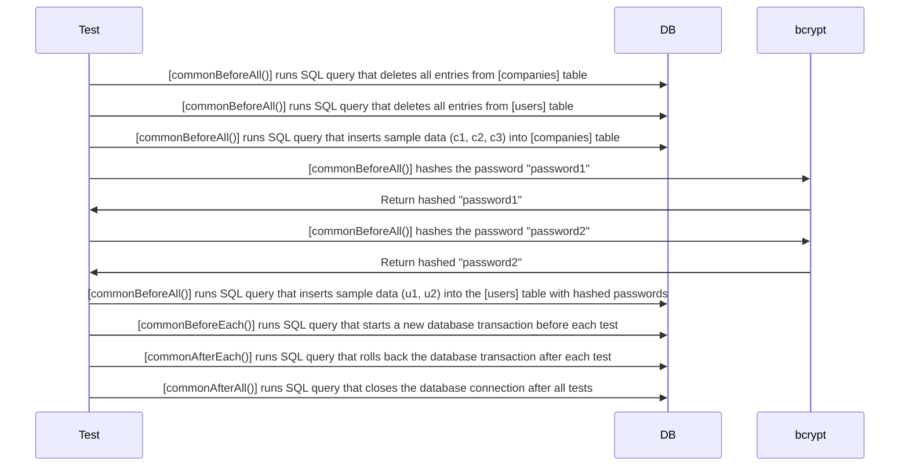

[Back to TOC](#models-folder-file-notesexplanationsdiagrams)

#### Explanation of `_testCommon.js` Sequence Diagram

The sequence diagram illustrates the order of operations that are tested in the `_testCommon.js`file. Here is a step-by-step explanation of what the diagram is illustrating:

1. **Test Setup `commonBeforeAll`**:

   - The test framework initiates the setup process by calling the `commonBeforeAll` function.
   - The `commonBeforeAll` function sends a query to the database (`DB`) to delete all records from the `companies` table.
   - The `commonBeforeAll` function sends another query to the database to delete all records from the `users` table.
   - The `commonBeforeAll` function sends a query to the database to insert sample data into the `companies` table (with handles `c1`, `c2`, and `c3`).
   - The `commonBeforeAll` function calls the `bcrypt` library to hash the password `password1`.
   - The `bcrypt` library returns the hashed password `password1` to the `commonBeforeAll` function.
   - The `commonBeforeAll` function calls the `bcrypt` library to hash the password `password2`.
   - The `bcrypt` library returns the hashed password `password2` to the `commonBeforeAll` function.
   - The `commonBeforeAll` function sends a query to the database to insert sample data into the `users` table (with usernames `u1` and `u2` and their respective hashed passwords).

2. **Test Initialization `commonBeforeEach`**:

   - Before each test, the test framework calls the `commonBeforeEach` function.
   - The `commonBeforeEach` function sends a query to the database to begin a new transaction.

3. **Test Cleanup `commonAfterEach`**:

   - After each test, the test framework calls the `commonAfterEach` function.
   - The `commonAfterEach` function sends a query to the database to roll back the transaction, ensuring that any changes made during the test are not saved.

4. **Test Teardown `commonAfterAll`**:
   - After all tests have run, the test framework calls the `commonAfterAll` function.
   - The `commonAfterAll` function sends a query to the database to end the connection.

This sequence diagram provides a visual representation of the order of operations that are tested in the `_testCommon.js` file, ensuring that the database is in a consistent state before and after each test.

[Back to TOC](#models-folder-file-notesexplanationsdiagrams)

#### `_testCommon.js` Code Overview

1. Imports and Setup

- `bcrypt`: Library for hashing passwords.
- `db`: Database connection.
- `BCRYPT_WORK_FACTOR`: Configuration for the bcrypt hashing algorithm.

```javascript
const bcrypt = require("bcrypt");
const db = require("../db.js");
const { BCRYPT_WORK_FACTOR } = require("../config");
```

2. Function: `commonBeforeAll`

This function runs once before all tests. It:

- Deletes all records from the `companies` and `users` tables.
- Inserts sample data into the `companies` table.
- Inserts sample data into the `users` table with hashed passwords.

```javascript
async function commonBeforeAll() {
  // noinspection SqlWithoutWhere
  await db.query("DELETE FROM companies");
  // noinspection SqlWithoutWhere
  await db.query("DELETE FROM users");

  await db.query(`
    INSERT INTO companies(handle, name, num_employees, description, logo_url)
    VALUES ('c1', 'C1', 1, 'Desc1', 'http://c1.img'),
           ('c2', 'C2', 2, 'Desc2', 'http://c2.img'),
           ('c3', 'C3', 3, 'Desc3', 'http://c3.img')`);

  await db.query(
    `
        INSERT INTO users(username,
                          password,
                          first_name,
                          last_name,
                          email)
        VALUES ('u1', $1, 'U1F', 'U1L', 'u1@email.com'),
               ('u2', $2, 'U2F', 'U2L', 'u2@email.com')
        RETURNING username`,
    [
      await bcrypt.hash("password1", BCRYPT_WORK_FACTOR),
      await bcrypt.hash("password2", BCRYPT_WORK_FACTOR),
    ]
  );
}
```

3. Function: `commonBeforeEach`
   This function runs before each test. It starts a new database transaction.

```javascript
async function commonBeforeEach() {
  await db.query("BEGIN");
}
```

4. Function: `commonAfterEach`
   This function runs after each test. It rolls back the database transaction, ensuring that any changes made during the test are not saved.

```javascript
async function commonAfterEach() {
  await db.query("ROLLBACK");
}
```

5. Function: `commonAfterAll`
   This function runs once after all tests. It closes the database connection.

```javascript
async function commonAfterAll() {
  await db.end();
}
```

6. Export the Functions:

```javascript
module.exports = {
  commonBeforeAll,
  commonBeforeEach,
  commonAfterEach,
  commonAfterAll,
};
```

7. Understanding `beforeEach` and `afterEach`
   In the context of testing, `beforeEach` and `afterEach` are hooks provided by testing frameworks like Jest to run code before and after each test case, respectively.

- `beforeEach`: Runs a specific piece of code before each test case. This is useful for setting up a consistent state before each test.
  - In this file, `commonBeforeEach` starts a new database transaction before each test.
    `afterEach`: Runs a specific piece of code after each test case. This is useful for cleaning up after each test to ensure tests do not affect each other.
  - In this file, `commonAfterEach` rolls back the database transaction after each test.

Running Tests with Coverage and the `-i` Flag
To run the tests with coverage and ensure they run in order (in band), you can use the following command:

```javascript
jest --coverage -i
```

- `--coverage`: Generates a test coverage report, showing which parts of your code are covered by tests.
- `-i` (in band): Ensures that tests run sequentially rather than in parallel. This is useful when tests might interfere with each other if run simultaneously.

[Back to TOC](#models-folder-file-notesexplanationsdiagrams)

### `company.test.js`

The `company.test.js` file contains tests for the `Company` class using the `jest` testing framework. The tests include `creating`, `finding`, `getting`, `updating`, and `deleting` companies.

#### company.test.js sequence diagram

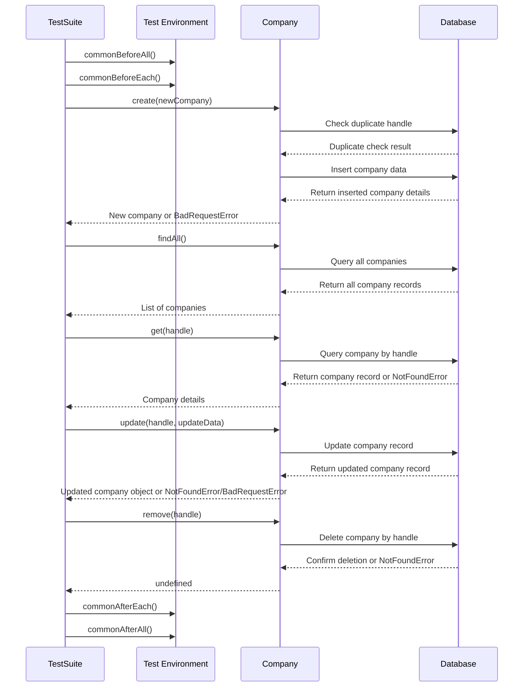
[Back to TOC](#models-folder-file-notesexplanationsdiagrams)

#### Explanation of `company.test.js` sequence diagram

##### testing `create` method

**Create a Company**:
- The test calls the `create` method with new company data.
- The `Company` class checks for duplicate companies in the database.
- If a duplicate is found, a `BadRequestError` is thrown.
- Otherwise, the new company is inserted into the database, and the new company data is returned to the test.

##### testing `findAll` method
**Find All Companies**:
- The test calls the `findAll` method.
- The `Company` class retrieves all companies from the database and returns them to the test.

##### testing `get` method
**Get a Company**:
- The test calls the `get` method with a company handle.
- The `Company` class retrieves the company data from the database.
- If the company is not found, a `NotFoundError` is thrown.
- Otherwise, the company data is returned to the test.

##### testing `update` method
**Update a Company**:
- The test calls the `update` method with a company handle and data.
- The `Company` class generates the SQL for a partial update and updates the company data in the database.
- If the company is not found, a `NotFoundError` is thrown.
- Otherwise, the updated company data is returned to the test.

##### testing `remove` method
**Remove a Company**:
- The test calls the `remove` method with a company handle.
- The `Company` class deletes the company from the database.
- If the company is not found, a `NotFoundError` is thrown.
- Otherwise, `undefined` is returned to the test.

[Back to TOC](#models-folder-file-notesexplanationsdiagrams)

#### `company.test.js` Code Overview

1. Imports and Setup

- `db`: Database connection.
- `BadRequestError`, `NotFoundError`: Custom error classes.
- `Company`: The Company class to be tested.
- `commonBeforeAll`, `commonBeforeEach`, `commonAfterEach`, `commonAfterAll`: Common setup and teardown functions.

```javascript
"use strict";

const db = require("../db.js");
const { BadRequestError, NotFoundError } = require("../expressError");
const Company = require("./company.js");
const {
  commonBeforeAll,
  commonBeforeEach,
  commonAfterEach,
  commonAfterAll,
} = require("./_testCommon");

beforeAll(commonBeforeAll);
beforeEach(commonBeforeEach);
afterEach(commonAfterEach);
afterAll(commonAfterAll);
```

2. Test Suite: `create`

- Test for Successful Creation:
  - Verifies that a new company can be created and retrieved from the database.
- Test for Duplicate Creation:
  - Verifies that creating a duplicate company throws a `BadRequestError`.

```javascript
describe("create", function () {
  const newCompany = {
    handle: "new",
    name: "New",
    description: "New Description",
    numEmployees: 1,
    logoUrl: "http://new.img",
  };

  test("works", async function () {
    let company = await Company.create(newCompany);
    expect(company).toEqual(newCompany);

    const result = await db.query(
      `SELECT handle, name, description, num_employees, logo_url
           FROM companies
           WHERE handle = 'new'`
    );
    expect(result.rows).toEqual([
      {
        handle: "new",
        name: "New",
        description: "New Description",
        num_employees: 1,
        logo_url: "http://new.img",
      },
    ]);
  });

  test("bad request with dupe", async function () {
    try {
      await Company.create(newCompany);
      await Company.create(newCompany);
      fail();
    } catch (err) {
      expect(err instanceof BadRequestError).toBeTruthy();
    }
  });
});
```

3. Test Suite: `findAll`

- Test for Retrieving All Companies
  - Verifies that all companies can be retrieved from the database.

```javascript
describe("findAll", function () {
  test("works: no filter", async function () {
    let companies = await Company.findAll();
    expect(companies).toEqual([
      {
        handle: "c1",
        name: "C1",
        description: "Desc1",
        numEmployees: 1,
        logoUrl: "http://c1.img",
      },
      {
        handle: "c2",
        name: "C2",
        description: "Desc2",
        numEmployees: 2,
        logoUrl: "http://c2.img",
      },
      {
        handle: "c3",
        name: "C3",
        description: "Desc3",
        numEmployees: 3,
        logoUrl: "http://c3.img",
      },
    ]);
  });
});
```

4. Test Suite: `get`

- Test for Retrieving a Company:
  - Verifies that a company can be retrieved by its handle.
- Test for Non-Existent Company:
  - Verifies that retrieving a non-existent company throws a `NotFoundError`.

```javascript
describe("get", function () {
  test("works", async function () {
    let company = await Company.get("c1");
    expect(company).toEqual({
      handle: "c1",
      name: "C1",
      description: "Desc1",
      numEmployees: 1,
      logoUrl: "http://c1.img",
    });
  });

  test("not found if no such company", async function () {
    try {
      await Company.get("nope");
      fail();
    } catch (err) {
      expect(err instanceof NotFoundError).toBeTruthy();
    }
  });
});
```

5. Test Suite: `update`
   - Test for Successful Update:
     - Verifies that a company's data can be updated.
   - Test for Update with Null Fields:
     - Verifies that a company's data can be updated with null fields.
   - Test for Non-Existent Company:
     - Verifies that updating a non-existent company throws a `NotFoundError`.
   - Test for Update with No Data:
     - Verifies that updating a company with no data throws a `BadRequestError`.

```javascript
describe("update", function () {
  const updateData = {
    name: "New",
    description: "New Description",
    numEmployees: 10,
    logoUrl: "http://new.img",
  };

  test("works", async function () {
    let company = await Company.update("c1", updateData);
    expect(company).toEqual({
      handle: "c1",
      ...updateData,
    });

    const result = await db.query(
      `SELECT handle, name, description, num_employees, logo_url
           FROM companies
           WHERE handle = 'c1'`
    );
    expect(result.rows).toEqual([
      {
        handle: "c1",
        name: "New",
        description: "New Description",
        num_employees: 10,
        logo_url: "http://new.img",
      },
    ]);
  });

  test("works: null fields", async function () {
    const updateDataSetNulls = {
      name: "New",
      description: "New Description",
      numEmployees: null,
      logoUrl: null,
    };

    let company = await Company.update("c1", updateDataSetNulls);
    expect(company).toEqual({
      handle: "c1",
      ...updateDataSetNulls,
    });

    const result = await db.query(
      `SELECT handle, name, description, num_employees, logo_url
           FROM companies
           WHERE handle = 'c1'`
    );
    expect(result.rows).toEqual([
      {
        handle: "c1",
        name: "New",
        description: "New Description",
        num_employees: null,
        logo_url: null,
      },
    ]);
  });

  test("not found if no such company", async function () {
    try {
      await Company.update("nope", updateData);
      fail();
    } catch (err) {
      expect(err instanceof NotFoundError).toBeTruthy();
    }
  });

  test("bad request with no data", async function () {
    try {
      await Company.update("c1", {});
      fail();
    } catch (err) {
      expect(err instanceof BadRequestError).toBeTruthy();
    }
  });
});
```

6. Test Suite: `remove`

- Test for Successful Removal:
  - Verifies that a company can be removed from the database.
- Test for Non-Existent Company:
  - Verifies that removing a non-existent company throws a `NotFoundError`.

```javascript
describe("remove", function () {
  test("works", async function () {
    await Company.remove("c1");
    const res = await db.query(
      "SELECT handle FROM companies WHERE handle='c1'"
    );
    expect(res.rows.length).toEqual(0);
  });

  test("not found if no such company", async function () {
    try {
      await Company.remove("nope");
      fail();
    } catch (err) {
      expect(err instanceof NotFoundError).toBeTruthy();
    }
  });
});
```

7. Understanding `beforeEach` and `afterEach`
   In the context of testing, `beforeEach` and `afterEach` are hooks provided by testing frameworks like Jest to run code before and after each test case, respectively.

- `beforeEach`: Runs a specific piece of code before each test case. This is useful for setting up a consistent state before each test.
  - In this file, `commonBeforeEach` starts a new database transaction before each test.
- `afterEach`: Runs a specific piece of code after each test case. This is useful for cleaning up after each test to ensure tests do not affect each other.
  - In this file, `commonAfterEach` rolls back the database transaction after each test.

8. Running Tests with Coverage and the `-i` Flag
   To run the tests with coverage and ensure they run in order (in band), you can use the following command:

- `--coverage`: Generates a test coverage report, showing which parts of your code are covered by tests.
- `-i` (in band): Ensures that tests run sequentially rather than in parallel. This is useful when tests might interfere with each other if run simultaneously.

```javascript
jest --coverage -i
```

[Back to TOC](#models-folder-file-notesexplanationsdiagrams)

### `user.test.js`

This sequence diagram illustrates the test flow in `user.test.js`. Each test setup interacts with the test environment (e.g., database setup/teardown) and executes specific User methods. The tests validate outcomes against expected results.

#### `user.test.js` Diagram

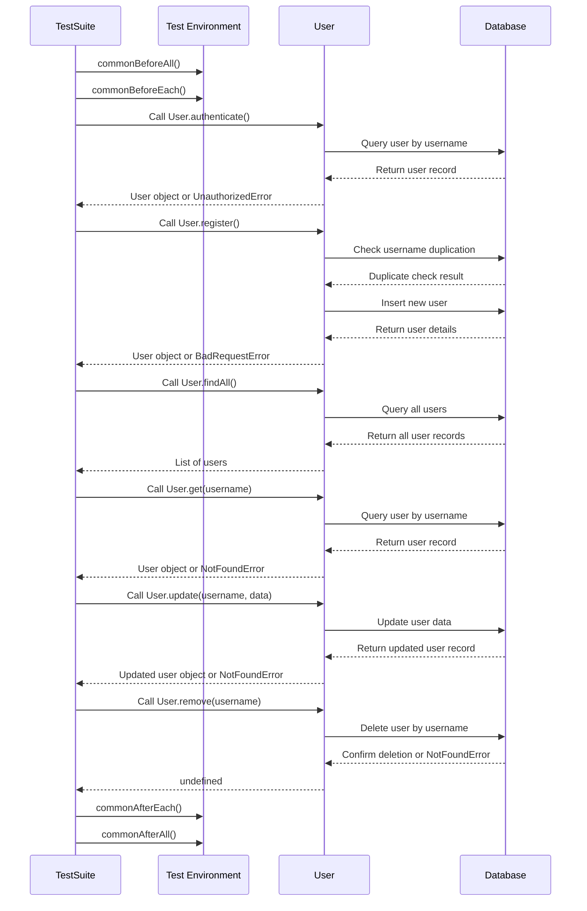

[Back to TOC](#models-folder-file-notesexplanationsdiagrams)

#### Explanation of `user.test.js` sequence diagram

**Participants**
1. TestSuite: The testing framework or suite that orchestrates and runs the test cases for the User class methods.
2. TestEnv (Test Environment): The setup and teardown utilities that manage the test environment, ensuring a clean state before and after tests are executed.
3. User: The User class containing the core functionality being tested (e.g., user authentication, registration, and data manipulation).
4. DB (Database): Represents the database where user data is stored, queried, and modified during the tests.

**Process Flow**
1. Test Environment Setup
   - TestSuite->>TestEnv: `commonBeforeAll()`
     - The `commonBeforeAll` function initializes the test environment. This includes setting up the database schema, loading initial data, and preparing any other prerequisites needed for the tests.
   - TestSuite->>TestEnv: `commonBeforeEach()`
     - The `commonBeforeEach` function resets the database or environment to a consistent state before each test case. This ensures that tests are independent and do not interfere with one another.

2. Testing User.authenticate()
   - TestSuite->>User: Call User.authenticate()
     - The test suite invokes the `User.authenticate` method with a username and password.
   - User->>DB: Query user by username
     - The `User.authenticate` method queries the database to find the user record matching the provided username.
   - DB-->>User: Return user record
     - The database returns the user record if the username exists.
   - User-->>TestSuite: User object or `UnauthorizedError`
     - If the password matches, the method returns a user object to the test suite. Otherwise, it raises an `UnauthorizedError`.

3. Testing User.register()
- TestSuite->>User: Call `User.register()`
  - The test suite calls the `User.register` method to add a new user to the database.
- User->>DB: Check username duplication
  - The `User.register` method queries the database to ensure that the username is not already in use.
- DB-->>User: Duplicate check result
  - The database responds with the result of the duplication check.
- User->>DB: Insert new user
  - If no duplication is found, the method inserts the new user into the database.
- DB-->>User: Return user details
  - The database returns the details of the newly created user.
- User-->>TestSuite: User object or `BadRequestError`
  - If successful, the method returns the new user object. If the username already exists, it raises a `BadRequestError`.

4. Testing User.findAll()
- TestSuite->>User: Call User.findAll()
  - The test suite invokes the `User.findAll` method to retrieve all users.
- User->>DB: Query all users
  - The method queries the database for all user records.
- DB-->>User: Return all user records
  - The database responds with a list of all user records.
- User-->>TestSuite: List of users
  - The method returns the list of users to the test suite.

5. Testing User.get(username)
- TestSuite->>User: Call User.get(username)
  - The test suite calls the `User.get` method with a username to retrieve a specific user's details.
- User->>DB: Query user by username
  - The method queries the database to find the user record by the provided username.
- DB-->>User: Return user record
  - If the username exists, the database returns the user record.
- User-->>TestSuite: User object or `NotFoundError`
  - If the user is found, the method returns the user object. Otherwise, it raises a `NotFoundError`.

6. Testing User.update(username, data)
- TestSuite->>User: Call User.update(username, data)
  - The test suite calls the User.update method with a username and updated data.
- User->>DB: Update user data
  - The method updates the user record in the database with the new data.
- DB-->>User: Return updated user record
  - The database returns the updated user record.
- User-->>TestSuite: Updated user object or NotFoundError
  - If successful, the method returns the updated user object. If the username does not exist, it raises a NotFoundError.

7. Testing User.remove(username)
- TestSuite->>User: Call User.remove(username)
  - The test suite invokes the User.remove method to delete a user by their username.
- User->>DB: Delete user by username
  - The method deletes the user record from the database.
- DB-->>User: Confirm deletion or NotFoundError
  - If the deletion is successful, the database confirms the action. If the username does not exist, it raises a NotFoundError.
- User-->>TestSuite: undefined
  - The method returns undefined to indicate successful deletion.

8. Test Environment Teardown
- TestSuite->>TestEnv: `commonAfterEach()`
  - The `commonAfterEach` function resets the test environment after each test case, ensuring no lingering effects.
- TestSuite->>TestEnv: `commonAfterAll()`
  - The `commonAfterAll` function performs final cleanup operations, such as closing database connections or deleting temporary files, after all test cases have been executed.

[Back to TOC](#models-folder-file-notesexplanationsdiagrams)

#### `user.test.js` Code Overview

1. Imports and Setup:
- `db`: Database connection.
- `NotFoundError`, `BadRequestError`, `UnauthorizedError`: Custom error classes.
- `User`: The `User` class to be tested.
- `commonBeforeAll`, `commonBeforeEach`, `commonAfterEach`, `commonAfterAll`: Common setup and teardown functions.
```javascript
"use strict";

const {
  NotFoundError,
  BadRequestError,
  UnauthorizedError,
} = require("../expressError");
const db = require("../db.js");
const User = require("./user.js");
const {
  commonBeforeAll,
  commonBeforeEach,
  commonAfterEach,
  commonAfterAll,
} = require("./_testCommon");

beforeAll(commonBeforeAll);
beforeEach(commonBeforeEach);
afterEach(commonAfterEach);
afterAll(commonAfterAll);
```

2. Test Suite: `authenticate`
- Test for Successful Authentication:
  - Verifies that a user can be authenticated with the correct username and password.
- Test for Non-Existent User:
  - Verifies that an `UnauthorizedError` is thrown if the user does not exist.
- Test for Incorrect Password:
  - Verifies that an `UnauthorizedError` is thrown if the password is incorrect.
```javascript
describe("authenticate", function () {
  test("works", async function () {
    const user = await User.authenticate("u1", "password1");
    expect(user).toEqual({
      username: "u1",
      firstName: "U1F",
      lastName: "U1L",
      email: "u1@email.com",
      isAdmin: false,
    });
  });

  test("unauth if no such user", async function () {
    try {
      await User.authenticate("nope", "password");
      fail();
    } catch (err) {
      expect(err instanceof UnauthorizedError).toBeTruthy();
    }
  });

  test("unauth if wrong password", async function () {
    try {
      await User.authenticate("u1", "wrong");
      fail();
    } catch (err) {
      expect(err instanceof UnauthorizedError).toBeTruthy();
    }
  });
});
```

3. Test Suite: `register`
- Test for Successful Registration:
  - Verifies that a new user can be registered and retrieved from the database.
- Test for Admin Registration:
  - Verifies that a new admin user can be registered and retrieved from the database.
- Test for Duplicate Registration:
  - Verifies that registering a duplicate user throws a `BadRequestError`.
```javascript
describe("register", function () {
  const newUser = {
    username: "new",
    firstName: "Test",
    lastName: "Tester",
    email: "test@test.com",
    isAdmin: false,
  };

  test("works", async function () {
    let user = await User.register({
      ...newUser,
      password: "password",
    });
    expect(user).toEqual(newUser);
    const found = await db.query("SELECT * FROM users WHERE username = 'new'");
    expect(found.rows.length).toEqual(1);
    expect(found.rows[0].is_admin).toEqual(false);
    expect(found.rows[0].password.startsWith("$2b$")).toEqual(true);
  });

  test("works: adds admin", async function () {
    let user = await User.register({
      ...newUser,
      password: "password",
      isAdmin: true,
    });
    expect(user).toEqual({ ...newUser, isAdmin: true });
    const found = await db.query("SELECT * FROM users WHERE username = 'new'");
    expect(found.rows.length).toEqual(1);
    expect(found.rows[0].is_admin).toEqual(true);
    expect(found.rows[0].password.startsWith("$2b$")).toEqual(true);
  });

  test("bad request with dup data", async function () {
    try {
      await User.register({
        ...newUser,
        password: "password",
      });
      await User.register({
        ...newUser,
        password: "password",
      });
      fail();
    } catch (err) {
      expect(err instanceof BadRequestError).toBeTruthy();
    }
  });
});
```

4. Test Suite: `findAll`
- Test for Retrieving All Users:
- Verifies that all users can be retrieved from the database.
```javascript
describe("findAll", function () {
  test("works", async function () {
    const users = await User.findAll();
    expect(users).toEqual([
      {
        username: "u1",
        firstName: "U1F",
        lastName: "U1L",
        email: "u1@email.com",
        isAdmin: false,
      },
      {
        username: "u2",
        firstName: "U2F",
        lastName: "U2L",
        email: "u2@email.com",
        isAdmin: false,
      },
    ]);
  });
});
```

5. Test Suite: `get`
   - Test for Retrieving a User:
     - Verifies that a user can be retrieved by their username.
   - Test for Non-Existent User:
     - Verifies that retrieving a non-existent user throws a NotFoundError.
```javascript
describe("get", function () {
  test("works", async function () {
    let user = await User.get("u1");
    expect(user).toEqual({
      username: "u1",
      firstName: "U1F",
      lastName: "U1L",
      email: "u1@email.com",
      isAdmin: false,
    });
  });

  test("not found if no such user", async function () {
    try {
      await User.get("nope");
      fail();
    } catch (err) {
      expect(err instanceof NotFoundError).toBeTruthy();
    }
  });
});
```

6. Test Suite: `update`
- Test for Successful Update:
  - Verifies that a user's data can be updated.
- Test for Updating Password:
  - Verifies that a user's password can be updated.
- Test for Non-Existent User:
  - Verifies that updating a non-existent user throws a `NotFoundError`.
- Test for Update with No Data:
  - Verifies that updating a user with no data throws a `BadRequestError`.
```javascript
describe("update", function () {
  const updateData = {
    firstName: "NewF",
    lastName: "NewF",
    email: "new@email.com",
    isAdmin: true,
  };

  test("works", async function () {
    let job = await User.update("u1", updateData);
    expect(job).toEqual({
      username: "u1",
      ...updateData,
    });
  });

  test("works: set password", async function () {
    let job = await User.update("u1", {
      password: "new",
    });
    expect(job).toEqual({
      username: "u1",
      firstName: "U1F",
      lastName: "U1L",
      email: "u1@email.com",
      isAdmin: false,
    });
    const found = await db.query("SELECT * FROM users WHERE username = 'u1'");
    expect(found.rows.length).toEqual(1);
    expect(found.rows[0].password.startsWith("$2b$")).toEqual(true);
  });

  test("not found if no such user", async function () {
    try {
      await User.update("nope", {
        firstName: "test",
      });
      fail();
    } catch (err) {
      expect(err instanceof NotFoundError).toBeTruthy();
    }
  });

  test("bad request if no data", async function () {
    expect.assertions(1);
    try {
      await User.update("c1", {});
      fail();
    } catch (err) {
      expect(err instanceof BadRequestError).toBeTruthy();
    }
  });
});
```

7. Test Suite: `remove`
- Test for Successful Removal:
  - Verifies that a user can be removed from the database.
- Test for Non-Existent User:
  - Verifies that removing a non-existent user throws a `NotFoundError`.
```javascript
describe("remove", function () {
  test("works", async function () {
    await User.remove("u1");
    const res = await db.query(
        "SELECT * FROM users WHERE username='u1'");
    expect(res.rows.length).toEqual(0);
  });

  test("not found if no such user", async function () {
    try {
      await User.remove("nope");
      fail();
    } catch (err) {
      expect(err instanceof NotFoundError).toBeTruthy();
    }
  });
});
```

8. Understanding `beforeEach` and `afterEach`
In the context of testing, `beforeEach` and `afterEach` are hooks provided by testing frameworks like Jest to run code before and after each test case, respectively.

- `beforeEach`: Runs a specific piece of code before each test case. This is useful for setting up a consistent state before each test.
  - In this file, `commonBeforeEach` starts a new database transaction before each test.
- `afterEach`: Runs a specific piece of code after each test case. This is useful for cleaning up after each test to ensure tests do not affect each other.
  - In this file, `commonAfterEach` rolls back the database transaction after each test.

9. Running Tests with Coverage and the `-i` Flag
To run the tests with coverage and ensure they run in order (in band), you can use the following command:
```javascript
jest --coverage -i
```
- `--coverage`: Generates a test coverage report, showing which parts of your code are covered by tests.
- `-i` (in band): Ensures that tests run sequentially rather than in parallel. This is useful when tests might interfere with each other if run simultaneously.

[Back to TOC](#models-folder-file-notesexplanationsdiagrams)

### `job.test.js`

This file contains tests for the `Job` class in the application.  The purpose of these tests is to ensure that the `Job` class methods (`create`, `findAll`, `get`, `update`, and `remove`) function correctly and handle various scenarios, such as creating a job, retrieving jobs with filters, updating job details, and deleting a job.  The tests validate the outcomes against expected results to ensure the integrity and reliability of the `Job ` class methods.

#### `job.test.js` Diagram

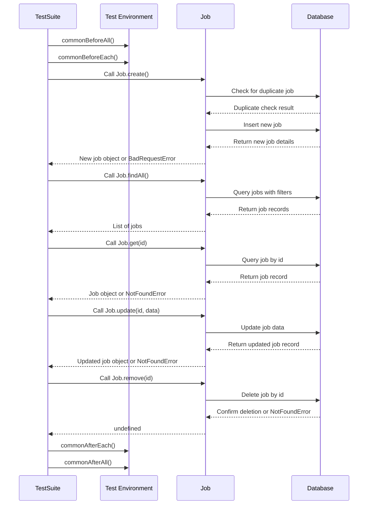

[Back to TOC](#models-folder-file-notesexplanationsdiagrams)

#### Explanation of `job.test.js` sequence diagram

**Participants**

1. TestSuite: The testing framework or suite that orchestrates and runs the test cases for the Job class methods.
2. TestEnv (Test Environment): The setup and teardown utilities that manage the test environment, ensuring a clean state before and after tests are executed.
3. Job: The Job class containing the core functionality being tested (e.g., job creation, retrieval, update, and deletion).
4. DB (Database): Represents the database where job data is stored, queried, and modified during the tests.

**Process Flow**
1. Test Environment Setup
   - TestSuite->>TestEnv: `commonBeforeAll()`
     - The `commonBeforeAll` function initializes the test environment. This includes setting up the database schema, loading initial data, and preparing any other prerequisites needed for the tests.
   - TestSuite->>TestEnv: `commonBeforeEach()`
     - The `commonBeforeEach` function resets the database or environment to a consistent state before each test case. This ensures that tests are independent and do not interfere with one another.

2. Testing Job.create()
   - TestSuite->>Job: Call Job.create()
     - The test suite invokes the `Job.create` method with job details.
   - Job->>DB: Check for duplicate job
     - The `Job.create` method queries the database to check for duplicate job entries.
   - DB-->>Job: Duplicate check result
     - The database returns the result of the duplicate check.
   - Job->>DB: Insert new job
     - If no duplicate is found, the method inserts the new job into the database.
   - DB-->>Job: Return job details
     - The database returns the details of the newly created job.
   - Job-->>TestSuite: Job object or `BadRequestError`
     - If successful, the method returns the new job object. If a duplicate is found, it raises a `BadRequestError`.

3. Testing Job.findAll()
   - TestSuite->>Job: Call Job.findAll()
     - The test suite invokes the `Job.findAll` method to retrieve all jobs with optional filters.
   - Job->>DB: Query all jobs with filters
     - The method queries the database for all job records that match the provided filters.
   - DB-->>Job: Return all job records
     - The database responds with a list of all job records that match the filters.
   - Job-->>TestSuite: List of jobs
     - The method returns the list of jobs to the test suite.

4. Testing Job.get(id)
   - TestSuite->>Job: Call Job.get(id)
     - The test suite calls the `Job.get` method with a job ID to retrieve a specific job's details.
   - Job->>DB: Query job by id
     - The method queries the database to find the job record by the provided ID.
   - DB-->>Job: Return job record
     - If the job ID exists, the database returns the job record.
   - Job-->>TestSuite: Job object or `NotFoundError`
     - If the job is found, the method returns the job object. Otherwise, it raises a `NotFoundError`.

5. Testing Job.update(id, data)
   - TestSuite->>Job: Call Job.update(id, data)
     - The test suite calls the `Job.update` method with a job ID and updated data.
   - Job->>DB: Update job data
     - The method updates the job record in the database with the new data.
   - DB-->>Job: Return updated job record
     - The database returns the updated job record.
   - Job-->>TestSuite: Updated job object or `NotFoundError`
     - If successful, the method returns the updated job object. If the job ID does not exist, it raises a `NotFoundError`.

6. Testing Job.remove(id)
   - TestSuite->>Job: Call Job.remove(id)
     - The test suite invokes the `Job.remove` method to delete a job by its ID.
   - Job->>DB: Delete job by id
     - The method deletes the job record from the database.
   - DB-->>Job: Confirm deletion or `NotFoundError`
     - If the deletion is successful, the database confirms the action. If the job ID does not exist, it raises a `NotFoundError`.
   - Job-->>TestSuite: undefined
     - The method returns undefined to indicate successful deletion.

7. Test Environment Teardown
   - TestSuite->>TestEnv: `commonAfterEach()`
     - The `commonAfterEach` function resets the test environment after each test case, ensuring no lingering effects.
   - TestSuite->>TestEnv: `commonAfterAll()`
     - The `commonAfterAll` function performs final cleanup operations, such as closing database connections or deleting temporary files, after all test cases have been executed.

[Back to TOC](#models-folder-file-notesexplanationsdiagrams)

#### `job.test.js` Code Overview

1. Imports and Setup:
- `db`: Database connection.
- `NotFoundError`, `BadRequestError`: Custom error classes.
- `Job`: The `Job` class to be tested.
- `commonBeforeAll`, `commonBeforeEach`, `commonAfterEach`, `commonAfterAll`: Common setup and teardown functions.
```javascript
"use strict";

const db = require("../db.js");
const { BadRequestError, NotFoundError } = require("../expressError");
const Job = require("./job.js");
const {
    commonBeforeAll,
    commonBeforeEach,
    commonAfterEach,
    commonAfterAll,
} = require("./_testCommon");

beforeAll(commonBeforeAll);
beforeEach(commonBeforeEach);
afterEach(commonAfterEach);
afterAll(commonAfterAll);
```

2. Test Suite: `create`
- Test for Successful Job Creation:
  - Verifies that a new job can be created and retrieved from the database.
- Test for Duplicate Job Creation:
  - Verifies that creating a duplicate job throws a `BadRequestError`.
```javascript
describe("create", function () {
    const newJob = {
        title: "New Job",
        salary: 100000,
        equity: 0.1,
        companyHandle: "c1",
    };

    test("works", async function () {
        let job = await Job.create(newJob);
        expect(job).toEqual({
            id: expect.any(Number),
            title: "New Job",
            salary: 100000,
            equity: "0.1",
            companyHandle: "c1",
        });

        const result = await db.query(
            `SELECT id, title, salary, equity, company_handle
           FROM jobs
           WHERE title = 'New Job'`);
        expect(result.rows).toEqual([
            {
                id: expect.any(Number),
                title: "New Job",
                salary: 100000,
                equity: "0.1",
                company_handle: "c1",
            },
        ]);
    });

    test("bad request with dupe", async function () {
        try {
            await Job.create(newJob);
            await Job.create(newJob);
            fail();
        } catch (err) {
            expect(err instanceof BadRequestError).toBeTruthy();
        }
    });
});
```

3. Test Suite: `findAll`
- Test for Retrieving All Jobs:
  - Verifies that all jobs can be retrieved from the database.
- Test for Retrieving Jobs with Minimum Salary Filter:
  - Verifies that jobs can be retrieved with a minimum salary filter.
- Test for Retrieving Jobs with Equity Filter:
  - Verifies that jobs can be retrieved with an equity filter.
- Test for Retrieving Jobs with Title Filter:
  - Verifies that jobs can be retrieved with a title filter.
- Test for Retrieving Jobs with Multiple Filters:
  - Verifies that jobs can be retrieved with multiple filters.
- Test for No Matching Jobs:
  - Verifies that an empty array is returned if no jobs match the filters.
```javascript
describe("findAll", function () {
    test("works: no filter", async function () {
        let jobs = await Job.findAll();
        expect(jobs).toEqual([
            {
                id: 1001,
                title: "Job1",
                salary: 50000,
                equity: "0.05",
                companyHandle: "c1",
            },
            {
                id: 1002,
                title: "Job2",
                salary: 60000,
                equity: "0",
                companyHandle: "c2",
            },
            {
                id: 1003,
                title: "Job3",
                salary: 70000,
                equity: "0.1",
                companyHandle: "c3",
            },
        ]);
    });

    test("works: minSalary filter", async function () {
        let jobs = await Job.findAll({ minSalary: 60000 });
        expect(jobs).toEqual([
            {
                id: 1002,
                title: "Job2",
                salary: 60000,
                equity: "0",
                companyHandle: "c2",
            },
            {
                id: 1003,
                title: "Job3",
                salary: 70000,
                equity: "0.1",
                companyHandle: "c3",
            },
        ]);
    });

    test("works: hasEquity filter", async function () {
        let jobs = await Job.findAll({ hasEquity: true });
        expect(jobs).toEqual([
            {
                id: 1001,
                title: "Job1",
                salary: 50000,
                equity: "0.05",
                companyHandle: "c1",
            },
            {
                id: 1003,
                title: "Job3",
                salary: 70000,
                equity: "0.1",
                companyHandle: "c3",
            },
        ]);
    });

    test("works: titleLike filter", async function () {
        let jobs = await Job.findAll({ titleLike: "Job" });
        expect(jobs).toEqual([
            {
                id: 1001,
                title: "Job1",
                salary: 50000,
                equity: "0.05",
                companyHandle: "c1",
            },
            {
                id: 1002,
                title: "Job2",
                salary: 60000,
                equity: "0",
                companyHandle: "c2",
            },
            {
                id: 1003,
                title: "Job3",
                salary: 70000,
                equity: "0.1",
                companyHandle: "c3",
            },
        ]);
    });

    test("works: multiple filters", async function () {
        let jobs = await Job.findAll({ minSalary: 60000, hasEquity: true, titleLike: "Job" });
        expect(jobs).toEqual([
            {
                id: 1003,
                title: "Job3",
                salary: 70000,
                equity: "0.1",
                companyHandle: "c3",
            },
        ]);
    });

    test("returns empty if no match", async function () {
        let jobs = await Job.findAll({ minSalary: 100000 });
        expect(jobs).toEqual([]);
    });
});
```

4. Test Suite: `get`
   - Test for Retrieving a Job:
     - Verifies that a job can be retrieved by its ID.
   - Test for Non-Existent Job:
     - Verifies that retrieving a non-existent job throws a `NotFoundError`.
```javascript
describe("get", function () {
    test("works", async function () {
        let job = await Job.get(1001);
        expect(job).toEqual({
            id: 1001,
            title: "Job1",
            salary: 50000,
            equity: "0.05",
            companyHandle: "c1",
        });
    });

    test("not found if no such job", async function () {
        try {
            await Job.get(9999);
            fail();
        } catch (err) {
            expect(err instanceof NotFoundError).toBeTruthy();
        }
    });
});
```

5. Test Suite: `update`
- Test for Successful Update:
  - Verifies that a job's data can be updated.
- Test for Updating with Null Fields:
  - Verifies that a job's data can be updated with null fields.
- Test for Non-Existent Job:
  - Verifies that updating a non-existent job throws a `NotFoundError`.
- Test for Update with No Data:
  - Verifies that updating a job with no data throws a `BadRequestError`.
```javascript
describe("update", function () {
    const updateData = {
        title: "Updated Job",
        salary: 80000,
        equity: 0.2,
    };

    test("works", async function () {
        let job = await Job.update(1001, updateData);
        expect(job).toEqual({
            id: 1001,
            title: "Updated Job",
            salary: 80000,
            equity: "0.2",
            companyHandle: "c1",
        });

        const result = await db.query(
            `SELECT id, title, salary, equity, company_handle
           FROM jobs
           WHERE id = 1001`);
        expect(result.rows).toEqual([{
            id: 1001,
            title: "Updated Job",
            salary: 80000,
            equity: "0.2",
            company_handle: "c1",
        }]);
    });

    test("works: null fields", async function () {
        const updateDataSetNulls = {
            title: "Updated Job",
            salary: null,
            equity: null,
        };

        let job = await Job.update(1001, updateDataSetNulls);
        expect(job).toEqual({
            id: 1001,
            title: "Updated Job",
            salary: null,
            equity: null,
            companyHandle: "c1",
        });

        const result = await db.query(
            `SELECT id, title, salary, equity, company_handle
           FROM jobs
           WHERE id = 1001`);
        expect(result.rows).toEqual([{
            id: 1001,
            title: "Updated Job",
            salary: null,
            equity: null,
            company_handle: "c1",
        }]);
    });

    test("not found if no such job", async function () {
        try {
            await Job.update(9999, updateData);
            fail();
        } catch (err) {
            expect(err instanceof NotFoundError).toBeTruthy();
        }
    });

    test("bad request with no data", async function () {
        try {
            await Job.update(1001, {});
            fail();
        } catch (err) {
            expect(err instanceof BadRequestError).toBeTruthy();
        }
    });
});
```

6. Test Suite: `remove`
- Test for Successful Removal:
  - Verifies that a job can be removed from the database.
- Test for Non-Existent Job:
  - Verifies that removing a non-existent job throws a `NotFoundError`.
```javascript
describe("remove", function () {
    test("works", async function () {
        await Job.remove(1001);
        const res = await db.query(
            "SELECT id FROM jobs WHERE id=1001");
        expect(res.rows.length).toEqual(0);
    });

    test("not found if no such job", async function () {
        try {
            await Job.remove(9999);
            fail();
        } catch (err) {
            expect(err instanceof NotFoundError).toBeTruthy();
        }
    });
});
```

7. Understanding `beforeEach` and `afterEach`
In the context of testing, `beforeEach` and `afterEach` are hooks provided by testing frameworks like Jest to run code before and after each test case, respectively.

- `beforeEach`: Runs a specific piece of code before each test case. This is useful for setting up a consistent state before each test.
  - In this file, `commonBeforeEach` starts a new database transaction before each test.
- `afterEach`: Runs a specific piece of code after each test case. This is useful for cleaning up after each test to ensure tests do not affect each other.
  - In this file, `commonAfterEach` rolls back the database transaction after each test.

8. Running Tests with Coverage and the `-i` Flag
To run the tests with coverage and ensure they run in order (in band), you can use the following command:
```javascript
jest --coverage -i
```
- `--coverage`: Generates a test coverage report, showing which parts of your code are covered by tests.
- `-i` (in band): Ensures that tests run sequentially rather than in parallel. This is useful when tests might interfere with each other if run simultaneously.

[Back to TOC](#models-folder-file-notesexplanationsdiagrams)

## Scripts

### `company.js`

The `company.js` file contains the `Company` class, which provides methods for interacting with the companies table in the database. The methods include `creating`, `finding`, `getting`, `updating`, and `deleting` companies.

[Back to TOC](#models-folder-file-notesexplanationsdiagrams)

#### `company.js` sequence diagram with explanation

##### `create` method diagram

**Create a Company**:

- The client calls the `create` method with company data.
- The `Company` class checks for duplicate companies in the database.
- If a duplicate is found, a `BadRequestError` is thrown.
- Otherwise, the new company is inserted into the database, and the new company data is returned to the client.

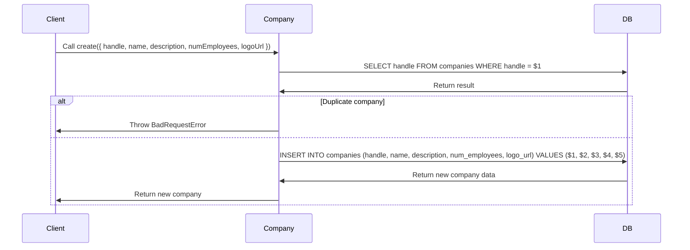

[Back to TOC](#models-folder-file-notesexplanationsdiagrams)

##### `findAll` method diagram

**Find All Companies**:

- The client calls the `findAll` method.
- The `Company` class retrieves all companies from the database and returns them to the client.

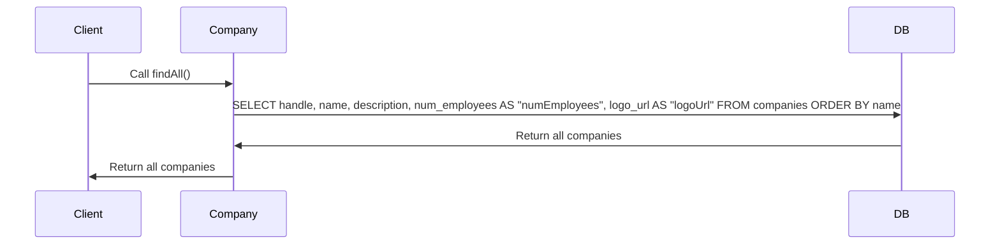

[Back to TOC](#models-folder-file-notesexplanationsdiagrams)

##### `get` method diagram

**Find All Companies**:

- The client calls the `get` method.
- The `Company` class retrieves all companies from the database and returns them to the client.

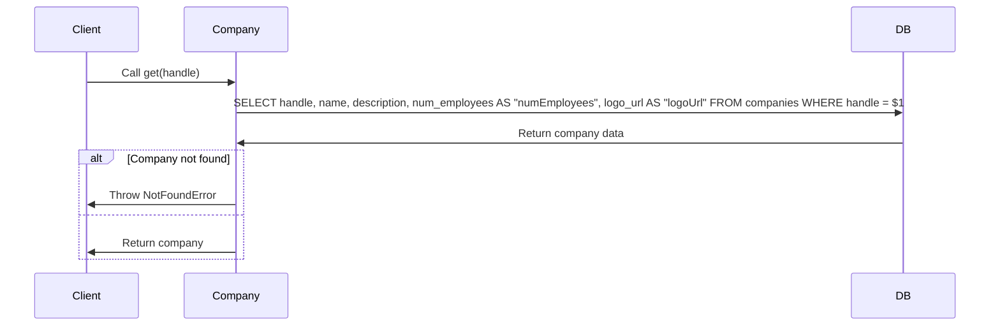

[Back to TOC](#models-folder-file-notesexplanationsdiagrams)

##### `update` method diagram

**Update a Company**:

- The client calls the `update` method with a company handle and data.
- The `Company` class generates the SQL for a partial update and updates the company data in the database.
- If the company is not found, a `NotFoundError` is thrown.
- Otherwise, the updated company data is returned to the client.

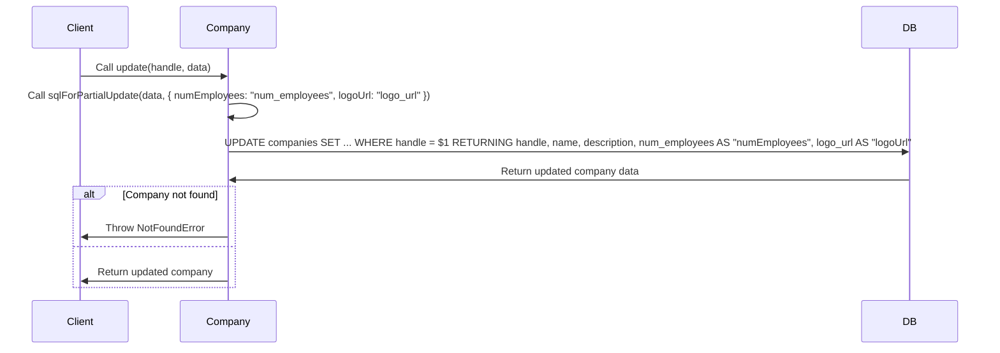

[Back to TOC](#models-folder-file-notesexplanationsdiagrams)

##### `remove` method diagram

**Remove a Company**:

- The client calls the `remove` method with a company handle.
- The `Company` class deletes the company from the database.
- If the company is not found, a `NotFoundError` is thrown.
- Otherwise, `undefined` is returned to the client.

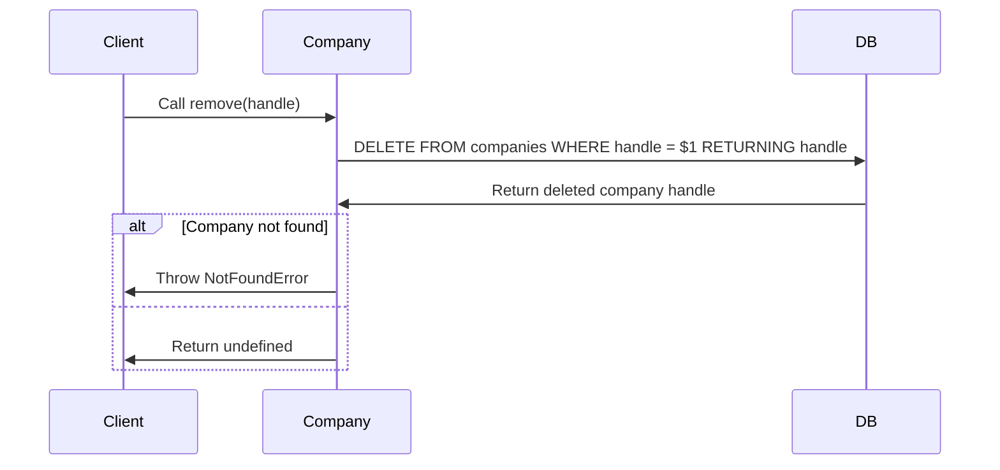

[Back to TOC](#models-folder-file-notesexplanationsdiagrams)

#### Overview of `company.js`

1. Imports and Setup:

- `db`: Database connection.
- `BadRequestError`, `NotFoundError`: Custom error classes.
- `sqlForPartialUpdate`: Helper function for generating SQL for partial updates.

```javascript
"use strict";

const db = require("../db");
const { BadRequestError, NotFoundError } = require("../expressError");
const { sqlForPartialUpdate } = require("../helpers/sql");
```

2. Class: `Company`
   - Method: `create`
     - Creates a new company in the database.
     - Throws `BadRequestError` if the company already exists.

```javascript
static async create({ handle, name, description, numEmployees, logoUrl }) {
  const duplicateCheck = await db.query(
        `SELECT handle
         FROM companies
         WHERE handle = $1`,
      [handle]);

  if (duplicateCheck.rows[0])
    throw new BadRequestError(`Duplicate company: ${handle}`);

  const result = await db.query(
        `INSERT INTO companies
         (handle, name, description, num_employees, logo_url)
         VALUES ($1, $2, $3, $4, $5)
         RETURNING handle, name, description, num_employees AS "numEmployees", logo_url AS "logoUrl"`,
      [
        handle,
        name,
        description,
        numEmployees,
        logoUrl,
      ],
  );
  const company = result.rows[0];

  return company;
}
```

2. Class: `Company`
   - Method: `findAll`
     - Retrieves all companies from the database.

```javascript
static async findAll() {
  const companiesRes = await db.query(
        `SELECT handle,
                name,
                description,
                num_employees AS "numEmployees",
                logo_url AS "logoUrl"
         FROM companies
         ORDER BY name`);
  return companiesRes.rows;
}
```

2. Class: `Company`
   - Method: `get`
     - Retrieves a company by its handle.
     - Throws `NotFoundError` if the company does not exist.

```javascript
static async get(handle) {
  const companyRes = await db.query(
        `SELECT handle,
                name,
                description,
                num_employees AS "numEmployees",
                logo_url AS "logoUrl"
         FROM companies
         WHERE handle = $1`,
      [handle]);

  const company = companyRes.rows[0];

  if (!company) throw new NotFoundError(`No company: ${handle}`);

  return company;
}
```

2. Class: `Company`
   - Method: `get`
     - Updates a company's data.
     - Throws `NotFoundError` if the company does not exist.

```javascript
static async update(handle, data) {
  const { setCols, values } = sqlForPartialUpdate(
      data,
      {
        numEmployees: "num_employees",
        logoUrl: "logo_url",
      });
  const handleVarIdx = "$" + (values.length + 1);

  const querySql = `UPDATE companies
                    SET ${setCols}
                    WHERE handle = ${handleVarIdx}
                    RETURNING handle,
                              name,
                              description,
                              num_employees AS "numEmployees",
                              logo_url AS "logoUrl"`;
  const result = await db.query(querySql, [...values, handle]);
  const company = result.rows[0];

  if (!company) throw new NotFoundError(`No company: ${handle}`);

  return company;
}
```

2. Class: `Company`
   - Method: `remove`
     - Deletes a company from the database.
     - Throws `NotFoundError` if the company does not exist.

```javascript
static async remove(handle) {
  const result = await db.query(
        `DELETE
         FROM companies
         WHERE handle = $1
         RETURNING handle`,
      [handle]);
  const company = result.rows[0];

  if (!company) throw new NotFoundError(`No company: ${handle}`);
}
```

3. Export the Class

```javascript
module.exports = Company;
```

[Back to TOC](#models-folder-file-notesexplanationsdiagrams)

### `user.js`

This file contains the `User` class, which provides methods for interacting with the `users` table in the database.

#### `user.js` Explanation

This sequence diagram shows how the User class functions are executed and interact with external dependencies (e.g., db, bcrypt, and helper utilities). Each function represents a specific user-related operation, like authentication, registration, or updating user details.

[Back to TOC](#models-folder-file-notesexplanationsdiagrams)

#### `user.js` Diagram

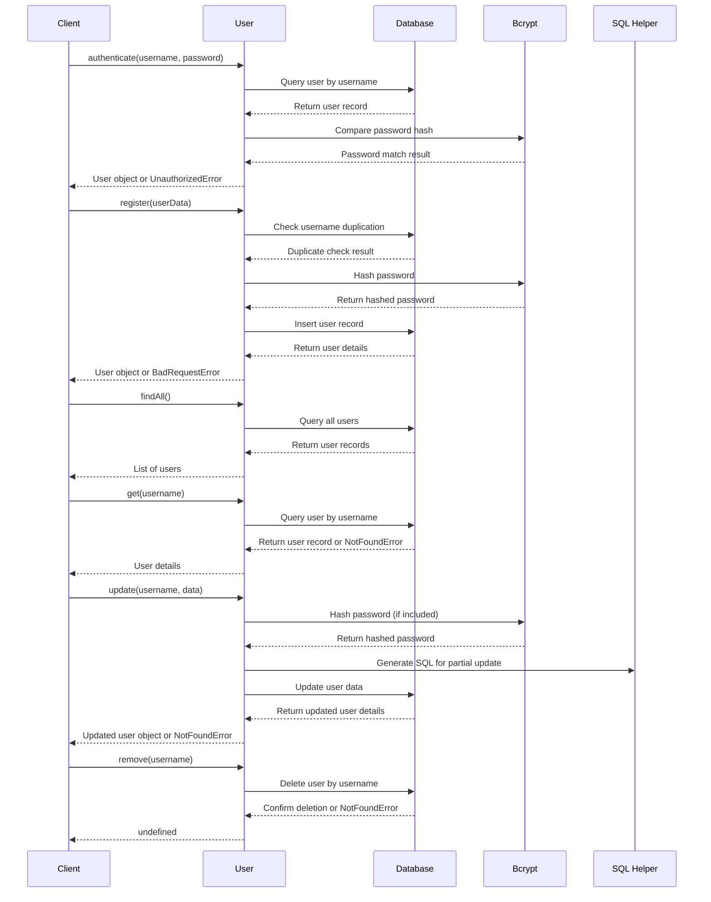

[Back to TOC](#models-folder-file-notesexplanationsdiagrams)

### `job.js`

The `job.js` file contains the `Job` class, which provides methods for interacting with the jobs table in the database. The methods include `creating`, `finding`, `getting`, `updating`, and `deleting` jobs.

#### `job.js` sequence diagram with explanation

##### `create` method diagram

Create a Job:

- The client calls the `create` method with job data.
- The `Job` class checks for duplicate jobs in the database.
- If a duplicate is found, a `BadRequestError` is thrown.
- Otherwise, the new job is inserted into the database, and the new job data is returned to the client.

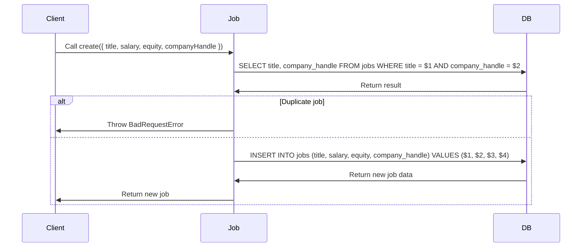

[Back to TOC](#models-folder-file-notesexplanationsdiagrams)

##### `findAll` method diagram

Find All Jobs:

- The client calls the `findAll` method with optional filters.
- The `Job` class retrieves all jobs from the database that match the filters and returns them to the client.
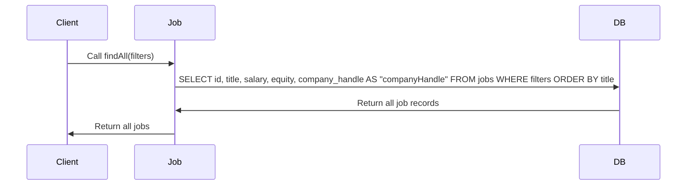

[Back to TOC](#models-folder-file-notesexplanationsdiagrams)

##### `get` method diagram

Get a Job:

- The client calls the `get` method with a job ID.
- The `Job` class retrieves the job data from the database.
- If the job is not found, a `NotFoundError` is thrown.
- Otherwise, the job data is returned to the client.
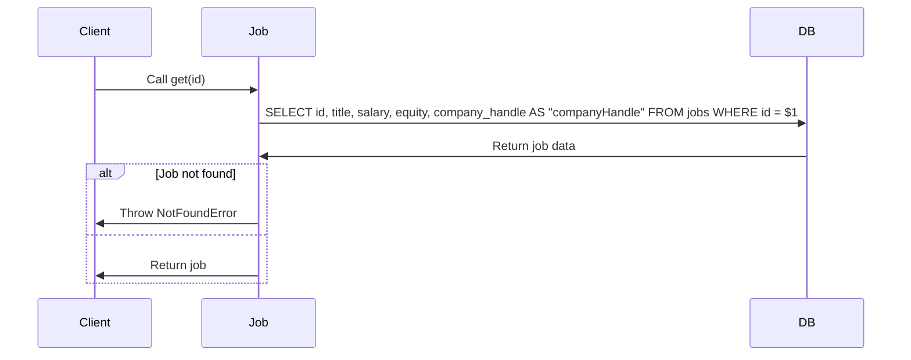

[Back to TOC](#models-folder-file-notesexplanationsdiagrams)

##### `update` method diagram

Update a Job:

The client calls the `update` method with a job ID and data.
The `Job` class generates the SQL for a partial update and updates the job data in the database.
If the job is not found, a `NotFoundError` is thrown.
Otherwise, the updated job data is returned to the client.
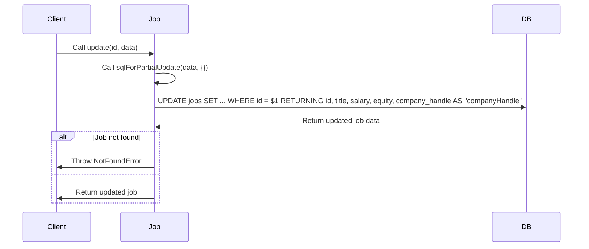

[Back to TOC](#models-folder-file-notesexplanationsdiagrams)

##### `remove` method diagram

Remove a Job:

- The client calls the `remove` method with a job ID.
- The `Job` class deletes the job from the database.
- If the job is not found, a `NotFoundError` is thrown.
- Otherwise, `undefined` is returned to the client.
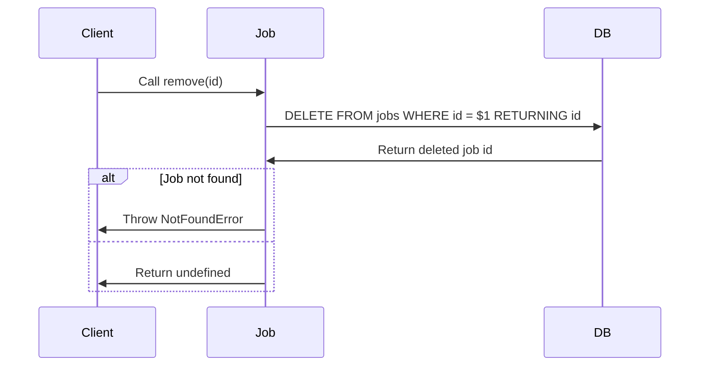

[Back to TOC](#models-folder-file-notesexplanationsdiagrams)

#### Overview of `job.js`

1. Imports and Setup:
- `db`: Database connection.
- `BadRequestError`, `NotFoundError`: Custom error classes.
- `sqlForPartialUpdate`: Helper function for generating SQL for partial updates.
```javascript
"use strict";

const db = require("../db");
const { BadRequestError, NotFoundError } = require("../expressError");
const { sqlForPartialUpdate } = require("../helpers/sql");
```

2. Class: `Job`
   - Method: `create`
     - Creates a new job in the database.
     - Throws `BadRequestError` if the job already exists.
```javascript
static async create({ title, salary, equity, companyHandle }) {
  const duplicateCheck = await db.query(
        `SELECT title, company_handle
         FROM jobs
         WHERE title = $1 AND company_handle = $2`,
      [title, companyHandle]);

  if (duplicateCheck.rows[0])
    throw new BadRequestError(`Duplicate job: ${title} at ${companyHandle}`);

  const result = await db.query(
        `INSERT INTO jobs
         (title, salary, equity, company_handle)
         VALUES ($1, $2, $3, $4)
         RETURNING id, title, salary, equity, company_handle AS "companyHandle"`,
      [
        title,
        salary,
        equity,
        companyHandle,
      ],
  );
  const job = result.rows[0];

  return job;
}
```

2. Class: `Job`
   - Method: `findAll`
     - Retrieves all jobs from the database with optional filtering.
```javascript
static async findAll(filters = {}) {
  let query = `SELECT id,
                      title,
                      salary,
                      equity,
                      company_handle AS "companyHandle"
               FROM jobs`;
  const whereClauses = [];
  const values = [];

  // Apply filters dynamically
  const { minSalary, hasEquity, titleLike } = filters;

  if (minSalary !== undefined) {
    values.push(minSalary);
    whereClauses.push(`salary >= $${values.length}`);
  }

  if (hasEquity === true) {
    whereClauses.push(`equity > 0`);
  }

  if (titleLike !== undefined) {
    values.push(`%${titleLike}%`);
    whereClauses.push(`title ILIKE $${values.length}`);
  }

  // Append WHERE clause if filters exist
  if (whereClauses.length > 0) {
    query += " WHERE " + whereClauses.join(" AND ");
  }

  // Add ordering
  query += " ORDER BY title";

  // Execute query
  const result = await db.query(query, values);
  return result.rows;
}
```

2. Class: `Job`
   - Method: `get`
     - Retrieves a job by its ID.
     - Throws `NotFoundError` if the job does not exist.
```mermaid
static async get(id) {
  const jobRes = await db.query(
        `SELECT id,
                title,
                salary,
                equity,
                company_handle AS "companyHandle"
         FROM jobs
         WHERE id = $1`,
      [id]);

  const job = jobRes.rows[0];

  if (!job) throw new NotFoundError(`No job: ${id}`);

  return job;
}
```

2. Class: `Job`
   - Method: `update`
     - Updates a job's data.
     - Throws `NotFoundError` if the job does not exist.
```javascript
static async update(id, data) {
  const { setCols, values } = sqlForPartialUpdate(
      data,
      {});
  const idVarIdx = "$" + (values.length + 1);

  const querySql = `UPDATE jobs
                    SET ${setCols}
                    WHERE id = ${idVarIdx}
                    RETURNING id,
                              title,
                              salary,
                              equity,
                              company_handle AS "companyHandle"`;
  const result = await db.query(querySql, [...values, id]);
  const job = result.rows[0];

  if (!job) throw new NotFoundError(`No job: ${id}`);

  return job;
}
```

2. Class: `Job`
   - Method: `remove`
     - Deletes a job from the database.
     - Throws `NotFoundError` if the job does not exist.
```javascript
static async remove(id) {
  const result = await db.query(
        `DELETE
         FROM jobs
         WHERE id = $1
         RETURNING id`,
      [id]);
  const job = result.rows[0];

  if (!job) throw new NotFoundError(`No job: ${id}`);
}
```

3. Export the Class
```javascript
module.exports = Job;
```

[Back to TOC](#models-folder-file-notesexplanationsdiagrams)