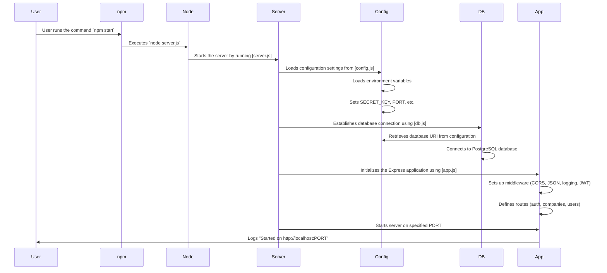

# Jobly Backend

This is the Express backend for Jobly, version 2.

- [Jobly Backend](#jobly-backend)
  - [startup instructions](#startup-instructions)
  - [assignment instructions](#assignment-instructions)
    - [**Goals \& Requirements**](#goals--requirements)
    - [Part One: Setup / Starter Code](#part-one-setup--starter-code)
      - [`jobly.sql` explained](#joblysql-explained)
      - [Instructions to Setting Up the Databases](#instructions-to-setting-up-the-databases)
      - [Description of the Server Startup Process](#description-of-the-server-startup-process)
        - [`app.js` and `app.test.js` explained](#appjs-and-apptestjs-explained)
          - [Explanation of `app.js`](#explanation-of-appjs)
          - [Explanation of `app.test.js`](#explanation-of-apptestjs)
          - [Understanding `beforeEach` and `afterEach`](#understanding-beforeeach-and-aftereach)
          - [Running Tests with Coverage and the `-i` Flag](#running-tests-with-coverage-and-the--i-flag)
        - [`config.js` and `config.test.js` explained](#configjs-and-configtestjs-explained)
          - [Explanation of `config.js`](#explanation-of-configjs)
          - [Explanation of `config.test.js`](#explanation-of-configtestjs)
        - [helpers (folder) / `tokens.js` and `tokens.test.js` explained](#helpers-folder--tokensjs-and-tokenstestjs-explained)
          - [Explanation of `tokens.js`](#explanation-of-tokensjs)
          - [Explanation of `tokens.test.js`](#explanation-of-tokenstestjs)
        - [middleware (folder) / `auth.js` and `auth.test.js` explained](#middleware-folder--authjs-and-authtestjs-explained)
          - [Explanation of `auth.js`](#explanation-of-authjs)
          - [Explanation of `auth.test.js`](#explanation-of-authtestjs)
        - [models (folder) / `_testCommon.js` explained](#models-folder--_testcommonjs-explained)
        - [models (folder) /  `company.js` and `company.test.js` explained](#models-folder---companyjs-and-companytestjs-explained)
          - [Explanation of `company.js`](#explanation-of-companyjs)
          - [Explanation of `company.test.js`](#explanation-of-companytestjs)
        - [models (folder) / `user.js` and `user.test.js` explained](#models-folder--userjs-and-usertestjs-explained)
          - [Explanation of `user.js`](#explanation-of-userjs)
          - [Explanation of `user.test.js`](#explanation-of-usertestjs)
        - [routes (folder) / `_testCommon.js` explained](#routes-folder--_testcommonjs-explained)
        - [routes (folder) / `auth.js` and `auth.test.js` explained](#routes-folder--authjs-and-authtestjs-explained)
          - [`auth.js`explained](#authjsexplained)
          - [`auth.test.js`explained](#authtestjsexplained)
        - [routes (folder) / `companies.js` and `companies.test.js` explained](#routes-folder--companiesjs-and-companiestestjs-explained)
          - [`companies.js`explained](#companiesjsexplained)
          - [`companies.test.js` explained](#companiestestjs-explained)
        - [routes (folder) / `users.js` and `users.test.js` explained](#routes-folder--usersjs-and-userstestjs-explained)
          - [`users.js`explained](#usersjsexplained)
      - [First Task: sqlForPartialUpdate](#first-task-sqlforpartialupdate)
    - [Part Two: Companies](#part-two-companies)
      - [Adding Filtering](#adding-filtering)
      - [Some requirements:](#some-requirements)
  - [Part Three: Change Authorization](#part-three-change-authorization)
    - [Companies](#companies)
    - [Users](#users)
  - [Part Four: Jobs](#part-four-jobs)
    - [Adding Job Model, Routes, and Tests](#adding-job-model-routes-and-tests)
      - [Adding Filtering](#adding-filtering-1)
      - [Show Jobs for a Company](#show-jobs-for-a-company)
  - [Step Five: Job Applications](#step-five-job-applications)
  - [Further Study](#further-study)
    - [Choosing Random Password](#choosing-random-password)
    - [Use *enum* Type](#useenumtype)
    - [Add Technologies for Jobs](#add-technologies-for-jobs)
    - [Add Technologies for Users](#add-technologies-for-users)
  - [Table of Contents](#table-of-contents)

## startup instructions

To run this:

    node server.js

To run the tests:

    jest -i

## assignment instructions

This is a multi-day exercise to practice Node, Express, and PostgreSQL with relationships. In it, you’ll build “Jobly”, a job searching API.

### **Goals & Requirements**

- [ ] This is a pure API app, taking values from the query string (GET requests) or from a JSON body (other requests). It returns JSON.
- [ ] This gets authentication/authorization with JWT tokens. Make sure your additions only allow access as specified in our requirements.
- [ ] Be thoughtful about function and variable names, and write developer-friendly documentation *for every function and route* you write.
- [ ] The starter code is well-tested, with excellent coverage. We expect your new contributions to maintain good coverage.
- [ ] Model tests check the underlying database actions. Route tests check the underlying model methods and do not rely directly on the database changes. This is a useful testing design consideration and you should continue it.
- [ ] We *strongly encourage you* to practice some test-driven development. Write a test before writing a model method and a route. You will find that this can make the work of adding to an app like this easier, and much less bug-prone.

**Take your time, be organized and clear, and test carefully. Have fun!**

### Part One: Setup / Starter Code

Download the starter code. Do a quick skim of the code to get a sense of the main components and the organization.

We’ve provided **_jobly.sql_**, which will create a database (with a small amount of starter data) and a test database. Set those up. (Some of the tables included are not currently used by the application; you’ll add the parts of the app that will use those tables in the exercise).

#### `jobly.sql` explained

X. Full Code for `jobly.sql`:

```sql
\echo 'Delete and recreate jobly db?'
\prompt 'Return for yes or control-C to cancel > ' foo

DROP DATABASE jobly;
CREATE DATABASE jobly;
\connect jobly

\i jobly-schema.sql
\i jobly-seed.sql

\echo 'Delete and recreate jobly_test db?'
\prompt 'Return for yes or control-C to cancel > ' foo

DROP DATABASE jobly_test;
CREATE DATABASE jobly_test;
\connect jobly_test

\i jobly-schema.sql
```

1. This line prints a message to the terminal asking if you want to delete and recreate the `jobly` database.

```sql
\echo 'Delete and recreate jobly db?'
```

2. This line prompts the user to press **Enter** to proceed or **Control-C** to cancel the operation.

```sql
\prompt 'Return for yes or control-C to cancel > ' foo
```

3. This line deletes the existing `jobly` database if it exists. If the database does not exist, it will throw an error.

```sql
DROP DATABASE jobly;
```

4. This line creates a new jobly database.

```sql
CREATE DATABASE jobly;
```

5. This line connects to the newly created jobly database.

```sql
\connect jobly
```

6. This line runs the `jobly-schema.sql` file, which contains the SQL commands to create the necessary tables and schema for the `jobly` database.

```sql
\i jobly-schema.sql
```

7. This line prints a message to the terminal asking if you want to delete and recreate the jobly_test database.

```sql
\echo 'Delete and recreate jobly_test db?'
```

8. This line prompts the user to press Enter to proceed or Control-C to cancel the operation.

```sql
\prompt 'Return for yes or control-C to cancel > ' foo
```

9. This line deletes the existing `jobly_test` database if it exists. If the database does not exist, it will throw an error.

```sql
DROP DATABASE jobly_test;
```

10. This line creates a new `jobly_test` database.

```sql
CREATE DATABASE jobly_test;
```

11. This line connects to the newly created `jobly_test` database.

```sql
\connect jobly_test
```

12. This line runs the `jobly-schema.sql` file, which contains the SQL commands to create the necessary tables and schema for the `jobly_test` database.

```sql
\i jobly-schema.sql
```

#### Instructions to Setting Up the Databases

To set up the databases using the `jobly.sql` file, follow these steps:

- [x] 1. Open your terminal in Visual Studio Code (VSC) using WSL/Ubuntu.
- [x] 2. Ensure you have PostgreSQL installed and running. You can start PostgreSQL with the following command:

```
sudo service postgresql start
```

- [x] 3. Navigate to the directory containing the `jobly.sql` file. For example:

```
cd path/to/your/project
```

- [x] 4. Run the `jobly.sql` file using the `psql` command-line tool. This will execute the SQL commands in the file to set up your databases:

```
psql -U your_username -f jobly.sql
```

Remember to Replace `your_username` with your PostgreSQL username. You may be prompted to enter your password.

5. Follow the prompts in the terminal. Press Enter to proceed with deleting and recreating the databases or Control-C to cancel.

- [x] After completing these steps, you should have both the `jobly` and `jobly_test` databases set up with the necessary schema and initial data.

---

Read the tests and get an (I) understanding of what the (II) **_beforeEach_** and **_afterEach_** methods are specifically doing for our tests.

(III) Run our tests, with coverage. Any time you run our tests here, you will need to use the `-i` flag for Jest, so that the tests run “in band” (in order, not at the same time).

##### Description of the Server Startup Process
When you run the `command npm start`, it triggers the `start` script defined in the `package.json` file, which executes `node server.js`. This starts the server by performing the following steps:

1. Load Configuration: The `config.js` file is loaded, which sets up environment variables and configuration settings such as the `SECRET_KEY`, `PORT`, and database URI.
2. Database Connection: The `db.js` file is executed, which establishes a connection to the PostgreSQL database using the configuration settings.
3. Initialize Express App: The `app.js` file is loaded, which sets up the Express application, including middleware for CORS, JSON parsing, logging, and JWT authentication. It also defines routes for authentication, companies, and users.
4. Start the Server: The `server.js` file starts the Express server on the specified port and logs a message indicating that the server has started.



**Explanation of the Sequence Diagram**

This sequence diagram provides a visual representation of the function execution sequence and overall process of starting up the server when the npm start command is executed.

1. `User` runs the command `npm start`.
2. `npm` executes the start script, which runs `node server.js`.
3. `Node` starts the server by running the `server.js` file.
4. `Server` loads the `config.js` file to set up configuration settings.
5. `Config` loads environment variables and sets configuration values such as `SECRET_KEY`, `PORT`, and the `database URI`.
6. `Server` executes the db.js file to establish a connection to the PostgreSQL database.
7. `DB` retrieves the `database URI` from the configuration and connects to the database.
8. `Server` executes the `app.js` file to initialize the Express application.
9. `App` sets up middleware for CORS, JSON parsing, logging, and JWT authentication.
10. `App` defines routes for authentication, companies, and users.
11. `Server` starts the Express server on the specified port.
12. `App` logs a message indicating that the server has started and is listening on the specified port.


##### `app.js` and `app.test.js` explained

###### Explanation of `app.js`

1. imports

- `express`: The main framework used to build the web server.
- `cors`: Middleware to enable Cross-Origin Resource Sharing.
- `NotFoundError`: Custom error class for handling 404 errors.
- `authenticateJWT`: Middleware to authenticate JWT tokens.
- `authRoutes`, `companiesRoutes`, `usersRoutes`: Route handlers for different parts of the application.
- `morgan`: Middleware for logging HTTP requests.

```javascript
"use strict";
const express = require("express");
const cors = require("cors");
const { NotFoundError } = require("./expressError");
const { authenticateJWT } = require("./middleware/auth");
const authRoutes = require("./routes/auth");
const companiesRoutes = require("./routes/companies");
const usersRoutes = require("./routes/users");
const morgan = require("morgan");
```

2. Express App Initialization

```javascript
const app = express();
```

3. Middleware Setup
- `cors()`: Enables CORS.
- `express.json()`: Parses incoming JSON requests.
- `morgan("tiny")`: Logs HTTP requests.
- `authenticateJWT`: Authenticates JWT tokens for incoming requests.
```javascript
app.use(cors());
app.use(express.json());
app.use(morgan("tiny"));
app.use(authenticateJWT);
```

4. Route Handlers
Sets up route handlers for authentication, companies, and users.
```javascript
app.use("/auth", authRoutes);
app.use("/companies", companiesRoutes);
app.use("/users", usersRoutes);
```

5. 404 Error Handling
Handles requests to undefined routes by throwing a `NotFoundError`.
```javascript
app.use(function (req, res, next) {
  return next(new NotFoundError());
});
```

6. Generic Error Handler
Handles any unhandled errors and returns a JSON response with the error message and status code.
```javascript
app.use(function (err, req, res, next) {
  if (process.env.NODE_ENV !== "test") console.error(err.stack);
  const status = err.status || 500;
  const message = err.message;

  return res.status(status).json({
    error: { message, status },
  });
});
```

7. Export App
```javascript
module.exports = app;
```

###### Explanation of `app.test.js`

This file contains tests for the Express application using the `supertest` library.

1. Imports and Setup:

```javascript
const request = require("supertest");
const app = require("./app");
const db = require("./db");
```

- `request`: Library for testing HTTP requests.
- `app`: The Express application.
- `db`: The database connection.

2. Test for 404 Not Found

Tests that a request to a non-existent path returns a 404 status code.

```javascript
test("not found for site 404", async function () {
  const resp = await request(app).get("/no-such-path");
  expect(resp.statusCode).toEqual(404);
});
```

3. Test for 404 Not Found with Stack Print

Similar to the previous test but ensures the stack trace is printed when `NODE_ENV` is not set to "test".

```javascript
test("not found for site 404 (test stack print)", async function () {
  process.env.NODE_ENV = "";
  const resp = await request(app).get("/no-such-path");
  expect(resp.statusCode).toEqual(404);
  delete process.env.NODE_ENV;
});
```

4. Close Database Connection

Closes the database connection after all tests have run.

```javascript
afterAll(function () {
  db.end();
});
```

###### Understanding `beforeEach` and `afterEach`

In the context of testing, `beforeEach` and `afterEach` are hooks provided by testing frameworks like Jest to run code before and after each test case, respectively.

- `beforeEach`: Runs a specific piece of code before each test case. This is useful for setting up a consistent state before each test.
- `afterEach`: Runs a specific piece of code after each test case. This is useful for cleaning up after each test to ensure tests do not affect each other.

###### Running Tests with Coverage and the `-i` Flag

To run the tests with coverage and ensure they run in order (in band), you can use the following command:

```javascript
jest --coverage -i
```

- `--coverage`: Generates a test coverage report, showing which parts of your code are covered by tests.
- `-i` **(in band)**: Ensures that tests run sequentially rather than in parallel. This is useful when tests might interfere with each other if run simultaneously.

##### `config.js` and `config.test.js` explained

###### Explanation of `config.js`

1. **Imports and Setup**

- `dotenv`: Loads environment variables from a `.env` file into `process.env`.
- `colors`: Adds color support to the console output.

```javascript
"use strict";

require("dotenv").config();
require("colors");
```

2. **Configuration Variables**

- `SECRET_KEY`: The secret key used for signing JWT tokens. Defaults to "secret-dev" if not set in the environment.
- `PORT`: The port on which the server will run. Defaults to 3001 if not set in the environment.

```javascript
const SECRET_KEY = process.env.SECRET_KEY || "secret-dev";
const PORT = +process.env.PORT || 3001;
```

3. **Database URI Function**

- `getDatabaseUri()`: Returns the appropriate database URI based on the environment. Uses `jobly_test` for testing, otherwise uses `DATABASE_URL` or defaults to `jobly`.

```javascript
function getDatabaseUri() {
  return process.env.NODE_ENV === "test"
    ? "postgresql:///jobly_test"
    : process.env.DATABASE_URL || "postgresql:///jobly";
}
```

4. **Bcrypt Work Factor**

- `BCRYPT_WORK_FACTOR`: Sets the bcrypt work factor for hashing passwords. Uses a lower value for testing to speed up tests.

```javascript
const BCRYPT_WORK_FACTOR = process.env.NODE_ENV === "test" ? 1 : 12;
```

5. **Logging Configuration**

- Logs the configuration settings to the console.

```javascript
console.log("Jobly Config:".green);
console.log("SECRET_KEY:".yellow, SECRET_KEY);
console.log("PORT:".yellow, PORT.toString());
console.log("BCRYPT_WORK_FACTOR".yellow, BCRYPT_WORK_FACTOR);
console.log("Database:".yellow, getDatabaseUri());
console.log("---");
```

6. **Export Configuration**

- Exports the configuration variables and functions for use in other parts of the application.

```javascript
module.exports = {
  SECRET_KEY,
  PORT,
  BCRYPT_WORK_FACTOR,
  getDatabaseUri,
};
```

###### Explanation of `config.test.js`

This file contains tests for the configuration settings in `config.js`.

1. **Test Suite**

- Test Setup: Sets environment variables to specific values.
- Assertions: Checks that the configuration values match the environment variables.
- Cleanup: Deletes the environment variables and checks the default values.

```javascript
"use strict";

describe("config can come from env", function () {
  test("works", function () {
    process.env.SECRET_KEY = "abc";
    process.env.PORT = "5000";
    process.env.DATABASE_URL = "other";
    process.env.NODE_ENV = "other";

    const config = require("./config");
    expect(config.SECRET_KEY).toEqual("abc");
    expect(config.PORT).toEqual(5000);
    expect(config.getDatabaseUri()).toEqual("other");
    expect(config.BCRYPT_WORK_FACTOR).toEqual(12);

    delete process.env.SECRET_KEY;
    delete process.env.PORT;
    delete process.env.BCRYPT_WORK_FACTOR;
    delete process.env.DATABASE_URL;

    expect(config.getDatabaseUri()).toEqual("jobly");
    process.env.NODE_ENV = "test";

    expect(config.getDatabaseUri()).toEqual("jobly_test");
  });
});
```

2. **Understanding `beforeEach` and `afterEach`**
   In the context of testing, `beforeEach` and `afterEach` are hooks provided by testing frameworks like Jest to run code before and after each test case, respectively.

- `beforeEach`: Runs a specific piece of code before each test case. This is useful for setting up a consistent state before each test.
- `afterEach`: Runs a specific piece of code after each test case. This is useful for cleaning up after each test to ensure tests do not affect each other.

In the provided test file, there are no `beforeEach` or `afterEach` hooks, but they are commonly used in other test files to manage database transactions or reset state.

3. Running Tests with Coverage and the `-i` Flag

- `--coverage`: Generates a test coverage report, showing which parts of your code are covered by tests.
- `-i` (in band): Ensures that tests run sequentially rather than in parallel. This is useful when tests might interfere with each other if run simultaneously.

To run the tests with coverage and ensure they run in order (in band), you can use the following command:

```javascript
jest --coverage -i
```

##### helpers (folder) / `tokens.js` and `tokens.test.js` explained

###### Explanation of `tokens.js`

This file contains a function to create JSON Web Tokens (JWT) for user authentication.

1. Imports and Setup

- `jsonwebtoken`: Library for creating and verifying JWTs.
- `SECRET_KEY`: Secret key used to sign the JWT, imported from the configuration file.

```javascript
const jwt = require("jsonwebtoken");
const { SECRET_KEY } = require("../config");
```

2. Create Token Function:

- `createToken(user)`: Function that takes a user object and returns a signed JWT.
- `console.assert`: Ensures that the `isAdmin` property is defined on the user object.
- `payload`: Object containing the `username` and `isAdmin` properties.
- `jwt.sign(payload, SECRET_KEY)`: Signs the payload with the secret key to create the JWT.

```javascript
function createToken(user) {
  console.assert(
    user.isAdmin !== undefined,
    "createToken passed user without isAdmin property"
  );

  let payload = {
    username: user.username,
    isAdmin: user.isAdmin || false,
  };

  return jwt.sign(payload, SECRET_KEY);
}
```

3. Export the Function

- Exports the `createToken` function for use in other parts of the application.

```javascript
module.exports = { createToken };
```

###### Explanation of `tokens.test.js`

This file contains tests for the `createToken` function using the `jest` testing framework.

1. Imports and Setup

- `jsonwebtoken`: Library for creating and verifying JWTs.
- `createToken`: Function to create JWTs, imported from `tokens.js`.
- `SECRET_KEY`: Secret key used to sign the JWT, imported from the configuration file.

```javascript
const jwt = require("jsonwebtoken");
const { createToken } = require("./tokens");
const { SECRET_KEY } = require("../config");
```

2. Test Suite Overview

```javascript
describe("createToken", function () {
  test("works: not admin", function () {
    const token = createToken({ username: "test", is_admin: false });
    const payload = jwt.verify(token, SECRET_KEY);
    expect(payload).toEqual({
      iat: expect.any(Number),
      username: "test",
      isAdmin: false,
    });
  });

  test("works: admin", function () {
    const token = createToken({ username: "test", isAdmin: true });
    const payload = jwt.verify(token, SECRET_KEY);
    expect(payload).toEqual({
      iat: expect.any(Number),
      username: "test",
      isAdmin: true,
    });
  });

  test("works: default no admin", function () {
    // given the security risk if this didn't work, checking this specifically
    const token = createToken({ username: "test" });
    const payload = jwt.verify(token, SECRET_KEY);
    expect(payload).toEqual({
      iat: expect.any(Number),
      username: "test",
      isAdmin: false,
    });
  });
});
```

2. (a) Test for Non-Admin User

Creates a token for a non-admin user and verifies the payload

```javascript
test("works: not admin", function () {
  const token = createToken({ username: "test", is_admin: false });
  const payload = jwt.verify(token, SECRET_KEY);
  expect(payload).toEqual({
    iat: expect.any(Number),
    username: "test",
    isAdmin: false,
  });
});
```

2. (b) Test for Admin User

Creates a token for an admin user and verifies the payload.

```javascript
test("works: admin", function () {
  const token = createToken({ username: "test", isAdmin: true });
  const payload = jwt.verify(token, SECRET_KEY);
  expect(payload).toEqual({
    iat: expect.any(Number),
    username: "test",
    isAdmin: true,
  });
});
```

2. (c) Test for Default Non-Admin User

Creates a token for a user without specifying `isAdmin` and verifies the payload defaults to `isAdmin: false`.

```javascript
test("works: default no admin", function () {
  // given the security risk if this didn't work, checking this specifically
  const token = createToken({ username: "test" });
  const payload = jwt.verify(token, SECRET_KEY);
  expect(payload).toEqual({
    iat: expect.any(Number),
    username: "test",
    isAdmin: false,
  });
});
```

2. (d) Understanding `beforeEach` and `afterEach`

In the provided test file, there are no `beforeEach` or `afterEach` hooks. However, these hooks are commonly used in other test files to manage database transactions or reset state.

- `beforeEach`: Runs a specific piece of code before each test case. This is useful for setting up a consistent state before each test.
- `afterEach`: Runs a specific piece of code after each test case. This is useful for cleaning up after each test to ensure tests do not affect each other.

Running Tests with Coverage and the `-i` Flag
To run the tests with coverage and ensure they run in order (in band), you can use the following command:

Start up the server *(note that, unlike most exercises, we start this server on port 3001)*.

```javascript
jest --coverage -i
```

##### middleware (folder) / `auth.js` and `auth.test.js` explained

###### Explanation of `auth.js`

This file contains middleware functions for handling authentication and authorization in the Jobly application.

1. Imports and Setup:

- `jsonwebtoken`: Library for creating and verifying JSON Web Tokens (JWT).
- `SECRET_KEY`: Secret key used to sign the JWT, imported from the configuration file.
- `UnauthorizedError`: Custom error class for handling unauthorized access.

```javascript
"use strict";

const jwt = require("jsonwebtoken");
const { SECRET_KEY } = require("../config");
const { UnauthorizedError } = require("../expressError");
```

2. Middleware: authenticateJWT

- This middleware function checks if a JWT token is provided in the request headers.
- If a token is provided, it verifies the token and stores the payload (including `username` and `isAdmin` fields) in `res.locals.user`.
- If no token is provided or the token is invalid, it simply calls `next()` without setting `res.locals.user`.

```javascript
function authenticateJWT(req, res, next) {
  try {
    const authHeader = req.headers && req.headers.authorization;
    if (authHeader) {
      const token = authHeader.replace(/^[Bb]earer /, "").trim();
      res.locals.user = jwt.verify(token, SECRET_KEY);
    }
    return next();
  } catch (err) {
    return next();
  }
}
```

3. Middleware: `ensureLoggedIn`

- This middleware function checks if the user is logged in by verifying the presence of `res.locals.user`.
- If the user is not logged in, it throws an `UnauthorizedError`.
- If the user is logged in, it calls `next()` to proceed to the next middleware or route handler.

```javascript
function ensureLoggedIn(req, res, next) {
  try {
    if (!res.locals.user) throw new UnauthorizedError();
    return next();
  } catch (err) {
    return next(err);
  }
}
```

4. Export the Middleware Functions

```javascript
module.exports = {
  authenticateJWT,
  ensureLoggedIn,
};
```

###### Explanation of `auth.test.js`

This file contains tests for the authentication middleware functions using the jest testing framework.

1. Imports and Setup

- `jsonwebtoken`: Library for creating and verifying JWTs.
- `UnauthorizedError`: Custom error class for handling unauthorized access.
- `authenticateJWT`, `ensureLoggedIn`: Middleware functions to be tested.
- `SECRET_KEY`: Secret key used to sign the JWT, imported from the configuration file.
- `testJwt`: A valid JWT token for testing.
- `badJwt`: An invalid JWT token for testing.

```javascript
"use strict";

const jwt = require("jsonwebtoken");
const { UnauthorizedError } = require("../expressError");
const { authenticateJWT, ensureLoggedIn } = require("./auth");

const { SECRET_KEY } = require("../config");
const testJwt = jwt.sign({ username: "test", isAdmin: false }, SECRET_KEY);
const badJwt = jwt.sign({ username: "test", isAdmin: false }, "wrong");
```

2. Test Suite: `authenticateJWT`

- Test for Valid Token:
  - Verifies that a valid token in the header sets `res.locals.user` correctly.
- Test for No Header:
  - Verifies that no token in the header leaves `res.locals` empty.
- Test for Invalid Token:
  - Verifies that an invalid token in the header leaves `res.locals` empty.

```javascript
describe("authenticateJWT", function () {
  test("works: via header", function () {
    expect.assertions(2);
    const req = { headers: { authorization: `Bearer ${testJwt}` } };
    const res = { locals: {} };
    const next = function (err) {
      expect(err).toBeFalsy();
    };
    authenticateJWT(req, res, next);
    expect(res.locals).toEqual({
      user: {
        iat: expect.any(Number),
        username: "test",
        isAdmin: false,
      },
    });
  });

  test("works: no header", function () {
    expect.assertions(2);
    const req = {};
    const res = { locals: {} };
    const next = function (err) {
      expect(err).toBeFalsy();
    };
    authenticateJWT(req, res, next);
    expect(res.locals).toEqual({});
  });

  test("works: invalid token", function () {
    expect.assertions(2);
    const req = { headers: { authorization: `Bearer ${badJwt}` } };
    const res = { locals: {} };
    const next = function (err) {
      expect(err).toBeFalsy();
    };
    authenticateJWT(req, res, next);
    expect(res.locals).toEqual({});
  });
});
```

3. Test Suite: `ensureLoggedIn`

- Test for Logged-In User:
  - Verifies that a logged-in user (with `res.locals.user` set) proceeds without error.
- Test for Not Logged-In User:
  - Verifies that a user who is not logged in (without `res.locals.user` set) throws an `UnauthorizedError`.

```javascript
describe("ensureLoggedIn", function () {
  test("works", function () {
    expect.assertions(1);
    const req = {};
    const res = { locals: { user: { username: "test", is_admin: false } } };
    const next = function (err) {
      expect(err).toBeFalsy();
    };
    ensureLoggedIn(req, res, next);
  });

  test("unauth if no login", function () {
    expect.assertions(1);
    const req = {};
    const res = { locals: {} };
    const next = function (err) {
      expect(err instanceof UnauthorizedError).toBeTruthy();
    };
    ensureLoggedIn(req, res, next);
  });
});
```

4. Understanding `beforeEach` and `afterEach`
   In the provided test file, there are no `beforeEach` or `afterEach` hooks. However, these hooks are commonly used in other test files to manage database transactions or reset state.

- `beforeEach`: Runs a specific piece of code before each test case. This is useful for setting up a consistent state before each test.
- `afterEach`: Runs a specific piece of code after each test case. This is useful for cleaning up after each test to ensure tests do not affect each other.

5. Running Tests with Coverage and the `-i` Flag

##### routes (folder) / `_testCommon.js` explained
This file contains common setup and teardown functions for tests in the routes folder. These functions help ensure that the database is in a consistent state before and after each test.

1. Imports and Setup:
- `db`: Database connection.
- `User`: The `User` model for interacting with the `users` table.
- `Company`: The `Company` model for interacting with the `companies` table.
- `createToken`: Function to create JSON Web Tokens (JWT).
```javascript
"use strict";

const db = require("../db.js");
const User = require("../models/user");
const Company = require("../models/company");
const { createToken } = require("../helpers/tokens");
```

2. Function: `commonBeforeAll`
- This function runs once before all tests. It:
  - Deletes all records from the `users` and `companies` tables.
  - Inserts sample data into the `companies` table.
  - Registers sample users with hashed passwords.
```javascript
async function commonBeforeAll() {
  // noinspection SqlWithoutWhere
  await db.query("DELETE FROM users");
  // noinspection SqlWithoutWhere
  await db.query("DELETE FROM companies");

  await Company.create(
      {
        handle: "c1",
        name: "C1",
        numEmployees: 1,
        description: "Desc1",
        logoUrl: "http://c1.img",
      });
  await Company.create(
      {
        handle: "c2",
        name: "C2",
        numEmployees: 2,
        description: "Desc2",
        logoUrl: "http://c2.img",
      });
  await Company.create(
      {
        handle: "c3",
        name: "C3",
        numEmployees: 3,
        description: "Desc3",
        logoUrl: "http://c3.img",
      });

  await User.register({
    username: "u1",
    firstName: "U1F",
    lastName: "U1L",
    email: "user1@user.com",
    password: "password1",
    isAdmin: false,
  });
  await User.register({
    username: "u2",
    firstName: "U2F",
    lastName: "U2L",
    email: "user2@user.com",
    password: "password2",
    isAdmin: false,
  });
  await User.register({
    username: "u3",
    firstName: "U3F",
    lastName: "U3L",
    email: "user3@user.com",
    password: "password3",
    isAdmin: false,
  });
}
```

3. Function: `commonBeforeEach`
   - This function runs before each test. It starts a new database transaction.
```javascript
async function commonBeforeEach() {
  await db.query("BEGIN");
}
```

4. Function: `commonAfterEach`
This function runs after each test. It rolls back the database transaction, ensuring that any changes made during the test are not saved.
```javascript
async function commonAfterEach() {
  await db.query("ROLLBACK");
}
```

5. Function: `commonAfterAll`
   - This function runs once after all tests. It closes the database connection.
```javscript
async function commonAfterAll() {
  await db.end();
}
```

6. Token for Testing:
   - Creates a JWT token for user `u1` to be used in tests.
```javascript
const u1Token = createToken({ username: "u1", isAdmin: false });
```

7. Export the Functions and Token:
```javascript
module.exports = {
  commonBeforeAll,
  commonBeforeEach,
  commonAfterEach,
  commonAfterAll,
  u1Token,
};
```

8. Understanding `beforeEach` and `afterEach`
In the context of testing, `beforeEach` and `afterEach` are hooks provided by testing frameworks like Jest to run code before and after each test case, respectively.

- `beforeEach`: Runs a specific piece of code before each test case. This is useful for setting up a consistent state before each test.
  - In this file, `commonBeforeEach` starts a new database transaction before each test.
- `afterEach`: Runs a specific piece of code after each test case. This is useful for cleaning up after each test to ensure tests do not affect each other.
  - In this file, `commonAfterEach` rolls back the database transaction after each test.

9. Running Tests with Coverage and the `-i` Flag
To run the tests with coverage and ensure they run in order (in band), you can use the following command:
```javascript
jest --coverage -i'


```
- `--coverage`: Generates a test coverage report, showing which parts of your code are covered by tests.
- `-i` (in band): Ensures that tests run sequentially rather than in parallel. This is useful when tests might interfere with each other if run simultaneously.

##### routes (folder) / `auth.js` and `auth.test.js` explained

###### `auth.js`explained

This file contains the routes for handling authentication in the Jobly application.

1. Imports and Setup
- `jsonschema`: Library for validating JSON objects against a schema.
- `User`: The `User` model for interacting with the `users` table.
- `express`: The main framework used to build the web server.
- `createToken`: Function to create JSON Web Tokens (JWT).
- `userAuthSchema`, `userRegisterSchema`: JSON schemas for validating user authentication and registration data.
- `BadRequestError`: Custom error class for handling bad requests.
```javascript
"use strict";

const jsonschema = require("jsonschema");
const User = require("../models/user");
const express = require("express");
const router = new express.Router();
const { createToken } = require("../helpers/tokens");
const userAuthSchema = require("../schemas/userAuth.json");
const userRegisterSchema = require("../schemas/userRegister.json");
const { BadRequestError } = require("../expressError");
```

2. Route: `POST /auth/token`
- Validates the request body against the `userAuthSchema`.
- Authenticates the user with the provided username and password.
- Creates a JWT token for the authenticated user.
- Returns the token in the response.
```javascript
router.post("/token", async function (req, res, next) {
  try {
    const validator = jsonschema.validate(req.body, userAuthSchema);
    if (!validator.valid) {
      const errs = validator.errors.map(e => e.stack);
      throw new BadRequestError(errs);
    }

    const { username, password } = req.body;
    const user = await User.authenticate(username, password);
    const token = createToken(user);
    return res.json({ token });
  } catch (err) {
    return next(err);
  }
});
```

3. Route: `POST /auth/register`
- Validates the request body against the `userRegisterSchema`.
- Registers a new user with the provided data.
- Creates a JWT token for the new user.
- Returns the token in the response.
```javascript
router.post("/register", async function (req, res, next) {
  try {
    const validator = jsonschema.validate(req.body, userRegisterSchema);
    if (!validator.valid) {
      const errs = validator.errors.map(e => e.stack);
      throw new BadRequestError(errs);
    }

    const newUser = await User.register({ ...req.body, isAdmin: false });
    const token = createToken(newUser);
    return res.status(201).json({ token });
  } catch (err) {
    return next(err);
  }
});
```

4. Export the Router:
```javascript
module.exports = router;
```

###### `auth.test.js`explained

This file contains tests for the authentication routes using the `jest` testing framework.

1. Imports and Setup
- `request`: Library for testing HTTP requests.
- `app`: The Express application.
- `commonBeforeAll`, `commonBeforeEach`, `commonAfterEach`, `commonAfterAll`: Common setup and teardown functions.

2. Test Suite: `POST /auth/token`
- Test for Successful Token Generation:
  - Verifies that a token is generated for a valid username and password.
- Test for Non-Existent User:
  - Verifies that a 401 status code is returned for a non-existent user.
- Test for Incorrect Password:
  - Verifies that a 401 status code is returned for an incorrect password.
- Test for Missing Data:
  - Verifies that a 400 status code is returned for missing data.
- Test for Invalid Data:
  - Verifies that a 400 status code is returned for invalid data.
```javascript
describe("POST /auth/token", function () {
  test("works", async function () {
    const resp = await request(app)
        .post("/auth/token")
        .send({
          username: "u1",
          password: "password1",
        });
    expect(resp.body).toEqual({
      "token": expect.any(String),
    });
  });

  test("unauth with non-existent user", async function () {
    const resp = await request(app)
        .post("/auth/token")
        .send({
          username: "no-such-user",
          password: "password1",
        });
    expect(resp.statusCode).toEqual(401);
  });

  test("unauth with wrong password", async function () {
    const resp = await request(app)
        .post("/auth/token")
        .send({
          username: "u1",
          password: "nope",
        });
    expect(resp.statusCode).toEqual(401);
  });

  test("bad request with missing data", async function () {
    const resp = await request(app)
        .post("/auth/token")
        .send({
          username: "u1",
        });
    expect(resp.statusCode).toEqual(400);
  });

  test("bad request with invalid data", async function () {
    const resp = await request(app)
        .post("/auth/token")
        .send({
          username: 42,
          password: "above-is-a-number",
        });
    expect(resp.statusCode).toEqual(400);
  });
});
```

3. Test Suite: `POST /auth/register`
- Test for Successful Registration:
  - Verifies that a new user can be registered and a token is generated.
- Test for Missing Fields:
  - Verifies that a 400 status code is returned for missing fields.
- Test for Invalid Data:
  - Verifies that a 400 status code is returned for invalid data.
```javascript
describe("POST /auth/register", function () {
  test("works for anon", async function () {
    const resp = await request(app)
        .post("/auth/register")
        .send({
          username: "new",
          firstName: "first",
          lastName: "last",
          password: "password",
          email: "new@email.com",
        });
    expect(resp.statusCode).toEqual(201);
    expect(resp.body).toEqual({
      "token": expect.any(String),
    });
  });

  test("bad request with missing fields", async function () {
    const resp = await request(app)
        .post("/auth/register")
        .send({
          username: "new",
        });
    expect(resp.statusCode).toEqual(400);
  });

  test("bad request with invalid data", async function () {
    const resp = await request(app)
        .post("/auth/register")
        .send({
          username: "new",
          firstName: "first",
          lastName: "last",
          password: "password",
          email: "not-an-email",
        });
    expect(resp.statusCode).toEqual(400);
  });
});
```

4. Understanding `beforeEach` and `afterEach`
In the context of testing, `beforeEach` and `afterEach` are hooks provided by testing frameworks like Jest to run code before and after each test case, respectively.

`beforeEach`: Runs a specific piece of code before each test case. This is useful for setting up a consistent state before each test.
In this file, `commonBeforeEach` starts a new database transaction before each test.
`afterEach`: Runs a specific piece of code after each test case. This is useful for cleaning up after each test to ensure tests do not affect each other.
In this file, `commonAfterEach` rolls back the database transaction after each test.

5. Running Tests with Coverage and the `-i` Flag
To run the tests with coverage and ensure they run in order (in band), you can use the following command:
```javascript
jest --coverage -i
```
- `--coverage`: Generates a test coverage report, showing which parts of your code are covered by tests.
- `-i` (in band): Ensures that tests run sequentially rather than in parallel. This is useful when tests might interfere with each other if run simultaneously.


##### routes (folder) / `companies.js` and `companies.test.js` explained

###### `companies.js`explained

This file contains the routes for handling company-related operations in the Jobly application.

1. Imports and Setup
- `jsonschema`: Library for validating JSON objects against a schema.
- `express`: The main framework used to build the web server.
- `BadRequestError`: Custom error class for handling bad requests.
- `ensureLoggedIn`: Middleware to ensure the user is logged in.
- `Company`: The `Company` model for interacting with the `companies` table.
- `companyNewSchema`, `companyUpdateSchema`: JSON schemas for validating company data.
```javascript
"use strict";

const jsonschema = require("jsonschema");
const express = require("express");

const { BadRequestError } = require("../expressError");
const { ensureLoggedIn } = require("../middleware/auth");
const Company = require("../models/company");

const companyNewSchema = require("../schemas/companyNew.json");
const companyUpdateSchema = require("../schemas/companyUpdate.json");

const router = new express.Router();
```

2. Route: `POST /companies`
- Validates the request body against the `companyNewSchema`.
- Creates a new company with the provided data.
- Returns the created company in the response.
```javascript
router.post("/", ensureLoggedIn, async function (req, res, next) {
  try {
    const validator = jsonschema.validate(req.body, companyNewSchema);
    if (!validator.valid) {
      const errs = validator.errors.map(e => e.stack);
      throw new BadRequestError(errs);
    }

    const company = await Company.create(req.body);
    return res.status(201).json({ company });
  } catch (err) {
    return next(err);
  }
});
```

3. Route: `GET /companies`
- Retrieves all companies from the database.
- Returns the list of companies in the response.
```javascript
router.get("/", async function (req, res, next) {
  try {
    const companies = await Company.findAll();
    return res.json({ companies });
  } catch (err) {
    return next(err);
  }
});
```

4. Route: `GET /companies/:handle`
- Retrieves a company by its handle.
- Returns the company data in the response.
```javascript
router.get("/:handle", async function (req, res, next) {
  try {
    const company = await Company.get(req.params.handle);
    return res.json({ company });
  } catch (err) {
    return next(err);
  }
});
```

5. Route: `PATCH /companies/:handle`
- Validates the request body against the `companyUpdateSchema`.
- Updates the company data with the provided fields.
- Returns the updated company data in the response.
```javascript
router.patch("/:handle", ensureLoggedIn, async function (req, res, next) {
  try {
    const validator = jsonschema.validate(req.body, companyUpdateSchema);
    if (!validator.valid) {
      const errs = validator.errors.map(e => e.stack);
      throw new BadRequestError(errs);
    }

    const company = await Company.update(req.params.handle, req.body);
    return res.json({ company });
  } catch (err) {
    return next(err);
  }
});
```

6. Route: `DELETE /companies/:handle`
- Deletes a company by its handle.
- Returns a confirmation message in the response.
```javascript
router.delete("/:handle", ensureLoggedIn, async function (req, res, next) {
  try {
    await Company.remove(req.params.handle);
    return res.json({ deleted: req.params.handle });
  } catch (err) {
    return next(err);
  }
});
```

7. Export the Router:
```javascript
module.exports = router;
```

###### `companies.test.js` explained

This file contains tests for the company routes using the jest testing framework.

1. Imports and Setup
- `request`: Library for testing HTTP requests.
- `db`: Database connection.
- `app`: The Express application.
- `commonBeforeAll`, `commonBeforeEach`, `commonAfterEach`, `commonAfterAll`: Common setup and teardown functions.
`u1Token`: JWT token for user `u1`.
```javascript
"use strict";

const request = require("supertest");

const db = require("../db");
const app = require("../app");

const {
  commonBeforeAll,
  commonBeforeEach,
  commonAfterEach,
  commonAfterAll,
  u1Token,
} = require("./_testCommon");

beforeAll(commonBeforeAll);
beforeEach(commonBeforeEach);
afterEach(commonAfterEach);
afterAll(commonAfterAll);
```

2. Test Suite: `POST /companies`
- Test for Successful Creation:
  - Verifies that a new company can be created with valid data.
- Test for Missing Data:
  - Verifies that a 400 status code is returned for missing data.
- Test for Invalid Data:
  - Verifies that a 400 status code is returned for invalid data.
```javascript
describe("POST /companies", function () {
  const newCompany = {
    handle: "new",
    name: "New",
    logoUrl: "http://new.img",
    description: "DescNew",
    numEmployees: 10,
  };

  test("ok for users", async function () {
    const resp = await request(app)
        .post("/companies")
        .send(newCompany)
        .set("authorization", `Bearer ${u1Token}`);
    expect(resp.statusCode).toEqual(201);
    expect(resp.body).toEqual({
      company: newCompany,
    });
  });

  test("bad request with missing data", async function () {
    const resp = await request(app)
        .post("/companies")
        .send({
          handle: "new",
          numEmployees: 10,
        })
        .set("authorization", `Bearer ${u1Token}`);
    expect(resp.statusCode).toEqual(400);
  });

  test("bad request with invalid data", async function () {
    const resp = await request(app)
        .post("/companies")
        .send({
          ...newCompany,
          logoUrl: "not-a-url",
        })
        .set("authorization", `Bearer ${u1Token}`);
    expect(resp.statusCode).toEqual(400);
  });
});
```

3. Test Suite: `GET /companies`
- Test for Retrieving All Companies:
  - Verifies that all companies can be retrieved.
- Test for Error Handling:
  - Verifies that a 500 status code is returned when an error occurs.
```javascript
describe("GET /companies", function () {
  test("ok for anon", async function () {
    const resp = await request(app).get("/companies");
    expect(resp.body).toEqual({
      companies:
          [
            {
              handle: "c1",
              name: "C1",
              description: "Desc1",
              numEmployees: 1,
              logoUrl: "http://c1.img",
            },
            {
              handle: "c2",
              name: "C2",
              description: "Desc2",
              numEmployees: 2,
              logoUrl: "http://c2.img",
            },
            {
              handle: "c3",
              name: "C3",
              description: "Desc3",
              numEmployees: 3,
              logoUrl: "http://c3.img",
            },
          ],
    });
  });

  test("fails: test next() handler", async function () {
    await db.query("DROP TABLE companies CASCADE");
    const resp = await request(app)
        .get("/companies")
        .set("authorization", `Bearer ${u1Token}`);
    expect(resp.statusCode).toEqual(500);
  });
});
```

4. Test Suite: `GET /companies/:handle`
- Test for Retrieving a Company:
  - Verifies that a company can be retrieved by its handle.
- Test for Non-Existent Company:
  - Verifies that a 404 status code is returned for a non-existent company.
```javascript
describe("GET /companies/:handle", function () {
  test("works for anon", async function () {
    const resp = await request(app).get(`/companies/c1`);
    expect(resp.body).toEqual({
      company: {
        handle: "c1",
        name: "C1",
        description: "Desc1",
        numEmployees: 1,
        logoUrl: "http://c1.img",
      },
    });
  });

  test("works for anon: company w/o jobs", async function () {
    const resp = await request(app).get(`/companies/c2`);
    expect(resp.body).toEqual({
      company: {
        handle: "c2",
        name: "C2",
        description: "Desc2",
        numEmployees: 2,
        logoUrl: "http://c2.img",
      },
    });
  });

  test("not found for no such company", async function () {
    const resp = await request(app).get(`/companies/nope`);
    expect(resp.statusCode).toEqual(404);
  });
});
```

5. Test Suite: `PATCH /companies/:handle`
- Test for Successful Update:
  - Verifies that a company's data can be updated.
- Test for Unauthorized Access:
  - Verifies that a 401 status code is returned for unauthorized access.
- Test for Non-Existent Company:
  - Verifies that a 404 status code is returned for a non-existent company.
- Test for Invalid Handle Change:
  - Verifies that a 400 status code is returned for an invalid handle change.
- Test for Invalid Data:
  - Verifies that a 400 status code is returned for invalid data.
```javascript
describe("PATCH /companies/:handle", function () {
  test("works for users", async function () {
    const resp = await request(app)
        .patch(`/companies/c1`)
        .send({
          name: "C1-new",
        })
        .set("authorization", `Bearer ${u1Token}`);
    expect(resp.body).toEqual({
      company: {
        handle: "c1",
        name: "C1-new",
        description: "Desc1",
        numEmployees: 1,
        logoUrl: "http://c1.img",
      },
    });
  });

  test("unauth for anon", async function () {
    const resp = await request(app)
        .patch(`/companies/c1`)
        .send({
          name: "C1-new",
        });
    expect(resp.statusCode).toEqual(401);
  });

  test("not found on no such company", async function () {
    const resp = await request(app)
        .patch(`/companies/nope`)
        .send({
          name: "new nope",
        })
        .set("authorization", `Bearer ${u1Token}`);
    expect(resp.statusCode).toEqual(404);
  });

  test("bad request on handle change attempt", async function () {
    const resp = await request(app)
        .patch(`/companies/c1`)
        .send({
          handle: "c1-new",
        })
        .set("authorization", `Bearer ${u1Token}`);
    expect(resp.statusCode).toEqual(400);
  });

  test("bad request on invalid data", async function () {
    const resp = await request(app)
        .patch(`/companies/c1`)
        .send({
          logoUrl: "not-a-url",
        })
        .set("authorization", `Bearer ${u1Token}`);
    expect(resp.statusCode).toEqual(400);
  });
});
```

6. Test Suite: `DELETE /companies/:handle`
- Test for Successful Deletion:
  - Verifies that a company can be deleted.
- Test for Unauthorized Access:
  - Verifies that a 401 status code is returned for unauthorized access.
- Test for Non-Existent Company:
  - Verifies that a 404 status code is returned for a non-existent company.
```javascript
describe("DELETE /companies/:handle", function () {
  test("works for users", async function () {
    const resp = await request(app)
        .delete(`/companies/c1`)
        .set("authorization", `Bearer ${u1Token}`);
    expect(resp.body).toEqual({ deleted: "c1" });
  });

  test("unauth for anon", async function () {
    const resp = await request(app)
        .delete(`/companies/c1`);
    expect(resp.statusCode).toEqual(401);
  });

  test("not found for no such company", async function () {
    const resp = await request(app)
        .delete(`/companies/nope`)
        .set("authorization", `Bearer ${u1Token}`);
    expect(resp.statusCode).toEqual(404);
  });
});
```

7. Understanding `beforeEach` and `afterEach`
In the context of testing, `beforeEach` and `afterEach` are hooks provided by testing frameworks like Jest to run code before and after each test case, respectively.

- `beforeEach`: Runs a specific piece of code before each test case. This is useful for setting up a consistent state before each test.
  - In this file, `commonBeforeEach` starts a new database transaction before each test.
- `afterEach`: Runs a specific piece of code after each test case. This is useful for cleaning up after each test to ensure tests do not affect each other.
  - In this file, `commonAfterEach` rolls back the database transaction after each test.

8. Running Tests with Coverage and the `-i` Flag
To run the tests with coverage and ensure they run in order (in band), you can use the following command:
```javascript
jest --coverage -i
```
- `--coverage`: Generates a test coverage report, showing which parts of your code are covered by tests.
- `-i` (in band): Ensures that tests run sequentially rather than in parallel. This is useful when tests might interfere with each other if run simultaneously.


##### routes (folder) / `users.js` and `users.test.js` explained

###### `users.js`explained

This file contains the routes for handling user-related operations in the Jobly application.

1. Imports and Setup
- `jsonschema`: Library for validating JSON objects against a schema.
- `express`: The main framework used to build the web server.
- `ensureLoggedIn`: Middleware to ensure the user is logged in.
- `BadRequestError`: Custom error class for handling bad requests.
- `User`: The `User` model for interacting with the `users` table.
- `createToken`: Function to create JSON Web Tokens (JWT).
- `userNewSchema`, `userUpdateSchema`: JSON schemas for validating user data.
```javascript
"use strict";

const jsonschema = require("jsonschema");
const express = require("express");
const { ensureLoggedIn } = require("../middleware/auth");
const { BadRequestError } = require("../expressError");
const User = require("../models/user");
const { createToken } = require("../helpers/tokens");
const userNewSchema = require("../schemas/userNew.json");
const userUpdateSchema = require("../schemas/userUpdate.json");

const router = express.Router();
```

2. Route: `POST /users`
- Validates the request body against the `userNewSchema`.
- Registers a new user with the provided data.
- Creates a JWT token for the new user.
- Returns the new user and token in the response.
```javascript
router.post("/", ensureLoggedIn, async function (req, res, next) {
  try {
    const validator = jsonschema.validate(req.body, userNewSchema);
    if (!validator.valid) {
      const errs = validator.errors.map(e => e.stack);
      throw new BadRequestError(errs);
    }

    const user = await User.register(req.body);
    const token = createToken(user);
    return res.status(201).json({ user, token });
  } catch (err) {
    return next(err);
  }
});
```

3. Route: `GET /users`
  - Retrieves all users from the database.
  - Returns the list of users in the response.
```javascript
router.get("/", ensureLoggedIn, async function (req, res, next) {
  try {
    const users = await User.findAll();
    return res.json({ users });
  } catch (err) {
    return next(err);
  }
});
```

4. Route: `GET /users/:username`
- Retrieves a user by their username.
- Returns the user data in the response.
```javascript
router.get("/:username", ensureLoggedIn, async function (req, res, next) {
  try {
    const user = await User.get(req.params.username);
    return res.json({ user });
  } catch (err) {
    return next(err);
  }
});
```

5. Route: `PATCH /users/:username`
- Validates the request body against the userUpdateSchema.
- Updates the user data with the provided fields.
- Returns the updated user data in the response.
```javascript
router.patch("/:username", ensureLoggedIn, async function (req, res, next) {
  try {
    const validator = jsonschema.validate(req.body, userUpdateSchema);
    if (!validator.valid) {
      const errs = validator.errors.map(e => e.stack);
      throw new BadRequestError(errs);
    }

    const user = await User.update(req.params.username, req.body);
    return res.json({ user });
  } catch (err) {
    return next(err);
  }
});
```

6. Route: `DELETE /users/:username`
- Deletes a user by their username.
- Returns a confirmation message in the response.
```javascript
router.delete("/:username", ensureLoggedIn, async function (req, res, next) {
  try {
    await User.remove(req.params.username);
    return res.json({ deleted: req.params.username });
  } catch (err) {
    return next(err);
  }
});
```

7. Export the Router:
```javascript
module.exports = router;
```

###### `users.test.js`explained

This file contains tests for the user routes using the `jest` testing framework.
- `request`: Library for testing HTTP requests.
- `db`: Database connection.
- `app`: The Express application.
- `User`: The `User` model.
- `commonBeforeAll`, `commonBeforeEach`, `commonAfterEach`, `commonAfterAll`: Common setup and teardown functions.
u1Token: JWT token for user u1.

1. Imports and Setup:
```javascript
"use strict";

const request = require("supertest");

const db = require("../db.js");
const app = require("../app");
const User = require("../models/user");

const {
  commonBeforeAll,
  commonBeforeEach,
  commonAfterEach,
  commonAfterAll,
  u1Token,
} = require("./_testCommon");

beforeAll(commonBeforeAll);
beforeEach(commonBeforeEach);
afterEach(commonAfterEach);
afterAll(commonAfterAll);
```

2. Test Suite: `POST /users`
- Test for Successful Creation (Non-Admin):
  - Verifies that a new non-admin user can be created.
- Test for Successful Creation (Admin):
  - Verifies that a new admin user can be created.
- Test for Unauthorized Access:
  - Verifies that a 401 status code is returned for unauthorized access.
- Test for Missing Data:
  - Verifies that a 400 status code is returned for missing data.
- Test for Invalid Data:
  - Verifies that a 400 status code is returned for invalid data.
```javascript
describe("POST /users", function () {
  test("works for users: create non-admin", async function () {
    const resp = await request(app)
        .post("/users")
        .send({
          username: "u-new",
          firstName: "First-new",
          lastName: "Last-newL",
          password: "password-new",
          email: "new@email.com",
          isAdmin: false,
        })
        .set("authorization", `Bearer ${u1Token}`);
    expect(resp.statusCode).toEqual(201);
    expect(resp.body).toEqual({
      user: {
        username: "u-new",
        firstName: "First-new",
        lastName: "Last-newL",
        email: "new@email.com",
        isAdmin: false,
      }, token: expect.any(String),
    });
  });

  test("works for users: create admin", async function () {
    const resp = await request(app)
        .post("/users")
        .send({
          username: "u-new",
          firstName: "First-new",
          lastName: "Last-newL",
          password: "password-new",
          email: "new@email.com",
          isAdmin: true,
        })
        .set("authorization", `Bearer ${u1Token}`);
    expect(resp.statusCode).toEqual(201);
    expect(resp.body).toEqual({
      user: {
        username: "u-new",
        firstName: "First-new",
        lastName: "Last-newL",
        email: "new@email.com",
        isAdmin: true,
      }, token: expect.any(String),
    });
  });

  test("unauth for anon", async function () {
    const resp = await request(app)
        .post("/users")
        .send({
          username: "u-new",
          firstName: "First-new",
          lastName: "Last-newL",
          password: "password-new",
          email: "new@email.com",
          isAdmin: true,
        });
    expect(resp.statusCode).toEqual(401);
  });

  test("bad request if missing data", async function () {
    const resp = await request(app)
        .post("/users")
        .send({
          username: "u-new",
        })
        .set("authorization", `Bearer ${u1Token}`);
    expect(resp.statusCode).toEqual(400);
  });

  test("bad request if invalid data", async function () {
    const resp = await request(app)
        .post("/users")
        .send({
          username: "u-new",
          firstName: "First-new",
          lastName: "Last-newL",
          password: "password-new",
          email: "not-an-email",
          isAdmin: true,
        })
        .set("authorization", `Bearer ${u1Token}`);
    expect(resp.statusCode).toEqual(400);
  });
});
```

3. Test Suite: `GET /users`
- Test for Retrieving All Users:
  - Verifies that all users can be retrieved.
- Test for Unauthorized Access:
  - Verifies that a 401 status code is returned for unauthorized access.
- Test for Error Handling:
  - Verifies that a 500 status code is returned when an error occurs.
```javascript
describe("GET /users", function () {
  test("works for users", async function () {
    const resp = await request(app)
        .get("/users")
        .set("authorization", `Bearer ${u1Token}`);
    expect(resp.body).toEqual({
      users: [
        {
          username: "u1",
          firstName: "U1F",
          lastName: "U1L",
          email: "user1@user.com",
          isAdmin: false,
        },
        {
          username: "u2",
          firstName: "U2F",
          lastName: "U2L",
          email: "user2@user.com",
          isAdmin: false,
        },
        {
          username: "u3",
          firstName: "U3F",
          lastName: "U3L",
          email: "user3@user.com",
          isAdmin: false,
        },
      ],
    });
  });

  test("unauth for anon", async function () {
    const resp = await request(app)
        .get("/users");
    expect(resp.statusCode).toEqual(401);
  });

  test("fails: test next() handler", async function () {
    await db.query("DROP TABLE users CASCADE");
    const resp = await request(app)
        .get("/users")
        .set("authorization", `Bearer ${u1Token}`);
    expect(resp.statusCode).toEqual(500);
  });
});
```

4. Test Suite: `GET /users/:username`
- Test for Retrieving a User:
  - Verifies that a user can be retrieved by their username.
- Test for Unauthorized Access:
  - Verifies that a 401 status code is returned for unauthorized access.
- Test for Non-Existent User:
  - Verifies that a 404 status code is returned for a non-existent user.
```javascript
describe("GET /users/:username", function () {
  test("works for users", async function () {
    const resp = await request(app)
        .get(`/users/u1`)
        .set("authorization", `Bearer ${u1Token}`);
    expect(resp.body).toEqual({
      user: {
        username: "u1",
        firstName: "U1F",
        lastName: "U1L",
        email: "user1@user.com",
        isAdmin: false,
      },
    });
  });

  test("unauth for anon", async function () {
    const resp = await request(app)
        .get(`/users/u1`);
    expect(resp.statusCode).toEqual(401);
  });

  test("not found if user not found", async function () {
    const resp = await request(app)
        .get(`/users/nope`)
        .set("authorization", `Bearer ${u1Token}`);
    expect(resp.statusCode).toEqual(404);
  });
});
```

5. Test Suite: `PATCH /users/:username`
- Test for Successful Update:
  - Verifies that a user's data can be updated.
- Test for Unauthorized Access:
  - Verifies that a 401 status code is returned for unauthorized access.
- Test for Non-Existent User:
  - Verifies that a 404 status code is returned for a non-existent user.
- Test for Invalid Data:
  - Verifies that a 400 status code is returned for invalid data.
- Test for Updating Password:
  - Verifies that a user's password can be updated.
```javascript
describe("PATCH /users/:username", () => {
  test("works for users", async function () {
    const resp = await request(app)
        .patch(`/users/u1`)
        .send({
          firstName: "New",
        })
        .set("authorization", `Bearer ${u1Token}`);
    expect(resp.body).toEqual({
      user: {
        username: "u1",
        firstName: "New",
        lastName: "U1L",
        email: "user1@user.com",
        isAdmin: false,
      },
    });
  });

  test("unauth for anon", async function () {
    const resp = await request(app)
        .patch(`/users/u1`)
        .send({
          firstName: "New",
        });
    expect(resp.statusCode).toEqual(401);
  });

  test("not found if no such user", async function () {
    const resp = await request(app)
        .patch(`/users/nope`)
        .send({
          firstName: "Nope",
        })
        .set("authorization", `Bearer ${u1Token}`);
    expect(resp.statusCode).toEqual(404);
  });

  test("bad request if invalid data", async function () {
    const resp = await request(app)
        .patch(`/users/u1`)
        .send({
          firstName: 42,
        })
        .set("authorization", `Bearer ${u1Token}`);
    expect(resp.statusCode).toEqual(400);
  });

  test("works: set new password", async function () {
    const resp = await request(app)
        .patch(`/users/u1`)
        .send({
          password: "new-password",
        })
        .set("authorization", `Bearer ${u1Token}`);
    expect(resp.body).toEqual({
      user: {
        username: "u1",
        firstName: "U1F",
        lastName: "U1L",
        email: "user1@user.com",
        isAdmin: false,
      },
    });
    const isSuccessful = await User.authenticate("u1", "new-password");
    expect(isSuccessful).toBeTruthy();
  });
});
```

6. Test Suite: `DELETE /users/:username`
- Test for Successful Deletion:
  - Verifies that a user can be deleted.
- Test for Unauthorized Access:
  - Verifies that a 401 status code is returned for unauthorized access.
- Test for Non-Existent User:
  - Verifies that a 404 status code is returned for a non-existent user.
```javascript
describe("DELETE /users/:username", function () {
  test("works for users", async function () {
    const resp = await request(app)
        .delete(`/users/u1`)
        .set("authorization", `Bearer ${u1Token}`);
    expect(resp.body).toEqual({ deleted: "u1" });
  });

  test("unauth for anon", async function () {
    const resp = await request(app)
        .delete(`/users/u1`);
    expect(resp.statusCode).toEqual(401);
  });

  test("not found if user missing", async function () {
    const resp = await request(app)
        .delete(`/users/nope`)
        .set("authorization", `Bearer ${u1Token}`);
    expect(resp.statusCode).toEqual(404);
  });
});
```

7. Understanding `beforeEach` and `afterEach`
In the context of testing, `beforeEach` and `afterEach` are hooks provided by testing frameworks like Jest to run code before and after each test case, respectively.

- `beforeEach`: Runs a specific piece of code before each test case. This is useful for setting up a consistent state before each test.
  - In this file, `commonBeforeEach` starts a new database transaction before each test.
- `afterEach`: Runs a specific piece of code after each test case. This is useful for cleaning up after each test to ensure tests do not affect each other.
  - In this file, `commonAfterEach` rolls back the database transaction after each test.

8. Running Tests with Coverage and the `-i` Flag
To run the tests with coverage and ensure they run in order (in band), you can use the following command:
```javascript
jest --coverage -i
```
- `--coverage`: Generates a test coverage report, showing which parts of your code are covered by tests.
- `-i` (in band): Ensures that tests run sequentially rather than in parallel. This is useful when tests might interfere with each other if run simultaneously.
---
---
---

#### First Task: sqlForPartialUpdate

A starting piece to document and test:

We’ve provided a useful method in **_helpers/sql.js_** called **_sqlForPartialUpdate_**. This code works, and we use it, but the code is undocumented and not directly tested. Write unit tests for this, and thoroughly document the function.

### Part Two: Companies

We’ve provided a model and routes for companies.

#### Adding Filtering

The route for listing all companies (**_GET /companies_**) works, but it currently shows all companies. Add a new feature to this, allowing API users to filter the results based on optional filtering criteria, any or all of which can be passed in the query string:

- **_name_**: filter by company name: if the string “net” is passed in, this should find any company who name contains the word “net”, case-insensitive (so “Study Networks” should be included).
- **_minEmployees_**: filter to companies that have at least that number of employees.
- **_maxEmployees_**: filter to companies that have no more than that number of employees.
- If the **_minEmployees_** parameter is greater than the **_maxEmployees_** parameter, respond with a 400 error with an appropriate message.

#### Some requirements:

- Do not solve this by issuing a more complex SELECT statement than is needed (for example, if the user isn’t filtering by **_minEmployees_** or **_maxEmployees_**, the SELECT statement should not include anything about the **_num_employees_**.
- Validate that the request does not contain inappropriate other filtering fields in the route. Do the actual filtering in the model.
- Write unit tests for the model that exercise this in different ways, so you can be assured different combinations of filtering will work.
  Write tests for the route that will ensure that it correctly validates the incoming request and uses the model method properly.
- Document all new code here clearly; this is functionality that future team members should be able to understand how to use from your docstrings.

## Part Three: Change Authorization

Many routes for this site do not have appropriate authorization checks.

### Companies

- Retrieving the list of companies or information about a company should remain open to everyone, including anonymous users.
- Creating, updating, and deleting companies should only be possible for users who logged in with an account that has the **_is_admin_** flag in the database.

Find a way to do this where you don’t need to change the code of these routes, and where you don’t need to SELECT information about the user on every request, but that the authentication credentials provided by the user can contain information suitable for this requirement.

Update tests to demonstrate that these security changes are working.

### Users

- Creating users should only permitted by admins (registration, however, should remain open to everyone).
- Getting the list of all users should only be permitted by admins.
- Getting information on a user, updating, or deleting a user should only be permitted either by an admin, or by that user.

As before, write tests for this carefully.

## Part Four: Jobs

Add a feature for jobs to the application.

We’ve already provided a table for this. Study it.

### Adding Job Model, Routes, and Tests

Add a model for jobs — you can pattern-match this from the companies model.

Updating a job should never change the ID of a job, nor the company associated with a job.

Write tests for the model.

Add routes for jobs. The same routes should be handled as we did for companies (for now, omit the special filtering on the **_GET /_** route), with the same security requirements (anyone can get the jobs, but only admins can add, update, or delete them). Make sure you suitably validate incoming data.

Write tests for the routes.

#### Adding Filtering

Similar to the companies filtering for the **_GET /_** route, add filtering for jobs for the following possible filters:

- **_title_**: filter by job title. Like before, this should be a case-insensitive, matches-any-part-of-string search.
- **_minSalary_**: filter to jobs with at least that salary.
- **_hasEquity_**: if **_true_**, filter to jobs that provide a non-zero amount of equity. If **_false_** or not included in the filtering, list all jobs regardless of equity.

Write comprehensive tests for this, and document this feature well.

#### Show Jobs for a Company

Now that the app includes jobs, change the GET /companies/:handle feature so that it includes all of the information about the jobs associated with that company:

```javascript
{ ... other data ... , jobs: [ { id, title, salary, equity}, ... ] }
```

## Step Five: Job Applications

We’ve provided a table for applications. Incorporate this into the app by adding a method onto the **_User_** model, allowing users to apply for a job.

Add a route at **_POST /users/:username/jobs/:id_** that allows that user to apply for a job (or an admin to do it for them). That route should return JSON like:

```javascript
{
  applied: jobId;
}
```

Change the output of the get-all-info methods and routes for users so those include the a field with a simple list of job IDs the user has applied for:

```javascript
{ ..., jobs: [ jobId, jobId, ... ] }
```

Document this carefully and write tests.

## Further Study

**Before you continue, make sure you have completed all the parts above, including strong documentation, tests, and developer documentation artifacts.**

Here are some broad ideas for further study. We do not provide solutions on any of these particular tasks.

### Choosing Random Password

When admins add a user via the **_POST /users_** route (not the self-registration route), they should not provide a password. Instead, the system will make a random password for the user (you can find third-party libraries that will generate excellent random passwords). This route should continue to return the same information, so an admin can send the user that token to authenticate to the site, and the user can then change their password to something only known to them.

This is a very real-world feature.

### Use *enum* Type

Research PostgreSQL’s enum types and change the state column in the applications table to be an enum that consists of ‘interested’, ‘applied’, ‘accepted’, ‘rejected’.

### Add Technologies for Jobs

Add a table for technologies which is a many to many with jobs (a job can require “Python” and “JavaScript”, and these technologies could be linked to many jobs).

### Add Technologies for Users

Make the technologies table a many to many with users as well and create an endpoint that matches users with jobs where the technologies are the same.

## Table of Contents
