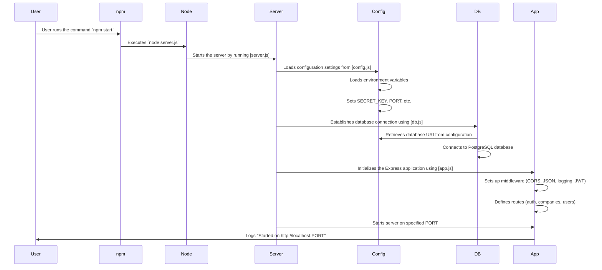

# Jobly Backend

This is the Express backend for Jobly, version 2.
## [Jobly Table of Contents](#jobly-table-of-contents)
- [Jobly Backend](#jobly-backend)
  - [startup instructions](#startup-instructions)
  - [assignment instructions](#assignment-instructions)
  - [**Goals \& Requirements**](#goals--requirements)
  - [Part One: Setup / Starter Code](#part-one-setup--starter-code)
      - [`jobly.sql` explained](#joblysql-explained)
      - [Instructions to Setting Up the Databases](#instructions-to-setting-up-the-databases)
      - [Description of the Server Startup Process](#description-of-the-server-startup-process)
      - [`app.js` and `app.test.js` explained](#appjs-and-apptestjs-explained)
        - [Explanation of `app.js`](#explanation-of-appjs)
        - [Explanation of `app.test.js`](#explanation-of-apptestjs)
        - [Understanding `beforeEach` and `afterEach`](#understanding-beforeeach-and-aftereach)
        - [Running Tests with Coverage and the `-i` Flag](#running-tests-with-coverage-and-the--i-flag)
      - [`config.js` and `config.test.js` explained](#configjs-and-configtestjs-explained)
        - [Explanation of `config.js`](#explanation-of-configjs)
        - [Explanation of `config.test.js`](#explanation-of-configtestjs)
      - [First Task: sqlForPartialUpdate](#first-task-sqlforpartialupdate)
  - [Part Two: Companies](#part-two-companies)
      - [Adding Filtering](#adding-filtering)
      - [Some requirements:](#some-requirements)
  - [Part Three: Change Authorization](#part-three-change-authorization)
    - [Companies](#companies)
    - [Users](#users)
  - [Part Four: Jobs](#part-four-jobs)
    - [Adding Job Model, Routes, and Tests](#adding-job-model-routes-and-tests)
    - [Adding Filtering](#adding-filtering-1)
    - [Show Jobs for a Company](#show-jobs-for-a-company)
  - [Step Five: Job Applications](#step-five-job-applications)
  - [Further Study](#further-study)
    - [Choosing Random Password](#choosing-random-password)
    - [Use *enum* Type](#useenumtype)
    - [Add Technologies for Jobs](#add-technologies-for-jobs)
    - [Add Technologies for Users](#add-technologies-for-users)


## startup instructions

To run this: `node server.js`

To run the tests: `jest -i`

## assignment instructions

This is a multi-day exercise to practice Node, Express, and PostgreSQL with relationships. In it, you’ll build “Jobly”, a job searching API.

[Back to TOC](#jobly-table-of-contents)

## **Goals & Requirements**

- [ ] This is a pure API app, taking values from the query string (GET requests) or from a JSON body (other requests). It returns JSON.
- [ ] This gets authentication/authorization with JWT tokens. Make sure your additions only allow access as specified in our requirements.
- [ ] Be thoughtful about function and variable names, and write developer-friendly documentation *for every function and route* you write.
- [ ] The starter code is well-tested, with excellent coverage. We expect your new contributions to maintain good coverage.
- [ ] Model tests check the underlying database actions. Route tests check the underlying model methods and do not rely directly on the database changes. This is a useful testing design consideration and you should continue it.
- [ ] We *strongly encourage you* to practice some test-driven development. Write a test before writing a model method and a route. You will find that this can make the work of adding to an app like this easier, and much less bug-prone.

**Take your time, be organized and clear, and test carefully. Have fun!**

[Back to TOC](#jobly-table-of-contents)

## Part One: Setup / Starter Code

Download the starter code. Do a quick skim of the code to get a sense of the main components and the organization.

We’ve provided **_jobly.sql_**, which will create a database (with a small amount of starter data) and a test database. Set those up. (Some of the tables included are not currently used by the application; you’ll add the parts of the app that will use those tables in the exercise).

[Back to TOC](#jobly-table-of-contents)

### `jobly.sql` explained

X. Full Code for `jobly.sql`:

```sql
\echo 'Delete and recreate jobly db?'
\prompt 'Return for yes or control-C to cancel > ' foo

DROP DATABASE jobly;
CREATE DATABASE jobly;
\connect jobly

\i jobly-schema.sql
\i jobly-seed.sql

\echo 'Delete and recreate jobly_test db?'
\prompt 'Return for yes or control-C to cancel > ' foo

DROP DATABASE jobly_test;
CREATE DATABASE jobly_test;
\connect jobly_test

\i jobly-schema.sql
```

1. This line prints a message to the terminal asking if you want to delete and recreate the `jobly` database.

```sql
\echo 'Delete and recreate jobly db?'
```

2. This line prompts the user to press **Enter** to proceed or **Control-C** to cancel the operation.

```sql
\prompt 'Return for yes or control-C to cancel > ' foo
```

3. This line deletes the existing `jobly` database if it exists. If the database does not exist, it will throw an error.

```sql
DROP DATABASE jobly;
```

4. This line creates a new jobly database.

```sql
CREATE DATABASE jobly;
```

5. This line connects to the newly created jobly database.

```sql
\connect jobly
```

6. This line runs the `jobly-schema.sql` file, which contains the SQL commands to create the necessary tables and schema for the `jobly` database.

```sql
\i jobly-schema.sql
```

7. This line prints a message to the terminal asking if you want to delete and recreate the jobly_test database.

```sql
\echo 'Delete and recreate jobly_test db?'
```

8. This line prompts the user to press Enter to proceed or Control-C to cancel the operation.

```sql
\prompt 'Return for yes or control-C to cancel > ' foo
```

9. This line deletes the existing `jobly_test` database if it exists. If the database does not exist, it will throw an error.

```sql
DROP DATABASE jobly_test;
```

10. This line creates a new `jobly_test` database.

```sql
CREATE DATABASE jobly_test;
```

11. This line connects to the newly created `jobly_test` database.

```sql
\connect jobly_test
```

12. This line runs the `jobly-schema.sql` file, which contains the SQL commands to create the necessary tables and schema for the `jobly_test` database.

```sql
\i jobly-schema.sql
```

[Back to TOC](#jobly-table-of-contents)

### Instructions to Setting Up the Databases

To set up the databases using the `jobly.sql` file, follow these steps:

- [x] 1. Open your terminal in Visual Studio Code (VSC) using WSL/Ubuntu.
- [x] 2. Ensure you have PostgreSQL installed and running. You can start PostgreSQL with the following command:

```
sudo service postgresql start
```

- [x] 3. Navigate to the directory containing the `jobly.sql` file. For example:

```
cd path/to/your/project
```

- [x] 4. Run the `jobly.sql` file using the `psql` command-line tool. This will execute the SQL commands in the file to set up your databases:

```
psql -U your_username -f jobly.sql
```

Remember to Replace `your_username` with your PostgreSQL username. You may be prompted to enter your password.

5. Follow the prompts in the terminal. Press Enter to proceed with deleting and recreating the databases or Control-C to cancel.

- [x] After completing these steps, you should have both the `jobly` and `jobly_test` databases set up with the necessary schema and initial data.


Read the tests and get an (I) understanding of what the (II) **_beforeEach_** and **_afterEach_** methods are specifically doing for our tests.

(III) Run our tests, with coverage. Any time you run our tests here, you will need to use the `-i` flag for Jest, so that the tests run “in band” (in order, not at the same time).

[Back to TOC](#jobly-table-of-contents)

### Description of the Server Startup Process
When you run the `command npm start`, it triggers the `start` script defined in the `package.json` file, which executes `node server.js`. This starts the server by performing the following steps:

1. Load Configuration: The `config.js` file is loaded, which sets up environment variables and configuration settings such as the `SECRET_KEY`, `PORT`, and database URI.
2. Database Connection: The `db.js` file is executed, which establishes a connection to the PostgreSQL database using the configuration settings.
3. Initialize Express App: The `app.js` file is loaded, which sets up the Express application, including middleware for CORS, JSON parsing, logging, and JWT authentication. It also defines routes for authentication, companies, and users.
4. Start the Server: The `server.js` file starts the Express server on the specified port and logs a message indicating that the server has started.



**Explanation of the Sequence Diagram**

This sequence diagram provides a visual representation of the function execution sequence and overall process of starting up the server when the npm start command is executed.

1. `User` runs the command `npm start`.
2. `npm` executes the start script, which runs `node server.js`.
3. `Node` starts the server by running the `server.js` file.
4. `Server` loads the `config.js` file to set up configuration settings.
5. `Config` loads environment variables and sets configuration values such as `SECRET_KEY`, `PORT`, and the `database URI`.
6. `Server` executes the db.js file to establish a connection to the PostgreSQL database.
7. `DB` retrieves the `database URI` from the configuration and connects to the database.
8. `Server` executes the `app.js` file to initialize the Express application.
9. `App` sets up middleware for CORS, JSON parsing, logging, and JWT authentication.
10. `App` defines routes for authentication, companies, and users.
11. `Server` starts the Express server on the specified port.
12. `App` logs a message indicating that the server has started and is listening on the specified port.

[Back to TOC](#jobly-table-of-contents)

### `app.js` and `app.test.js` explained

#### Explanation of `app.js`

1. imports

- `express`: The main framework used to build the web server.
- `cors`: Middleware to enable Cross-Origin Resource Sharing.
- `NotFoundError`: Custom error class for handling 404 errors.
- `authenticateJWT`: Middleware to authenticate JWT tokens.
- `authRoutes`, `companiesRoutes`, `usersRoutes`: Route handlers for different parts of the application.
- `morgan`: Middleware for logging HTTP requests.

```javascript
"use strict";
const express = require("express");
const cors = require("cors");
const { NotFoundError } = require("./expressError");
const { authenticateJWT } = require("./middleware/auth");
const authRoutes = require("./routes/auth");
const companiesRoutes = require("./routes/companies");
const usersRoutes = require("./routes/users");
const morgan = require("morgan");
```

2. Express App Initialization

```javascript
const app = express();
```

3. Middleware Setup
- `cors()`: Enables CORS.
- `express.json()`: Parses incoming JSON requests.
- `morgan("tiny")`: Logs HTTP requests.
- `authenticateJWT`: Authenticates JWT tokens for incoming requests.
```javascript
app.use(cors());
app.use(express.json());
app.use(morgan("tiny"));
app.use(authenticateJWT);
```

4. Route Handlers
Sets up route handlers for authentication, companies, and users.
```javascript
app.use("/auth", authRoutes);
app.use("/companies", companiesRoutes);
app.use("/users", usersRoutes);
```

5. 404 Error Handling
Handles requests to undefined routes by throwing a `NotFoundError`.
```javascript
app.use(function (req, res, next) {
  return next(new NotFoundError());
});
```

6. Generic Error Handler
Handles any unhandled errors and returns a JSON response with the error message and status code.
```javascript
app.use(function (err, req, res, next) {
  if (process.env.NODE_ENV !== "test") console.error(err.stack);
  const status = err.status || 500;
  const message = err.message;

  return res.status(status).json({
    error: { message, status },
  });
});
```

7. Export App
```javascript
module.exports = app;
```

[Back to TOC](#jobly-table-of-contents)

#### Explanation of `app.test.js`

This file contains tests for the Express application using the `supertest` library.

1. Imports and Setup:

```javascript
const request = require("supertest");
const app = require("./app");
const db = require("./db");
```

- `request`: Library for testing HTTP requests.
- `app`: The Express application.
- `db`: The database connection.

2. Test for 404 Not Found

Tests that a request to a non-existent path returns a 404 status code.

```javascript
test("not found for site 404", async function () {
  const resp = await request(app).get("/no-such-path");
  expect(resp.statusCode).toEqual(404);
});
```

3. Test for 404 Not Found with Stack Print

Similar to the previous test but ensures the stack trace is printed when `NODE_ENV` is not set to "test".

```javascript
test("not found for site 404 (test stack print)", async function () {
  process.env.NODE_ENV = "";
  const resp = await request(app).get("/no-such-path");
  expect(resp.statusCode).toEqual(404);
  delete process.env.NODE_ENV;
});
```

4. Close Database Connection

Closes the database connection after all tests have run.

```javascript
afterAll(function () {
  db.end();
});
```

[Back to TOC](#jobly-table-of-contents)

#### Understanding `beforeEach` and `afterEach`

In the context of testing, `beforeEach` and `afterEach` are hooks provided by testing frameworks like Jest to run code before and after each test case, respectively.

- `beforeEach`: Runs a specific piece of code before each test case. This is useful for setting up a consistent state before each test.
- `afterEach`: Runs a specific piece of code after each test case. This is useful for cleaning up after each test to ensure tests do not affect each other.

[Back to TOC](#jobly-table-of-contents)

#### Running Tests with Coverage and the `-i` Flag

To run the tests with coverage and ensure they run in order (in band), you can use the following command:

```javascript
jest --coverage -i
```

- `--coverage`: Generates a test coverage report, showing which parts of your code are covered by tests.
- `-i` **(in band)**: Ensures that tests run sequentially rather than in parallel. This is useful when tests might interfere with each other if run simultaneously.

[Back to TOC](#jobly-table-of-contents)

### `config.js` and `config.test.js` explained

#### Explanation of `config.js`

1. **Imports and Setup**

- `dotenv`: Loads environment variables from a `.env` file into `process.env`.
- `colors`: Adds color support to the console output.

```javascript
"use strict";

require("dotenv").config();
require("colors");
```

2. **Configuration Variables**

- `SECRET_KEY`: The secret key used for signing JWT tokens. Defaults to "secret-dev" if not set in the environment.
- `PORT`: The port on which the server will run. Defaults to 3001 if not set in the environment.

```javascript
const SECRET_KEY = process.env.SECRET_KEY || "secret-dev";
const PORT = +process.env.PORT || 3001;
```

3. **Database URI Function**

- `getDatabaseUri()`: Returns the appropriate database URI based on the environment. Uses `jobly_test` for testing, otherwise uses `DATABASE_URL` or defaults to `jobly`.

```javascript
function getDatabaseUri() {
  return process.env.NODE_ENV === "test"
    ? "postgresql:///jobly_test"
    : process.env.DATABASE_URL || "postgresql:///jobly";
}
```

4. **Bcrypt Work Factor**

- `BCRYPT_WORK_FACTOR`: Sets the bcrypt work factor for hashing passwords. Uses a lower value for testing to speed up tests.

```javascript
const BCRYPT_WORK_FACTOR = process.env.NODE_ENV === "test" ? 1 : 12;
```

5. **Logging Configuration**

- Logs the configuration settings to the console.

```javascript
console.log("Jobly Config:".green);
console.log("SECRET_KEY:".yellow, SECRET_KEY);
console.log("PORT:".yellow, PORT.toString());
console.log("BCRYPT_WORK_FACTOR".yellow, BCRYPT_WORK_FACTOR);
console.log("Database:".yellow, getDatabaseUri());
console.log("---");
```

6. **Export Configuration**

- Exports the configuration variables and functions for use in other parts of the application.

```javascript
module.exports = {
  SECRET_KEY,
  PORT,
  BCRYPT_WORK_FACTOR,
  getDatabaseUri,
};
```

[Back to TOC](#jobly-table-of-contents)

#### Explanation of `config.test.js`

This file contains tests for the configuration settings in `config.js`.

1. **Test Suite**

- Test Setup: Sets environment variables to specific values.
- Assertions: Checks that the configuration values match the environment variables.
- Cleanup: Deletes the environment variables and checks the default values.

```javascript
"use strict";

describe("config can come from env", function () {
  test("works", function () {
    process.env.SECRET_KEY = "abc";
    process.env.PORT = "5000";
    process.env.DATABASE_URL = "other";
    process.env.NODE_ENV = "other";

    const config = require("./config");
    expect(config.SECRET_KEY).toEqual("abc");
    expect(config.PORT).toEqual(5000);
    expect(config.getDatabaseUri()).toEqual("other");
    expect(config.BCRYPT_WORK_FACTOR).toEqual(12);

    delete process.env.SECRET_KEY;
    delete process.env.PORT;
    delete process.env.BCRYPT_WORK_FACTOR;
    delete process.env.DATABASE_URL;

    expect(config.getDatabaseUri()).toEqual("jobly");
    process.env.NODE_ENV = "test";

    expect(config.getDatabaseUri()).toEqual("jobly_test");
  });
});
```

2. **Understanding `beforeEach` and `afterEach`**
   In the context of testing, `beforeEach` and `afterEach` are hooks provided by testing frameworks like Jest to run code before and after each test case, respectively.

- `beforeEach`: Runs a specific piece of code before each test case. This is useful for setting up a consistent state before each test.
- `afterEach`: Runs a specific piece of code after each test case. This is useful for cleaning up after each test to ensure tests do not affect each other.

In the provided test file, there are no `beforeEach` or `afterEach` hooks, but they are commonly used in other test files to manage database transactions or reset state.

3. Running Tests with Coverage and the `-i` Flag

- `--coverage`: Generates a test coverage report, showing which parts of your code are covered by tests.
- `-i` (in band): Ensures that tests run sequentially rather than in parallel. This is useful when tests might interfere with each other if run simultaneously.

To run the tests with coverage and ensure they run in order (in band), you can use the following command:

```javascript
jest --coverage -i
```

#### First Task: sqlForPartialUpdate

A starting piece to document and test:

We’ve provided a useful method in **_helpers/sql.js_** called **_sqlForPartialUpdate_**. This code works, and we use it, but the code is undocumented and not directly tested. Write unit tests for this, and thoroughly document the function.

[Back to TOC](#jobly-table-of-contents)

### Part Two: Companies

We’ve provided a model and routes for companies.

#### Adding Filtering

The route for listing all companies (**_GET /companies_**) works, but it currently shows all companies. Add a new feature to this, allowing API users to filter the results based on optional filtering criteria, any or all of which can be passed in the query string:

- **_name_**: filter by company name: if the string “net” is passed in, this should find any company who name contains the word “net”, case-insensitive (so “Study Networks” should be included).
- **_minEmployees_**: filter to companies that have at least that number of employees.
- **_maxEmployees_**: filter to companies that have no more than that number of employees.
- If the **_minEmployees_** parameter is greater than the **_maxEmployees_** parameter, respond with a 400 error with an appropriate message.


#### Some requirements:

- Do not solve this by issuing a more complex SELECT statement than is needed (for example, if the user isn’t filtering by **_minEmployees_** or **_maxEmployees_**, the SELECT statement should not include anything about the **_num_employees_**.
- Validate that the request does not contain inappropriate other filtering fields in the route. Do the actual filtering in the model.
- Write unit tests for the model that exercise this in different ways, so you can be assured different combinations of filtering will work.
  Write tests for the route that will ensure that it correctly validates the incoming request and uses the model method properly.
- Document all new code here clearly; this is functionality that future team members should be able to understand how to use from your docstrings.

[Back to TOC](#jobly-table-of-contents)

## Part Three: Change Authorization

Many routes for this site do not have appropriate authorization checks.

### Companies

- Retrieving the list of companies or information about a company should remain open to everyone, including anonymous users.
- Creating, updating, and deleting companies should only be possible for users who logged in with an account that has the **_is_admin_** flag in the database.

Find a way to do this where you don’t need to change the code of these routes, and where you don’t need to SELECT information about the user on every request, but that the authentication credentials provided by the user can contain information suitable for this requirement.

Update tests to demonstrate that these security changes are working.

[Back to TOC](#jobly-table-of-contents)

### Users

- Creating users should only permitted by admins (registration, however, should remain open to everyone).
- Getting the list of all users should only be permitted by admins.
- Getting information on a user, updating, or deleting a user should only be permitted either by an admin, or by that user.

As before, write tests for this carefully.

[Back to TOC](#jobly-table-of-contents)

## Part Four: Jobs

Add a feature for jobs to the application.

We’ve already provided a table for this. Study it.

[Back to TOC](#jobly-table-of-contents)

### Adding Job Model, Routes, and Tests

Add a model for jobs — you can pattern-match this from the companies model.

Updating a job should never change the ID of a job, nor the company associated with a job.

Write tests for the model.

Add routes for jobs. The same routes should be handled as we did for companies (for now, omit the special filtering on the **_GET /_** route), with the same security requirements (anyone can get the jobs, but only admins can add, update, or delete them). Make sure you suitably validate incoming data.

Write tests for the routes.

[Back to TOC](#jobly-table-of-contents)

#### Adding Filtering

Similar to the companies filtering for the **_GET /_** route, add filtering for jobs for the following possible filters:

- **_title_**: filter by job title. Like before, this should be a case-insensitive, matches-any-part-of-string search.
- **_minSalary_**: filter to jobs with at least that salary.
- **_hasEquity_**: if **_true_**, filter to jobs that provide a non-zero amount of equity. If **_false_** or not included in the filtering, list all jobs regardless of equity.

Write comprehensive tests for this, and document this feature well.

[Back to TOC](#jobly-table-of-contents)

#### Show Jobs for a Company

Now that the app includes jobs, change the GET /companies/:handle feature so that it includes all of the information about the jobs associated with that company:

```javascript
{ ... other data ... , jobs: [ { id, title, salary, equity}, ... ] }
```

[Back to TOC](#jobly-table-of-contents)

## Step Five: Job Applications

We’ve provided a table for applications. Incorporate this into the app by adding a method onto the **_User_** model, allowing users to apply for a job.

Add a route at **_POST /users/:username/jobs/:id_** that allows that user to apply for a job (or an admin to do it for them). That route should return JSON like:

```javascript
{
  applied: jobId;
}
```

Change the output of the get-all-info methods and routes for users so those include the a field with a simple list of job IDs the user has applied for:

```javascript
{ ..., jobs: [ jobId, jobId, ... ] }
```

Document this carefully and write tests.

[Back to TOC](#jobly-table-of-contents)

## Further Study

**Before you continue, make sure you have completed all the parts above, including strong documentation, tests, and developer documentation artifacts.**

Here are some broad ideas for further study. We do not provide solutions on any of these particular tasks.

[Back to TOC](#jobly-table-of-contents)

### Choosing Random Password

When admins add a user via the **_POST /users_** route (not the self-registration route), they should not provide a password. Instead, the system will make a random password for the user (you can find third-party libraries that will generate excellent random passwords). This route should continue to return the same information, so an admin can send the user that token to authenticate to the site, and the user can then change their password to something only known to them.

This is a very real-world feature.

[Back to TOC](#jobly-table-of-contents)

### Use *enum* Type

Research PostgreSQL’s enum types and change the state column in the applications table to be an enum that consists of ‘interested’, ‘applied’, ‘accepted’, ‘rejected’.

[Back to TOC](#jobly-table-of-contents)

### Add Technologies for Jobs

Add a table for technologies which is a many to many with jobs (a job can require “Python” and “JavaScript”, and these technologies could be linked to many jobs).

[Back to TOC](#jobly-table-of-contents)

### Add Technologies for Users

Make the technologies table a many to many with users as well and create an endpoint that matches users with jobs where the technologies are the same.

[Back to TOC](#jobly-table-of-contents)